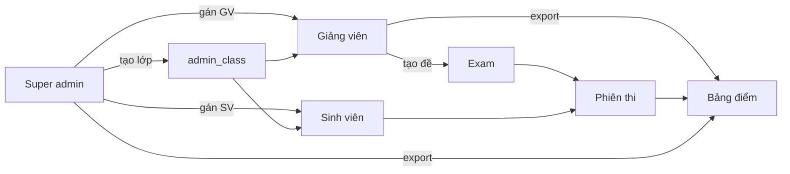
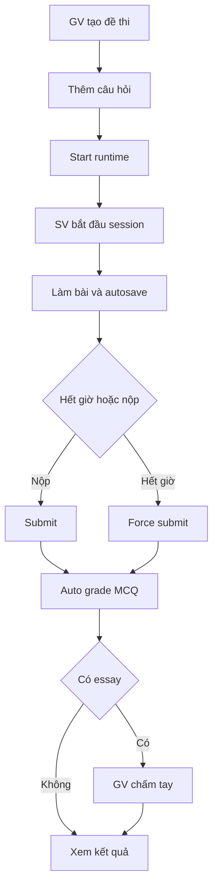

# ĐẶC TẢ HỆ THỐNG SIÊU CHI TIẾT — HỆ THỐNG THI TRỰC TUYẾN

## 1. THÔNG TIN CHUNG

Nguồn trích xuất: docs/_extracted_thesis.txt, TONGB_HOP_DOAN_TOT_NGHIEP.md.

- BỘ GIÁO DỤC ĐÀO TẠO
- TRƯỜNG ĐẠI HỌC ĐẠI NAM
- ĐỒ ÁN TỐT NGHIỆP
- TÊN ĐỀ TÀI: XÂY DỰNG HỆ THỐNG THI TRỰC TUYẾN (ONLINE EXAMINATION SYSTEM)
- SINH VIÊN THỰC HIỆN: ................................................
- MÃ SINH VIÊN: ................................................
- NGƯỜI HƯỚNG DẪN: (không có tên cụ thể trong tài liệu; chỉ có cụm “giảng viên hướng dẫn”)
- KHOA: CÔNG NGHỆ THÔNG TIN
- ĐỊA ĐIỂM/NĂM: HÀ NỘI 2026
- MÃ NGUỒN: C:\VS-Code\GraduationProject
- NGÀY CẬP NHẬT TÀI LIỆU: 2026-05-21 (TONGB_HOP_DOAN_TOT_NGHIEP.md), 2026-05-13 (DO_AN_MASTER.md)

## 2. TỔNG QUAN, TÍNH CẤP THIẾT VÀ MỤC TIÊU CỤ THỂ

Nguồn trích xuất: docs/_extracted_thesis.txt, DO_AN_MASTER.md, TONGB_HOP_DOAN_TOT_NGHIEP.md.

### 2.1 LỜI NÓI ĐẦU (TRÍCH TỪ _extracted_thesis.txt)

Trong bối cảnh chuyển đổi số giáo dục, hình thức kiểm tra – đánh giá trực tuyến ngày càng phổ biến. Đại dịch COVID-19 đã thúc đẩy nhanh việc tổ chức thi trên môi trường mạng, đặt ra yêu cầu về tính ổn định, bảo mật, công bằng và khả năng giám sát hành vi thí sinh.
Một hệ thống thi trực tuyến hoàn chỉnh không chỉ là trang web hiển thị câu hỏi, mà cần chuỗi nghiệp vụ: quản trị người dùng và phân quyền, quản lý môn học và đề thi, tổ chức phiên thi, đồng bộ thời gian, tự động lưu bài, chống gian lận ở mức hợp lý, kênh thông báo thời gian thực cho giám thị, chấm điểm và thống kê kết quả.
Đề tài “Xây dựng hệ thống thi trực tuyến” được thực hiện trên mã nguồn dự án GraduationProject: frontend React/TypeScript, backend Node.js/Express, cơ sở dữ liệu PostgreSQL, xác thực JWT, Socket.IO cho tín hiệu thi, cùng các tài liệu OpenAPI và hướng dẫn triển khai trong kho mã nguồn.
Báo cáo được tổ chức thành năm chương: tổng quan; cơ sở lý thuyết và công nghệ; phân tích thiết kế; triển khai kiểm thử; đánh giá và hướng phát triển, kèm kết luận và tài liệu tham khảo.

### 2.2 GIỚI THIỆU CHUNG VÀ TÍNH CẤP THIẾT (TRÍCH TỪ _extracted_thesis.txt)

Kiểm tra và đánh giá kết quả học tập là khâu then chốt trong quản lý đào tạo. Khi quy mô lớp học tăng và học viên phân tán địa lý, tổ chức thi tập trung tại phòng máy gặp hạn chế về chi phí cơ sở vật chất, lịch thi và khả năng mở rộng. Thi trực tuyến cho phép linh hoạt thời gian, giảm chi phí in ấn đề giấy, tự động hóa một phần chấm trắc nghiệm và thống kê nhanh kết quả.
Tuy nhiên, thi trực tuyến đặt ra thách thức về toàn vẹn dữ liệu bài làm, đồng bộ thời gian làm bài, phát hiện hành vi bất thường, và phân quyền chặt chẽ để tránh lộ đề hoặc truy cập trái phép. Do đó, việc xây dựng một hệ thống có kiến trúc rõ ràng, có tài liệu API và quy ước autosave/integrity là cần thiết cho cả mục đích học tập và làm cơ sở mở rộng thương mại.
Xuất phát từ nhu cầu trên, đồ án lựa chọn đề tài xây dựng hệ thống thi trực tuyến với đầy đủ vai trò quản trị viên, giáo viên và sinh viên, tích hợp import đề Word, timer đồng bộ máy chủ, autosave, Socket.IO cho giám sát, và các chức năng thống kê — phù hợp với xu hướng ứng dụng web hiện đại.

### 2.3 MỤC TIÊU NGHIÊN CỨU (TRÍCH TỪ _extracted_thesis.txt)

Mục tiêu tổng quát: xây dựng phần mềm web hỗ trợ vòng đời tổ chức thi trực tuyến, có khả năng triển khai cục bộ phục vụ demo và có thể cấu hình triển khai môi trường thật.
Mục tiêu cụ thể:
- Phân tích yêu cầu và thiết kế use case theo từng vai trò.
- Triển khai backend REST /v1 với PostgreSQL, migration schema, JWT và RBAC.
- Triển khai frontend SPA với React, quản lý trạng thái, định tuyến và i18n.
- Hiện thực làm bài thi: timer, autosave, integrity events, fullscreen theo cấu hình đề.
- Hiện thực Socket.IO cho tín hiệu thi (bắt đầu, cảnh báo, force-submit) và màn hình giám thị.
- Bổ sung tài liệu OpenAPI và hướng dẫn kiểm thử nhanh trong kho mã nguồn.

### 2.4 PHẠM VI VÀ ĐỐI TƯỢNG NGHIÊN CỨU (TRÍCH TỪ _extracted_thesis.txt)

Phạm vi đồ án tập trung vào hệ thống trong kho GraduationProject: module người dùng, đề thi, phiên thi, làm bài, chấm điểm, giám sát, thống kê và các tiện ích liên quan được mô tả trong DO_AN_MASTER.md. Phạm vi không bao gồm phần cứng phòng thi, sinh trắc học nâng cao, hay chứng thực pháp lý điện tử đầy đủ cấp quốc gia.
Đối tượng nghiên cứu là kiến trúc ứng dụng web đa vai trò, các mẫu thiết kế API, quản lý phiên làm bài an toàn, và trải nghiệm người dùng khi làm bài dài với mạng không ổn định.

### 2.5 PHƯƠNG PHÁP NGHIÊN CỨU (TRÍCH TỪ _extracted_thesis.txt)

Khảo sát tài liệu: đọc mã nguồn, API.md, openapi.yaml, tài liệu contract autosave/integrity.
Phân tích so sánh: đối chiếu với các nền tảng phổ biến (Moodle, Google Forms, hệ thống thương mại).
Thực nghiệm: cài đặt cục bộ, chạy migration, thực hiện kịch bản kiểm thử thủ công end-to-end.
Đánh giá: kiểm tra log, hành vi Socket, và test tự động phần backend (Vitest).

### 2.6 Ý NGHĨA THỰC TIỄN VÀ HỌC THUẬT (TRÍCH TỪ _extracted_thesis.txt)

Về thực tiễn, hệ thống có thể phục vụ các khóa học ngắn hạn, kiểm tra giữa kỳ trực tuyến hoặc thi thử trong trường đại học, giúp giảm khối lượng vận hành giấy tờ và rút ngắn thời gian công bố điểm cho phần trắc nghiệm. Khi kết hợp quy trình giám sát con người và camera ngoài phạm vi đồ án, có thể tiến tới mô hình phòng thi lai (hybrid).
Về học thuật, đồ án cho phép sinh viên ôn luyện các môn CSDL, Lập trình web, Phần mềm mã nguồn mở, An toàn thông tin cơ bản và Quản trị mạng máy tính thông qua một case study thống nhất. Việc đọc OpenAPI và viết kịch bản kiểm thử cũng rèn kỹ năng tư duy hệ thống.
Đồng thời, đề tài nhấn mạnh kỹ năng viết tài liệu kỹ thuật: mô tả use case, ma trận quyền, hướng dẫn triển khai và phân tích rủi ro — những nội dung thường xuất hiện trong quy trình phát triển phần mềm chuyên nghiệp.

### 2.7 TỔNG QUAN HỆ THỐNG (TRÍCH TỪ DO_AN_MASTER.md và TONGB_HOP_DOAN_TOT_NGHIEP.md)

Hệ thống hỗ trợ vòng đời thi trực tuyến: quản lý người dùng (admin/teacher/student), lớp–môn, đề thi & câu hỏi (MCQ/essay, media), import Word, làm bài có timer, autosave, chống gian lận (fullscreen, integrity events), Socket.IO (bắt đầu thi, cảnh báo, force-submit), chấm điểm (tự động + tay), giám thị, ngân hàng câu hỏi, thống kê điểm, dự đoán điểm (AI MiniMax), đa ngôn ngữ (vi/en/ja).

Hệ thống thi trực tuyến (Online Examination System) là một ứng dụng web full-stack xây dựng bằng TypeScript, phục vụ quy trình thi trực tuyến trong môi trường đại học. Hệ thống hỗ trợ đầy đủ vòng đời thi: từ tạo đề thi, làm bài, giám sát (proctoring), chấm điểm tự động/thủ công, đến thống kê và dự đoán kết quả bằng AI.

Các vai trò:
- admin: quản trị viên (Super admin) — toàn hệ thống
- teacher: giảng viên (Manager lớp) — một admin_class
- student: sinh viên — thuộc admin_class

Business rules cốt lõi:
1. 1 GV quản lý 1 lớp HC: admin_classes.manager_teacher_id là UNIQUE (hoặc bảng gán 1–1)
2. Không có đăng ký công khai: sinh viên / giảng viên chỉ đăng nhập; tài khoản do admin tạo
3. Xuất bảng điểm: GV lọc theo admin_class_id được gán; super admin không giới hạn lớp
4. Server-authoritative runtime: khi hết giờ realtime (exam:force_submit), server tự động force-submit toàn bộ phiên còn active, ưu tiên dùng autosave snapshot mới nhất nếu có

## 3. KIẾN TRÚC HỆ THỐNG CHI TIẾT

Nguồn trích xuất: TONGB_HOP_DOAN_TOT_NGHIEP.md, DO_AN_MASTER.md, MODULE_THI_SINH_VIEN.md, EXAM_INTEGRITY_AUTOSAVE_CONTRACT.md, SOCKET_IO_POC.md, docs/mermaid/*.mmd.

### 3.1 SƠ ĐỒ KIẾN TRÚC TỔNG THỂ (TRÍCH TỪ TONGB_HOP_DOAN_TOT_NGHIEP.md)

```
┌──────────────────────────────────────────────────────────┐
│                   Browser (Client)                        │
│          React 19 + TypeScript + Vite 7                  │
│          Mantine v8 (UI components)                      │
│          Redux Toolkit (state management)                 │
│          React Router v7 (routing)                        │
│          Socket.IO client + i18next + Axios              │
└──────────────────────────┬─────────────────────────────────┘
                           │ HTTPS / HTTP
                           │ REST API v1 + WebSocket
┌──────────────────────────▼─────────────────────────────────┐
│                Backend — Node.js / Express               │
│               TypeScript + Express 5                      │
│  ┌─────────────────┐ ┌──────────────────┐ ┌────────────┐   │
│  │  Controllers    │ │    Services      │ │   Jobs     │   │
│  │    (20+)       │ │     (30+)       │ │ (deadline) │   │
│  └─────────────────┘ └──────────────────┘ └────────────┘   │
│  ┌─────────────────┐ ┌──────────────────┐ ┌────────────┐   │
│  │    Models       │ │   Middlewares    │ │  Socket.IO │   │
│  │     (31)        │ │  (auth/RBAC)     │ │ (proctor)  │   │
│  └─────────────────┘ └──────────────────┘ └────────────┘   │
│                                                            │
│  PostgreSQL (Neon)  │  Cloudinary (media)  │  MiniMax AI     │
│  37 SQL migrations  │  SMTP (Nodemailer)   │                │
└────────────────────────────────────────────────────────────┘
```

### 3.2 LUỒNG CHÍNH (TRÍCH TỪ DO_AN_MASTER.md)

Luồng chính: Browser → REST /v1 + Socket.IO cùng host API; FE build production mặc định API https://api.nhongplus.id.vn (xem FrontEnd/client/src/configs/app.config.ts, .env.production).

### 3.3 SƠ ĐỒ KHỐI VÀ LUỒNG NGHIỆP VỤ (MERMAID)

#### 3.3.1 Sơ đồ khối phân quyền (docs/mermaid/06-flow-phan-quyen.mmd)



#### 3.3.2 Luồng làm bài (docs/mermaid/07-flow-lam-bai.mmd)



### 3.4 MÔ HÌNH WEB SERVER — OCR MICROSERVICE

Không có tài liệu về OCR, Tesseract hoặc PaddleOCR trong các file được cung cấp. Tài liệu chỉ mô tả mô-đun AI dự đoán điểm và gợi ý gọi dịch vụ Python cho Random Forest (MODULE_THI_SINH_VIEN.md). Nếu cần mô hình OCR Microservice, cần bổ sung tài liệu/sơ đồ riêng.

### 3.5 LUỒNG TRUYỀN NHẬN API GIỮA NODE.JS VÀ PYTHON (TRÍCH TỪ MODULE_THI_SINH_VIEN.md)

- Train / infer: Python (scikit-learn) là lựa chọn tự nhiên cho Random Forest Regressor; tách service riêng (HTTP hoặc message queue).
- Node backend đóng vai trò orchestrator — sau khi nộp bài, gom pastScores, questionDifficulty, timeSpent, accuracy, behaviorStats, gọi AI service, nhận JSON phân tích, ghi DB (predicted_score, feedback, topic_mastery, cheat_risk, …).
- Đồng bộ vs bất đồng bộ: có thể bắt đầu gọi đồng bộ (chờ vài trăm ms) rồi nâng cấp job queue nếu model chậm.

## 4. ĐẶC TẢ CHI TIẾT CÔNG NGHỆ

Nguồn trích xuất: DO_AN_MASTER.md, TONGB_HOP_DOAN_TOT_NGHIEP.md, package.json (BackEnd/server, FrontEnd/client).

### 4.1 CÔNG NGHỆ THEO TẦNG (TRÍCH TỪ TONGB_HOP_DOAN_TOT_NGHIEP.md)

| Lớp | Công nghệ | Version |
|-----|-----------|---------|
| Frontend | React | 19 |
| Frontend | TypeScript | 5 |
| Frontend | Vite | 7 |
| Frontend | Mantine | v8 |
| Frontend | Redux Toolkit | latest |
| Frontend | React Router | v7 |
| Frontend | Socket.IO client | latest |
| Frontend | i18next | latest |
| Frontend | Axios | latest |
| Backend | Node.js | LTS |
| Backend | TypeScript | 5 |
| Backend | Express | 5 |
| Database | PostgreSQL | (Neon serverless) |
| Realtime | Socket.IO | server |
| Auth | JWT + bcrypt | cost 12 |
| Media | Cloudinary | - |
| Email | Nodemailer | SMTP |
| Word parsing | Mammoth | .docx import |
| AI | MiniMax API | grade prediction |
| Validation | Joi | request validation |

### 4.2 BACKEND DEPENDENCIES (BackEnd/server/package.json)

- async-exit-hook ^2.0.1
- bcrypt ^6.0.0
- cloudinary ^1.41.3
- cors ^2.8.6
- dotenv ^17.3.1
- express ^5.2.1
- http-status-codes ^2.3.0
- joi ^18.0.2
- jsonwebtoken ^9.0.3
- mammoth ^1.12.0
- morgan ^1.10.1
- multer ^2.1.1
- nodemailer ^6.9.16
- pg ^8.18.0
- socket.io ^4.8.3
- swagger-ui-express ^5.0.1
- tsconfig-paths ^4.2.0
- xlsx ^0.18.5

Dev dependencies:
- @types/async-exit-hook ^2.0.2
- @types/bcrypt ^6.0.0
- @types/cors ^2.8.19
- @types/express ^5.0.6
- @types/jsonwebtoken ^9.0.10
- @types/morgan ^1.9.10
- @types/multer ^2.1.0
- @types/node ^25.0.3
- @types/nodemailer ^6.4.17
- @types/pg ^8.16.0
- @types/swagger-ui-express ^4.1.8
- @vitest/coverage-v8 ^4.1.4
- @vitest/ui ^4.1.4
- nodemon ^3.1.11
- socket.io-client ^4.8.3
- ts-node ^10.9.2
- ts-node-dev ^2.0.0
- tsc-alias ^1.8.16
- typescript ^5.9.3
- vitest ^4.1.4

### 4.3 FRONTEND DEPENDENCIES (FrontEnd/client/package.json)

Dependencies:
- @mantine/carousel ^8.3.10
- @mantine/charts ^8.3.10
- @mantine/core ^8.3.10
- @mantine/dates ^8.3.10
- @mantine/dropzone ^9.1.1
- @mantine/form ^8.3.10
- @mantine/hooks ^8.3.10
- @mantine/modals ^8.3.10
- @reduxjs/toolkit ^2.7.0
- @tabler/icons-react ^3.36.1
- @tanstack/react-query-devtools 4
- axios ^1.13.6
- dayjs ^1.11.19
- embla-carousel ^8.5.2
- embla-carousel-react ^8.5.2
- i18next ^25.7.3
- logo ^0.2.0
- lucide-react ^1.16.0
- react ^19.2.0
- react-dom ^19.2.0
- react-i18next ^16.5.0
- react-is ^19.2.3
- react-redux ^9.2.0
- react-router-dom ^7.11.0
- recharts ^3.6.0
- redux-persist ^6.0.0
- scss ^0.2.4
- socket.io-client 4.8.3
- tabler ^1.0.0-alpha.8

Dev dependencies:
- @chromatic-com/storybook ^5.0.1
- @eslint/js ^9.39.1
- @storybook/addon-a11y ^10.2.8
- @storybook/addon-docs ^10.2.8
- @storybook/addon-onboarding ^10.2.8
- @storybook/addon-themes ^10.2.8
- @storybook/addon-vitest ^10.2.8
- @storybook/react-vite ^10.2.8
- @types/node ^24.10.1
- @types/react ^19.2.5
- @types/react-dom ^19.2.3
- @vitejs/plugin-react ^5.1.1
- @vitest/browser-playwright ^4.0.18
- @vitest/coverage-v8 ^4.0.18
- @vitest/ui ^4.0.18
- eslint ^9.39.1
- eslint-plugin-react-hooks ^7.0.1
- eslint-plugin-react-refresh ^0.4.24
- eslint-plugin-storybook ^10.2.8
- globals ^16.5.0
- playwright ^1.58.2
- postcss ^8.5.6
- postcss-preset-mantine ^1.18.0
- postcss-simple-vars ^7.0.1
- sass-embedded ^1.97.1
- storybook ^10.2.8
- typescript ~5.9.3
- typescript-eslint ^8.46.4
- vite ^7.2.4
- vitest ^4.0.18

### 4.4 CÁC CÔNG NGHỆ ĐƯỢC YÊU CẦU NHƯNG KHÔNG CÓ TRONG TÀI LIỆU

- EJS: không thấy trong tài liệu và package.json.
- Bootstrap: không thấy trong tài liệu và package.json (chỉ có dấu vết trong package-lock, không được khai báo phụ thuộc chính).
- MySQL: hệ thống dùng PostgreSQL (Neon) theo DO_AN_MASTER.md và TONGB_HOP_DOAN_TOT_NGHIEP.md.
- Sequelize: không thấy trong tài liệu và package.json.
- Tesseract / PaddleOCR: không thấy trong tài liệu; tài liệu chỉ mô tả AI MiniMax và gợi ý gọi Python scikit-learn cho dự đoán điểm.

## 5. PHÂN TÍCH CHỨC NĂNG CHI TIẾT THEO ACTOR

Nguồn trích xuất: ROLES_AND_PERMISSIONS.md, TEST_STRATEGY_ADMIN_STUDENT.md, TEST_GUIDE_TEACHER_UI.md, TONGB_HOP_DOAN_TOT_NGHIEP.md.

### 5.1 ACTOR: ADMIN (SUPER ADMIN)

#### 5.1.1 Phạm vi chức năng (trích từ TEST_STRATEGY_ADMIN_STUDENT.md)

| # | Module | URL | Ưu tiên |
|---|--------|-----|---------|
| A1 | Dashboard | /main | P1 |
| A2 | Quản lý tài khoản (SV/GV/Admin) | /admin/students | P1 |
| A3 | Quản lý môn học | /admin/subjects | P2 |
| A4 | Nhật ký hệ thống | /admin/audit-logs | P2 |
| A5 | Báo cáo hệ thống | /admin/system-report | P2 |
| A6 | Duyệt reset mật khẩu | /admin/password-resets | P1 |
| A7 | Giám thị (danh sách ca thi) | /proctoring | P2 |
| A8 | Bài thi / Ngân hàng câu / Chấm điểm | /exams, /question-bank, /grading | P1 (dùng chung GV) |
| A9 | Phân tích điểm | /score-analytics | P3 |
| A10 | Đổi mật khẩu cá nhân | /profile | P2 |

#### 5.1.2 Điều kiện tiên quyết (trích từ TEST_STRATEGY_ADMIN_STUDENT.md)

- Chạy backend + frontend (npm run dev).
- Chạy migration (npm run migrate).
- Dữ liệu demo: assign-teacher-class, seed-students-cntt1602.ts, seed-demo-exams.ts.
- Tài khoản test: admin01@system.local / Test@123.

#### 5.1.3 Kịch bản P1 — Admin (bắt buộc pass)

A1 — Dashboard
- Đăng nhập admin01@system.local → vào /main
- Sidebar có nhóm Quản lý sinh viên, Công cụ quản trị
- Metric / hoạt động gần đây tải không lỗi

A2 — Quản lý tài khoản (/admin/students)
- Danh sách user tải được (API GET /v1/users)
- Thêm tài khoản: họ tên, username, email, role, mật khẩu → xuất hiện trong bảng
- Xóa tài khoản test → biến mất
- Lọc/ hiển thị đúng role (student / teacher / admin)
- Không trùng email/username khi thêm (409 + thông báo)

A6 — Reset mật khẩu (/admin/password-resets)
- Có danh sách yêu cầu (nếu SV đã gửi yêu cầu)
- Duyệt yêu cầu → SV đăng nhập được bằng mật khẩu mới
- Từ chối → trạng thái cập nhật, SV không đổi được mật khẩu qua link cũ

A8 — Vòng đời đề thi (phối hợp GV hoặc tự làm Admin)
- Tạo đề (/exams/new): lớp, môn, thời gian, số mã đề
- Gán câu hỏi (ngân hàng hoặc import)
- Start runtime → SV thấy đề ở trạng thái có thể vào thi
- Vào Chấm điểm → chấm câu tự luận (nếu có) → điểm cập nhật

#### 5.1.4 Kết quả đầu ra

- Dashboard hiển thị thống kê hệ thống.
- CRUD tài khoản thành công, không trùng email/username.
- Duyệt reset mật khẩu thành công.
- Đề thi được tạo, start runtime và chấm điểm cập nhật điểm.

### 5.2 ACTOR: TEACHER (GIẢNG VIÊN)

#### 5.2.1 Điều kiện tiên quyết (trích từ TEST_GUIDE_TEACHER_UI.md)

- Chạy backend: cd BackEnd/server && npm run dev
- Chạy frontend: cd FrontEnd/client && npm run dev
- Chạy migration: npm run migrate
- Gán GV quản lý lớp CNTT 16-02: npm run assign-teacher-class
- Tài khoản test: gv01@system.local / Test@123

#### 5.2.2 Kịch bản chính (trích từ TEST_GUIDE_TEACHER_UI.md)

B0: Chuẩn bị DB
- Gán GV quản lý lớp CNTT 16-02; kiểm tra GET /v1/admin-classes/me.

Màn 1: Dashboard
- Hiển thị tên giáo viên ở góc trên
- Sidebar có: Dashboard, Bài thi, Ngân hàng câu hỏi, Lịch thi/Ca thi, Chấm điểm, Giám thị (nếu có), Thông báo
- Dashboard hiển thị: số bài thi đã tạo, số SV đã làm bài, bài thi gần đây

Màn 2: Danh sách Bài thi
- Bảng hiển thị: Tên bài thi, Lớp, Thời gian, Hạn nộp, Trạng thái
- Nút Tạo bài thi
- Nút hành động: Sửa, Xóa, Start, Set time
- Phân trang nếu có

Tạo bài thi mới
- Tiêu đề: Bài thi Test GV
- Lớp hành chính: CNTT 16-02
- Môn học: chọn 1 môn
- Thời gian: 60 phút
- Mô tả: Bài thi test cho giáo viên
- Kỳ vọng: bài thi mới xuất hiện trong bảng

Sửa bài thi
- Thay đổi tiêu đề/thời gian
- Kỳ vọng: bảng cập nhật

Xóa bài thi
- Xóa dòng bài thi
- Kỳ vọng: bài thi biến mất

Start
- Bài thi chuyển trạng thái Đang thi
- SV có thể vào làm bài

Màn 3: ExamAuthoring
- Tab thông tin bài thi, danh sách câu hỏi, import Word
- Nút Lưu/Cập nhật/Xem trước/Import

Thêm câu hỏi trắc nghiệm
- Nhập nội dung, đáp án A-D, chọn đáp án đúng, điểm
- Kỳ vọng: câu hỏi xuất hiện

Thêm câu hỏi tự luận
- Nhập nội dung, điểm
- Kỳ vọng: câu hỏi tự luận xuất hiện

Import từ Word
- Upload .docx, Preview, Import
- Kỳ vọng: câu hỏi được thêm

Màn 4: Ngân hàng câu hỏi
- Tìm kiếm, lọc, bảng danh sách, Tạo câu hỏi, Import từ Word

Màn 5: Giám thị
- Có bài thi đang thi
- Danh sách SV online, số vi phạm

#### 5.2.3 Kết quả đầu ra

- Tạo/sửa/xóa bài thi, start runtime thành công.
- Import Word thành công, câu hỏi được thêm vào đề.
- Proctoring hiển thị danh sách SV online và vi phạm.

### 5.3 ACTOR: STUDENT (SINH VIÊN)

#### 5.3.1 Phạm vi chức năng (trích từ TEST_STRATEGY_ADMIN_STUDENT.md)

| # | Module | URL | Ưu tiên |
|---|--------|-----|---------|
| S1 | Dashboard | /main | P1 |
| S2 | Danh sách bài thi | /exams | P1 |
| S3 | Làm bài thi | /exam/:examId | P1 |
| S4 | Nộp bài & kết quả | submit → /result/:examId | P1 |
| S5 | Kết quả của tôi | /my-results | P1 |
| S6 | Dự đoán điểm (nếu bật) | /prediction | P3 |
| S7 | Đổi mật khẩu / Quên MK | /profile, /reset-password | P2 |
| S8 | Thông báo | Header bell | P3 |

#### 5.3.2 Điều kiện tiên quyết (trích từ TEST_STRATEGY_ADMIN_STUDENT.md)

1. GV/Admin đã tạo đề gán lớp CNTT 16-02
2. Đề đã Start (runtime active, trong khung giờ thi)
3. SV đăng nhập thuộc đúng admin_class_id
4. MCQ đã fix định dạng đáp án A–D (npm run fix-mcq-answers)

#### 5.3.3 Kịch bản P1 — Student (bắt buộc pass)

S1 — Đăng nhập & menu
- Đăng nhập 1671020190@student.dainam.edu.vn / Test@123
- Sidebar không có Quản lý user, Audit, System report, Chấm điểm, Tạo đề
- Có: Dashboard, Danh sách bài thi, Kết quả của tôi, Đổi mật khẩu

S2 — Danh sách bài thi
- Chỉ thấy đề thuộc lớp CNTT 16-02
- Trạng thái: Chưa mở / Đang thi / Đã nộp / Hết hạn — hiển thị đúng
- Không thấy đề lớp khác

S3 — Làm bài
- Bắt buộc fullscreen
- Tạo session, hiển thị câu hỏi
- MCQ: chọn đáp án A–D, autosave (F5 vẫn giữ)
- Tự luận: nhập text, autosave
- Đồng hồ đếm ngược đúng duration_min / deadline
- Cấm copy/paste hoặc tab switch (nếu bật) → ghi nhận vi phạm
- Chuyển câu, đánh dấu để sau

S4 — Nộp bài
- Nộp bài → redirect /result/:examId
- Điểm MCQ hiển thị ngay
- TL: trạng thái Chờ chấm
- Nộp lần 2 cùng đề → bị chặn hoặc chỉ xem kết quả (theo rule)

S5 — Kết quả của tôi
- /my-results liệt kê phiên đã nộp
- Xem chi tiết: điểm, %, ngày nộp khớp
- Sau khi GV chấm TL → điểm tổng cập nhật

#### 5.3.4 Kết quả đầu ra

- Hoàn thành vòng đời làm bài, nộp bài và xem kết quả.
- Autosave hoạt động, fullscreen/integrity log được gửi.

### 5.4 ACTOR: GIÁO VỤ

Không có mô tả vai trò Giáo vụ trong tài liệu (hệ thống chỉ mô tả admin/teacher/student). Nếu cần thêm, cần bổ sung tài liệu phân quyền và use case riêng.

### 5.5 ACTOR: LÃNH ĐẠO KHOA

Không có mô tả vai trò Lãnh đạo khoa trong tài liệu (hệ thống chỉ mô tả admin/teacher/student). Nếu cần thêm, cần bổ sung tài liệu phân quyền và use case riêng.

### 5.6 ACTOR: KHÁCH

Không có vai trò “Khách” trong tài liệu. Các endpoint public hiện có: / (health), /v1/auth/login, /v1/dashboard/ping, /v1/board (nếu mount). Nếu cần actor Khách, cần bổ sung use case và luồng nghiệp vụ.

---

## 6. THIẾT KẾ CSDL VẬT LÝ

Nguồn trích xuất: BackEnd/server/src/db/migrations/*.sql, TONGB_HOP_DOAN_TOT_NGHIEP.md, docs/mermaid/*.mmd.

### 6.1 Ghi chú chung

- CSDL dùng PostgreSQL (Neon).
- Schema được build qua các migration SQL. File 009_clean_schema_with_subjects.sql là script “clean database” có DROP/CREATE lại nhiều bảng; các migration sau đó tiếp tục ALTER/ADD.
- Một số bảng có mô tả trong tài liệu tổng hợp nhưng chưa có CREATE TABLE trong migrations (ví dụ: assignments, grades, exam_shuffle). Các bảng này được ghi rõ ở mục 6.33.

### 6.2 Bảng users (legacy từ 001_create_users.sql)

Bảng này được tạo ở migration 001 và được thay thế bởi accounts ở migration 008. Nếu chạy đầy đủ các migration, bảng users có thể không còn được sử dụng.

| Tên trường | Kiểu dữ liệu | Ràng buộc | Khóa chính | Khóa ngoại | Ý nghĩa |
|-----------|-------------|-----------|-----------|-----------|--------|
| id | UUID | DEFAULT gen_random_uuid(), NOT NULL | PK | - | Định danh user (legacy) |
| email | TEXT | NOT NULL, UNIQUE | - | - | Email đăng nhập |
| password | TEXT | NOT NULL | - | - | Mật khẩu (legacy) |
| role | TEXT | NOT NULL, CHECK (admin/teacher/student) | - | - | Vai trò |
| device_id | TEXT | NULL | - | - | Thiết bị (legacy) |
| created_at | TIMESTAMPTZ | NOT NULL DEFAULT NOW() | - | - | Thời điểm tạo |
| updated_at | TIMESTAMPTZ | NOT NULL DEFAULT NOW() | - | - | Thời điểm cập nhật |

### 6.3 Bảng accounts

| Tên trường | Kiểu dữ liệu | Ràng buộc | Khóa chính | Khóa ngoại | Ý nghĩa |
|-----------|-------------|-----------|-----------|-----------|--------|
| id | UUID | DEFAULT gen_random_uuid(), NOT NULL | PK | - | Định danh tài khoản |
| email | TEXT | NOT NULL, UNIQUE | - | - | Email đăng nhập |
| username | TEXT | NOT NULL, UNIQUE | - | - | Tên đăng nhập |
| hashed_password | TEXT | NOT NULL | - | - | Mật khẩu băm |
| role | TEXT | NOT NULL, CHECK (admin/teacher/student) | - | - | Vai trò hệ thống |
| full_name | TEXT | NULL | - | - | Họ và tên |
| is_active | BOOLEAN | NOT NULL DEFAULT true | - | - | Trạng thái kích hoạt |
| admin_class_id | UUID | NULL | - | FK → admin_classes(id) ON DELETE SET NULL | Lớp hành chính của SV |
| password_plain | TEXT | NULL | - | - | Mật khẩu hiển thị (test, không dùng xác thực) |
| first_login | BOOLEAN | NOT NULL DEFAULT false | - | - | Bắt buộc đổi mật khẩu lần đầu |
| token_version | INTEGER | NOT NULL DEFAULT 0 | - | - | Vô hiệu hóa JWT cũ |
| created_at | TIMESTAMPTZ | NOT NULL DEFAULT NOW() | - | - | Thời điểm tạo |
| updated_at | TIMESTAMPTZ | NOT NULL DEFAULT NOW() | - | - | Thời điểm cập nhật |

### 6.4 Bảng user_sessions

| Tên trường | Kiểu dữ liệu | Ràng buộc | Khóa chính | Khóa ngoại | Ý nghĩa |
|-----------|-------------|-----------|-----------|-----------|--------|
| id | UUID | DEFAULT gen_random_uuid(), NOT NULL | PK | - | Định danh phiên đăng nhập |
| user_id | UUID | NOT NULL | - | FK → accounts(id) ON DELETE CASCADE | Tài khoản sở hữu |
| device_id | VARCHAR(255) | NOT NULL | - | - | Định danh thiết bị |
| device_info | TEXT | NULL | - | - | Thông tin thiết bị |
| token_hash | VARCHAR(64) | NOT NULL | - | - | Hash của JWT |
| is_active | BOOLEAN | NOT NULL DEFAULT true | - | - | Trạng thái phiên |
| created_at | TIMESTAMPTZ | NOT NULL DEFAULT NOW() | - | - | Thời điểm tạo |
| expires_at | TIMESTAMPTZ | NOT NULL | - | - | Hết hạn phiên |
| last_active_at | TIMESTAMPTZ | NOT NULL DEFAULT NOW() | - | - | Lần hoạt động cuối |

Ràng buộc bổ sung: UNIQUE INDEX idx_user_sessions_one_active_per_user (user_id) WHERE is_active = true (mỗi user chỉ 1 session active).

### 6.5 Bảng password_reset_requests

| Tên trường | Kiểu dữ liệu | Ràng buộc | Khóa chính | Khóa ngoại | Ý nghĩa |
|-----------|-------------|-----------|-----------|-----------|--------|
| id | UUID | DEFAULT gen_random_uuid(), NOT NULL | PK | - | Định danh yêu cầu reset |
| user_id | UUID | NOT NULL | - | FK → accounts(id) ON DELETE CASCADE | User cần reset |
| requested_by | UUID | NOT NULL | - | FK → accounts(id) | Ai tạo yêu cầu |
| status | TEXT | NOT NULL DEFAULT 'pending', CHECK (pending/approved/rejected/expired) | - | - | Trạng thái yêu cầu |
| admin_note | TEXT | NULL | - | - | Ghi chú admin |
| approved_by | UUID | NULL | - | FK → accounts(id) | Người duyệt |
| new_password_plain | TEXT | NULL | - | - | Mật khẩu tạm (sau duyệt) |
| expires_at | TIMESTAMPTZ | NOT NULL DEFAULT NOW() + INTERVAL '3 days' | - | - | Hết hạn yêu cầu |
| created_at | TIMESTAMPTZ | NOT NULL DEFAULT NOW() | - | - | Thời điểm tạo |
| updated_at | TIMESTAMPTZ | NOT NULL DEFAULT NOW() | - | - | Thời điểm cập nhật |

### 6.6 Bảng password_reset_tokens

| Tên trường | Kiểu dữ liệu | Ràng buộc | Khóa chính | Khóa ngoại | Ý nghĩa |
|-----------|-------------|-----------|-----------|-----------|--------|
| id | UUID | DEFAULT gen_random_uuid(), NOT NULL | PK | - | Định danh token reset |
| user_id | UUID | NOT NULL | - | FK → accounts(id) ON DELETE CASCADE | User reset |
| token | VARCHAR(64) | NOT NULL, UNIQUE | - | - | Token một lần |
| expires_at | TIMESTAMPTZ | NOT NULL DEFAULT NOW() + INTERVAL '1 hour' | - | - | Hết hạn token |
| used | BOOLEAN | NOT NULL DEFAULT false | - | - | Đã sử dụng hay chưa |
| used_at | TIMESTAMPTZ | NULL | - | - | Thời điểm dùng |
| created_at | TIMESTAMPTZ | NOT NULL DEFAULT NOW() | - | - | Thời điểm tạo |

### 6.7 Bảng admin_classes

| Tên trường | Kiểu dữ liệu | Ràng buộc | Khóa chính | Khóa ngoại | Ý nghĩa |
|-----------|-------------|-----------|-----------|-----------|--------|
| id | UUID | DEFAULT gen_random_uuid(), NOT NULL | PK | - | Định danh lớp hành chính |
| program_code | TEXT | NOT NULL DEFAULT 'CNTT' | - | - | Mã chương trình (legacy) |
| program_id | UUID | NULL | - | FK → programs(id) ON DELETE RESTRICT | Chương trình |
| intake_year | INTEGER | NOT NULL | - | - | Khóa (ví dụ 16) |
| section | TEXT | NOT NULL | - | - | Lớp (ví dụ 02) |
| display_name | TEXT | NOT NULL | - | - | Tên hiển thị (CNTT 16-02) |
| manager_teacher_id | UUID | NULL | - | FK → accounts(id) ON DELETE SET NULL | GV chủ nhiệm |
| expected_size | INTEGER | NOT NULL DEFAULT 0, CHECK (>=0) | - | - | Sĩ số dự kiến |
| created_at | TIMESTAMPTZ | NOT NULL DEFAULT NOW() | - | - | Thời điểm tạo |

Ràng buộc bổ sung: UNIQUE (program_code, intake_year, section); UNIQUE INDEX idx_admin_classes_manager_teacher (manager_teacher_id) WHERE NOT NULL.

### 6.8 Bảng programs

| Tên trường | Kiểu dữ liệu | Ràng buộc | Khóa chính | Khóa ngoại | Ý nghĩa |
|-----------|-------------|-----------|-----------|-----------|--------|
| id | UUID | DEFAULT gen_random_uuid(), NOT NULL | PK | - | Định danh chương trình |
| code | TEXT | NOT NULL, UNIQUE | - | - | Mã chương trình (CNTT) |
| name | TEXT | NOT NULL | - | - | Tên chương trình |
| description | TEXT | NULL | - | - | Mô tả |
| is_active | BOOLEAN | NOT NULL DEFAULT true | - | - | Trạng thái |
| created_at | TIMESTAMPTZ | NOT NULL DEFAULT NOW() | - | - | Thời điểm tạo |

### 6.9 Bảng subject_groups

| Tên trường | Kiểu dữ liệu | Ràng buộc | Khóa chính | Khóa ngoại | Ý nghĩa |
|-----------|-------------|-----------|-----------|-----------|--------|
| id | UUID | DEFAULT gen_random_uuid(), NOT NULL | PK | - | Định danh nhóm môn |
| program_id | UUID | NULL (sau 035) | - | FK → programs(id) ON DELETE CASCADE | Chương trình (legacy) |
| code | TEXT | NOT NULL | - | - | Mã nhóm môn |
| name | TEXT | NOT NULL | - | - | Tên nhóm môn |
| description | TEXT | NULL | - | - | Mô tả |
| sort_order | INT | NOT NULL DEFAULT 0 | - | - | Thứ tự hiển thị |
| is_active | BOOLEAN | NOT NULL DEFAULT true | - | - | Trạng thái |
| group_scope | TEXT | NOT NULL DEFAULT 'catalog', CHECK (base/shared/catalog) | - | - | Phạm vi nhóm |
| created_at | TIMESTAMPTZ | NOT NULL DEFAULT NOW() | - | - | Thời điểm tạo |

Ràng buộc bổ sung: UNIQUE INDEX idx_subject_groups_code_lower (LOWER(code)).

### 6.10 Bảng program_teachers

| Tên trường | Kiểu dữ liệu | Ràng buộc | Khóa chính | Khóa ngoại | Ý nghĩa |
|-----------|-------------|-----------|-----------|-----------|--------|
| program_id | UUID | NOT NULL | PK (gộp) | FK → programs(id) ON DELETE CASCADE | Chương trình |
| teacher_id | UUID | NOT NULL | PK (gộp) | FK → accounts(id) ON DELETE CASCADE | Giảng viên |
| created_at | TIMESTAMPTZ | NOT NULL DEFAULT NOW() | - | - | Thời điểm gán |

### 6.11 Bảng program_subject_groups

| Tên trường | Kiểu dữ liệu | Ràng buộc | Khóa chính | Khóa ngoại | Ý nghĩa |
|-----------|-------------|-----------|-----------|-----------|--------|
| program_id | UUID | NOT NULL | PK (gộp) | FK → programs(id) ON DELETE CASCADE | Chương trình |
| subject_group_id | UUID | NOT NULL | PK (gộp) | FK → subject_groups(id) ON DELETE CASCADE | Nhóm môn |
| sort_order | INT | NOT NULL DEFAULT 0 | - | - | Thứ tự hiển thị |
| created_at | TIMESTAMPTZ | NOT NULL DEFAULT NOW() | - | - | Thời điểm tạo |

### 6.12 Bảng program_subjects

| Tên trường | Kiểu dữ liệu | Ràng buộc | Khóa chính | Khóa ngoại | Ý nghĩa |
|-----------|-------------|-----------|-----------|-----------|--------|
| program_id | UUID | NOT NULL | PK (gộp) | FK → programs(id) ON DELETE CASCADE | Chương trình |
| subject_id | UUID | NOT NULL | PK (gộp) | FK → subjects(id) ON DELETE CASCADE | Môn học |
| created_at | TIMESTAMPTZ | NOT NULL DEFAULT NOW() | - | - | Thời điểm tạo |

### 6.13 Bảng subjects

| Tên trường | Kiểu dữ liệu | Ràng buộc | Khóa chính | Khóa ngoại | Ý nghĩa |
|-----------|-------------|-----------|-----------|-----------|--------|
| id | UUID | DEFAULT gen_random_uuid(), NOT NULL | PK | - | Định danh môn học |
| name | TEXT | NOT NULL | - | - | Tên môn |
| code | TEXT | NULL | - | - | Mã môn |
| credits | DECIMAL(4,1) | NOT NULL DEFAULT 0 | - | - | Số tín chỉ |
| semester | INTEGER | NOT NULL DEFAULT 0 | - | - | Học kỳ |
| category | TEXT | DEFAULT 'general' | - | - | Nhóm lớn (foundation, ai_ml, …) |
| sub_category | TEXT | NULL | - | - | Nhóm nhỏ (math, english, …) |
| prerequisites | UUID[] | NULL | - | - | Môn tiên quyết (mảng UUID) |
| program_id | UUID | NULL (sau 035) | - | FK → programs(id) ON DELETE RESTRICT | Chương trình (legacy) |
| subject_group_id | UUID | NULL | - | FK → subject_groups(id) ON DELETE SET NULL | Nhóm môn |
| is_active | BOOLEAN | NOT NULL DEFAULT true | - | - | Trạng thái |
| created_at | TIMESTAMPTZ | NOT NULL DEFAULT NOW() | - | - | Thời điểm tạo |

Ràng buộc bổ sung: UNIQUE INDEX idx_subjects_program_name (program_id, name) WHERE program_id IS NOT NULL; GIN index cho prerequisites.

### 6.14 Bảng classes

| Tên trường | Kiểu dữ liệu | Ràng buộc | Khóa chính | Khóa ngoại | Ý nghĩa |
|-----------|-------------|-----------|-----------|-----------|--------|
| id | UUID | DEFAULT gen_random_uuid(), NOT NULL | PK | - | Định danh lớp học phần |
| subject_id | UUID | NOT NULL | - | FK → subjects(id) ON DELETE RESTRICT | Môn học |
| teacher_id | UUID | NOT NULL | - | FK → accounts(id) ON DELETE RESTRICT | Giảng viên |
| semester | TEXT | NOT NULL | - | - | Học kỳ (string) |
| year | INTEGER | NOT NULL | - | - | Năm học |
| created_at | TIMESTAMPTZ | NOT NULL DEFAULT NOW() | - | - | Thời điểm tạo |

Ràng buộc bổ sung: UNIQUE INDEX idx_classes_unique_offering (subject_id, teacher_id, semester, year).

### 6.15 Bảng enrollments

| Tên trường | Kiểu dữ liệu | Ràng buộc | Khóa chính | Khóa ngoại | Ý nghĩa |
|-----------|-------------|-----------|-----------|-----------|--------|
| id | UUID | DEFAULT gen_random_uuid(), NOT NULL | PK | - | Định danh đăng ký |
| class_id | UUID | NOT NULL | - | FK → classes(id) ON DELETE CASCADE | Lớp học phần |
| student_id | UUID | NOT NULL | - | FK → accounts(id) ON DELETE CASCADE | Sinh viên |
| enrolled_at | TIMESTAMPTZ | NOT NULL DEFAULT NOW() | - | - | Thời điểm đăng ký |

Ràng buộc bổ sung: UNIQUE (class_id, student_id).

### 6.16 Bảng exams

| Tên trường | Kiểu dữ liệu | Ràng buộc | Khóa chính | Khóa ngoại | Ý nghĩa |
|-----------|-------------|-----------|-----------|-----------|--------|
| id | UUID | DEFAULT gen_random_uuid(), NOT NULL | PK | - | Định danh đề thi |
| title | TEXT | NOT NULL | - | - | Tiêu đề đề |
| description | TEXT | NULL | - | - | Mô tả |
| class_id | UUID | NULL (DROP NOT NULL) | - | FK → classes(id) ON DELETE CASCADE | Lớp học phần (legacy) |
| admin_class_id | UUID | NULL | - | FK → admin_classes(id) ON DELETE RESTRICT | Lớp hành chính |
| subject_id | UUID | NULL | - | FK → subjects(id) ON DELETE RESTRICT | Môn học |
| created_by | UUID | NOT NULL | - | FK → accounts(id) ON DELETE RESTRICT | Người tạo đề |
| duration_min | INTEGER | NOT NULL | - | - | Thời lượng (phút) |
| num_versions | INTEGER | NOT NULL DEFAULT 2, CHECK (1..4) | - | - | Số mã đề |
| closes_at | TIMESTAMPTZ | NULL | - | - | Hạn chót mở phiên |
| created_at | TIMESTAMPTZ | NOT NULL DEFAULT NOW() | - | - | Thời điểm tạo |

### 6.17 Bảng questions

| Tên trường | Kiểu dữ liệu | Ràng buộc | Khóa chính | Khóa ngoại | Ý nghĩa |
|-----------|-------------|-----------|-----------|-----------|--------|
| id | UUID | DEFAULT gen_random_uuid(), NOT NULL | PK | - | Định danh câu hỏi |
| exam_id | UUID | NOT NULL | - | FK → exams(id) ON DELETE CASCADE | Đề thi |
| content | TEXT | NOT NULL | - | - | Nội dung câu |
| question_type | TEXT | NOT NULL DEFAULT 'mcq', CHECK (mcq/essay) | - | - | Loại câu |
| options | JSONB | NULL | - | - | Đáp án (MCQ) |
| correct_answer | JSONB | NULL | - | - | Đáp án đúng |
| points | DECIMAL(4,1) | NOT NULL DEFAULT 1 | - | - | Điểm |
| display_order | INTEGER | DEFAULT 0 | - | - | Thứ tự hiển thị |
| version_index | INTEGER | NOT NULL DEFAULT 0, CHECK (0..3) | - | - | Chỉ số mã đề |
| media_url | TEXT | NULL | - | - | Media (audio/video/image) |
| question_bank_id | UUID | NULL | - | FK → question_bank(id) ON DELETE SET NULL | Nguồn ngân hàng |
| explanation | TEXT | NULL | - | - | Giải thích đáp án |
| created_at | TIMESTAMPTZ | NOT NULL DEFAULT NOW() | - | - | Thời điểm tạo |

### 6.18 Bảng exam_sessions

| Tên trường | Kiểu dữ liệu | Ràng buộc | Khóa chính | Khóa ngoại | Ý nghĩa |
|-----------|-------------|-----------|-----------|-----------|--------|
| id | UUID | DEFAULT gen_random_uuid(), NOT NULL | PK | - | Định danh phiên thi |
| exam_id | UUID | NOT NULL | - | FK → exams(id) ON DELETE CASCADE | Đề thi |
| student_id | UUID | NOT NULL | - | FK → accounts(id) ON DELETE CASCADE | Sinh viên |
| status | TEXT | NOT NULL DEFAULT 'active', CHECK (active/submitted/expired) | - | - | Trạng thái phiên |
| started_at | TIMESTAMPTZ | NOT NULL DEFAULT NOW() | - | - | Thời điểm bắt đầu |
| submitted_at | TIMESTAMPTZ | NULL | - | - | Thời điểm nộp |
| score | DECIMAL(6,2) | NULL | - | - | Điểm tổng |
| max_points | DECIMAL(6,2) | NULL | - | - | Điểm tối đa |
| student_answers | JSONB | NULL | - | - | Bài làm |
| graded_details | JSONB | NULL | - | - | Chi tiết chấm |
| grading_status | TEXT | DEFAULT 'pending_manual', CHECK (pending_manual/complete) | - | - | Trạng thái chấm |
| version_id | UUID | NULL | - | FK → exam_versions(id) | Mã đề |
| version_code | VARCHAR(10) | NULL | - | - | Mã đề hiển thị (D01) |
| question_order | JSONB | NULL | - | - | Thứ tự câu hỏi (shuffle) |
| created_at | TIMESTAMPTZ | NOT NULL DEFAULT NOW() | - | - | Thời điểm tạo |

Lưu ý migration: 002_exam_submission_grading.sql thêm score/max_points kiểu NUMERIC(12,2) cho schema cũ; 009_clean_schema_with_subjects.sql tạo bảng mới với DECIMAL(6,2). Kiểu dữ liệu thực tế phụ thuộc thứ tự chạy migration và việc có chạy script clean hay không.

### 6.19 Bảng exam_versions

| Tên trường | Kiểu dữ liệu | Ràng buộc | Khóa chính | Khóa ngoại | Ý nghĩa |
|-----------|-------------|-----------|-----------|-----------|--------|
| id | UUID | DEFAULT gen_random_uuid(), NOT NULL | PK | - | Định danh mã đề |
| exam_id | UUID | NOT NULL | - | FK → exams(id) ON DELETE CASCADE | Đề thi |
| version_code | VARCHAR(10) | NOT NULL | - | - | Mã đề (D01) |
| version_index | INTEGER | NOT NULL | - | - | Chỉ số mã đề |
| question_order | JSONB | NOT NULL | - | - | Thứ tự câu hỏi |
| option_maps | JSONB | NOT NULL | - | - | Map đảo đáp án |
| created_at | TIMESTAMPTZ | NOT NULL DEFAULT NOW() | - | - | Thời điểm tạo |

Ràng buộc bổ sung: UNIQUE (exam_id, version_code), UNIQUE (exam_id, version_index).

### 6.20 Bảng exam_runtime_state

| Tên trường | Kiểu dữ liệu | Ràng buộc | Khóa chính | Khóa ngoại | Ý nghĩa |
|-----------|-------------|-----------|-----------|-----------|--------|
| exam_id | UUID | NOT NULL | PK | FK → exams(id) ON DELETE CASCADE | Đề thi |
| started_at | TIMESTAMPTZ | NOT NULL | - | - | Bắt đầu runtime |
| ends_at | TIMESTAMPTZ | NOT NULL | - | - | Kết thúc runtime |
| duration_min | INTEGER | NOT NULL | - | - | Thời lượng |
| is_active | BOOLEAN | NOT NULL DEFAULT true | - | - | Trạng thái runtime |

### 6.21 Bảng exam_session_autosaves

| Tên trường | Kiểu dữ liệu | Ràng buộc | Khóa chính | Khóa ngoại | Ý nghĩa |
|-----------|-------------|-----------|-----------|-----------|--------|
| id | UUID | DEFAULT gen_random_uuid(), NOT NULL | PK | - | Định danh autosave |
| exam_id | UUID | NOT NULL | - | FK → exams(id) ON DELETE CASCADE | Đề thi |
| session_id | UUID | NOT NULL | - | FK → exam_sessions(id) ON DELETE CASCADE | Phiên thi |
| student_id | UUID | NOT NULL | - | FK → accounts(id) ON DELETE CASCADE | Sinh viên |
| saved_at | TIMESTAMPTZ | NOT NULL | - | - | Thời điểm autosave (client) |
| answers | JSONB | NOT NULL | - | - | Dữ liệu bài làm |
| server_at | TIMESTAMPTZ | NOT NULL DEFAULT NOW() | - | - | Thời điểm server nhận |
| created_at | TIMESTAMPTZ | NOT NULL DEFAULT NOW() | - | - | Thời điểm tạo |
| updated_at | TIMESTAMPTZ | NOT NULL DEFAULT NOW() | - | - | Thời điểm cập nhật |

Ràng buộc bổ sung: UNIQUE INDEX idx_autosave_session_unique (session_id) — một bản ghi/phiên.

### 6.22 Bảng exam_integrity_events

| Tên trường | Kiểu dữ liệu | Ràng buộc | Khóa chính | Khóa ngoại | Ý nghĩa |
|-----------|-------------|-----------|-----------|-----------|--------|
| id | UUID | DEFAULT gen_random_uuid(), NOT NULL | PK | - | Định danh sự kiện |
| exam_id | UUID | NOT NULL | - | FK → exams(id) ON DELETE CASCADE | Đề thi |
| session_id | UUID | NULL | - | FK → exam_sessions(id) ON DELETE SET NULL | Phiên thi |
| student_id | UUID | NOT NULL | - | FK → accounts(id) ON DELETE CASCADE | Sinh viên |
| event_type | TEXT | NOT NULL, CHECK (exam_opened, fullscreen_enter, fullscreen_exit, fullscreen_error, visibility_hidden, window_blur, window_focus, copy_attempt, paste_attempt, context_menu, before_unload) | - | - | Loại sự kiện |
| client_at | TIMESTAMPTZ | NOT NULL | - | - | Thời điểm client |
| server_at | TIMESTAMPTZ | NOT NULL DEFAULT NOW() | - | - | Thời điểm server |
| details | JSONB | NULL | - | - | Metadata |
| created_at | TIMESTAMPTZ | NOT NULL DEFAULT NOW() | - | - | Thời điểm tạo |

Lưu ý migration: 009_clean_schema_with_subjects.sql dùng cột event_at (không phải client_at); 018_proctoring_enhancements.sql ghi chú đồng bộ tên cột, và 003/038 định nghĩa client_at + server_at + constraint event_type (có fullscreen_error).

### 6.23 Bảng exam_proctor_presence

| Tên trường | Kiểu dữ liệu | Ràng buộc | Khóa chính | Khóa ngoại | Ý nghĩa |
|-----------|-------------|-----------|-----------|-----------|--------|
| id | UUID | DEFAULT gen_random_uuid(), NOT NULL | PK | - | Định danh presence |
| exam_id | UUID | NOT NULL | - | FK → exams(id) ON DELETE CASCADE | Đề thi |
| student_id | UUID | NOT NULL | - | FK → accounts(id) ON DELETE CASCADE | Sinh viên |
| socket_id | TEXT | NOT NULL | - | - | Socket.IO id |
| ip_address | TEXT | NULL | - | - | IP |
| user_agent | TEXT | NULL | - | - | UA |
| joined_at | TIMESTAMPTZ | NOT NULL DEFAULT NOW() | - | - | Tham gia phòng |
| last_ping_at | TIMESTAMPTZ | NOT NULL DEFAULT NOW() | - | - | Ping cuối |
| disconnected_at | TIMESTAMPTZ | NULL | - | - | Ngắt kết nối |

Ràng buộc bổ sung: UNIQUE (exam_id, student_id).

### 6.24 Bảng exam_proctor_logs

| Tên trường | Kiểu dữ liệu | Ràng buộc | Khóa chính | Khóa ngoại | Ý nghĩa |
|-----------|-------------|-----------|-----------|-----------|--------|
| id | UUID | DEFAULT gen_random_uuid(), NOT NULL | PK | - | Định danh log |
| exam_id | UUID | NOT NULL | - | FK → exams(id) ON DELETE CASCADE | Đề thi |
| session_id | UUID | NULL | - | FK → exam_sessions(id) ON DELETE SET NULL | Phiên thi |
| student_id | UUID | NOT NULL | - | FK → accounts(id) ON DELETE CASCADE | Sinh viên |
| event_type | TEXT | NOT NULL | - | - | Loại log (screenshot, webcam_capture, …) |
| screenshot_url | TEXT | NULL | - | - | URL ảnh |
| ip_address | TEXT | NULL | - | - | IP |
| user_agent | TEXT | NULL | - | - | UA |
| metadata | JSONB | NULL | - | - | Metadata |
| created_at | TIMESTAMPTZ | NOT NULL DEFAULT NOW() | - | - | Thời điểm tạo |

### 6.25 Bảng question_bank

| Tên trường | Kiểu dữ liệu | Ràng buộc | Khóa chính | Khóa ngoại | Ý nghĩa |
|-----------|-------------|-----------|-----------|-----------|--------|
| id | UUID | DEFAULT gen_random_uuid(), NOT NULL | PK | - | Định danh câu hỏi bank |
| created_by | UUID | NOT NULL | - | FK → accounts(id) | Người tạo |
| subject_id | UUID | NULL | - | FK → subjects(id) | Môn học |
| content | TEXT | NOT NULL | - | - | Nội dung |
| question_type | TEXT | NOT NULL, CHECK (mcq/essay) | - | - | Loại câu |
| options | JSONB | NULL | - | - | Đáp án MCQ |
| correct_answer | JSONB | NULL | - | - | Đáp án đúng |
| points | DECIMAL(4,1) | NOT NULL DEFAULT 1 | - | - | Điểm |
| difficulty | TEXT | DEFAULT 'TRUNGBINH', CHECK (DE/TRUNGBINH/KHO) | - | - | Độ khó |
| chapter | INTEGER | NULL | - | - | Chương |
| answer_hint | TEXT | NULL | - | - | Gợi ý |
| explanation | TEXT | NULL | - | - | Giải thích |
| tags | TEXT[] | NULL | - | - | Tags |
| source_exam_id | UUID | NULL | - | FK → exams(id) ON DELETE SET NULL | Nguồn đề |
| usage_count | INTEGER | NOT NULL DEFAULT 0 | - | - | Số lần sử dụng |
| created_at | TIMESTAMPTZ | NOT NULL DEFAULT NOW() | - | - | Thời điểm tạo |
| updated_at | TIMESTAMPTZ | NOT NULL DEFAULT NOW() | - | - | Thời điểm cập nhật |

### 6.26 Bảng exam_shares

| Tên trường | Kiểu dữ liệu | Ràng buộc | Khóa chính | Khóa ngoại | Ý nghĩa |
|-----------|-------------|-----------|-----------|-----------|--------|
| id | UUID | DEFAULT gen_random_uuid(), NOT NULL | PK | - | Định danh chia sẻ |
| exam_id | UUID | NOT NULL | - | FK → exams(id) ON DELETE CASCADE | Đề thi |
| shared_with | UUID | NOT NULL | - | FK → accounts(id) ON DELETE CASCADE | GV được chia sẻ |
| role | TEXT | NOT NULL DEFAULT 'grader', CHECK (viewer/grader/co-owner) | - | - | Quyền chia sẻ |
| assigned_by | UUID | NOT NULL | - | FK → accounts(id) | Người gán |
| assigned_at | TIMESTAMPTZ | NOT NULL DEFAULT NOW() | - | - | Thời điểm gán |

Ràng buộc bổ sung: UNIQUE (exam_id, shared_with).

### 6.27 Bảng grading_assignments

| Tên trường | Kiểu dữ liệu | Ràng buộc | Khóa chính | Khóa ngoại | Ý nghĩa |
|-----------|-------------|-----------|-----------|-----------|--------|
| id | UUID | DEFAULT gen_random_uuid(), NOT NULL | PK | - | Định danh phân công |
| exam_session_id | UUID | NOT NULL | - | FK → exam_sessions(id) ON DELETE CASCADE | Phiên thi |
| exam_id | UUID | NOT NULL | - | FK → exams(id) ON DELETE CASCADE | Đề thi |
| teacher_id | UUID | NOT NULL | - | FK → accounts(id) ON DELETE CASCADE | GV chấm |
| assigned_by | UUID | NOT NULL | - | FK → accounts(id) | Người phân công |
| assigned_at | TIMESTAMPTZ | NOT NULL DEFAULT NOW() | - | - | Thời điểm phân công |
| graded_at | TIMESTAMPTZ | NULL | - | - | Thời điểm chấm xong |
| status | TEXT | NOT NULL DEFAULT 'pending', CHECK (pending/in_progress/completed) | - | - | Trạng thái |
| notes | TEXT | NULL | - | - | Ghi chú |

Ràng buộc bổ sung: UNIQUE (exam_session_id, teacher_id).

### 6.28 Bảng exam_collaborators

| Tên trường | Kiểu dữ liệu | Ràng buộc | Khóa chính | Khóa ngoại | Ý nghĩa |
|-----------|-------------|-----------|-----------|-----------|--------|
| id | UUID | DEFAULT gen_random_uuid(), NOT NULL | PK | - | Định danh cộng tác |
| exam_id | UUID | NOT NULL | - | FK → exams(id) ON DELETE CASCADE | Đề thi |
| teacher_id | UUID | NOT NULL | - | FK → accounts(id) ON DELETE CASCADE | GV cộng tác |
| role | TEXT | NOT NULL DEFAULT 'grader', CHECK (owner/grader) | - | - | Quyền |
| created_at | TIMESTAMPTZ | NOT NULL DEFAULT NOW() | - | - | Thời điểm tạo |

Ràng buộc bổ sung: UNIQUE (exam_id, teacher_id).

### 6.29 Bảng student_prediction_cache

| Tên trường | Kiểu dữ liệu | Ràng buộc | Khóa chính | Khóa ngoại | Ý nghĩa |
|-----------|-------------|-----------|-----------|-----------|--------|
| user_id | UUID | NOT NULL | PK | FK → accounts(id) ON DELETE CASCADE | Sinh viên |
| payload | JSONB | NOT NULL | - | - | Kết quả dự đoán |
| computed_at | TIMESTAMPTZ | NOT NULL DEFAULT NOW() | - | - | Thời điểm tính |

### 6.30 Bảng user_notifications

| Tên trường | Kiểu dữ liệu | Ràng buộc | Khóa chính | Khóa ngoại | Ý nghĩa |
|-----------|-------------|-----------|-----------|-----------|--------|
| id | UUID | DEFAULT gen_random_uuid(), NOT NULL | PK | - | Định danh thông báo |
| user_id | UUID | NOT NULL | - | FK → accounts(id) ON DELETE CASCADE | Người nhận |
| type | TEXT | NOT NULL DEFAULT 'info', CHECK (info/success/warning/error) | - | - | Loại thông báo |
| title | TEXT | NOT NULL | - | - | Tiêu đề |
| message | TEXT | NOT NULL | - | - | Nội dung |
| is_read | BOOLEAN | NOT NULL DEFAULT false | - | - | Đã đọc |
| link | TEXT | NULL | - | - | Link liên quan |
| created_at | TIMESTAMPTZ | NOT NULL DEFAULT NOW() | - | - | Thời điểm tạo |

### 6.31 Bảng audit_logs

| Tên trường | Kiểu dữ liệu | Ràng buộc | Khóa chính | Khóa ngoại | Ý nghĩa |
|-----------|-------------|-----------|-----------|-----------|--------|
| id | UUID | DEFAULT gen_random_uuid(), NOT NULL | PK | - | Định danh log |
| actor_id | UUID | NULL | - | FK → accounts(id) | Người thao tác |
| actor_role | TEXT | NULL | - | - | Vai trò actor |
| action | TEXT | NOT NULL | - | - | Hành động (login, create_exam, …) |
| resource_type | TEXT | NULL | - | - | Loại tài nguyên |
| resource_id | UUID | NULL | - | - | Id tài nguyên |
| details | JSONB | DEFAULT '{}' | - | - | Chi tiết |
| ip_address | TEXT | NULL | - | - | IP |
| user_agent | TEXT | NULL | - | - | UA |
| created_at | TIMESTAMPTZ | NOT NULL DEFAULT NOW() | - | - | Thời điểm tạo |

### 6.32 Bảng exam_deadline_notifications

Có hai định nghĩa trong migrations:

1) Migration 004_exam_deadline_reminders.sql:

| Tên trường | Kiểu dữ liệu | Ràng buộc | Khóa chính | Khóa ngoại | Ý nghĩa |
|-----------|-------------|-----------|-----------|-----------|--------|
| exam_id | UUID | NOT NULL | PK (gộp) | FK → exams(id) ON DELETE CASCADE | Đề thi |
| kind | TEXT | NOT NULL, CHECK (24h/1h) | PK (gộp) | - | Loại nhắc hạn |
| notified_at | TIMESTAMPTZ | NOT NULL DEFAULT NOW() | - | - | Thời điểm gửi |

2) Migration 009_clean_schema_with_subjects.sql (schema clean):

| Tên trường | Kiểu dữ liệu | Ràng buộc | Khóa chính | Khóa ngoại | Ý nghĩa |
|-----------|-------------|-----------|-----------|-----------|--------|
| id | UUID | DEFAULT gen_random_uuid(), NOT NULL | PK | - | Định danh nhắc hạn |
| exam_id | UUID | NOT NULL | - | FK → exams(id) ON DELETE CASCADE | Đề thi |
| student_id | UUID | NOT NULL | - | FK → accounts(id) ON DELETE CASCADE | Sinh viên |
| sent_at | TIMESTAMPTZ | NOT NULL | - | - | Thời điểm gửi |
| notification_type | TEXT | NOT NULL DEFAULT 'reminder' | - | - | Loại thông báo |
| created_at | TIMESTAMPTZ | NOT NULL DEFAULT NOW() | - | - | Thời điểm tạo |

### 6.33 Bảng xuất hiện trong tài liệu nhưng chưa thấy CREATE TABLE trong migrations

- assignments (assignment.model.ts) — chưa thấy CREATE TABLE trong migrations.
- grades (grade.model.ts) — chưa thấy CREATE TABLE trong migrations.
- exam_shuffle (examShuffle.model.ts) — chưa thấy CREATE TABLE trong migrations.

---

## 7. QUY TRÌNH VÀ THUẬT TOÁN

Nguồn trích xuất: TONGB_HOP_DOAN_TOT_NGHIEP.md, MODULE_THI_SINH_VIEN.md, EXAM_INTEGRITY_AUTOSAVE_CONTRACT.md, SOCKET_IO_POC.md, FrontEnd/client/chien_luoc_fullscreen.md.

### 7.1 LUỒNG LÀM BÀI VÀ VÒNG ĐỜI PHIÊN THI (TRÍCH TỪ TONGB_HOP_DOAN_TOT_NGHIEP.md)

```
1. Teacher tạo đề
   └─ Chọn admin_class + subject
   └─ Đặt title, duration, closes_at
   └─ Thêm câu hỏi (manual / question bank / Word import)
   └─ Cấu hình shuffle (theo chapter)
   └─ Save & Publish

2. Admin/Teacher bắt đầu runtime
   └─ POST /exams/:id/start-runtime
   └─ Lưu exam_runtime_state (started_at, ends_at, is_active=true)
   └─ Broadcast "exam:runtime_started" qua Socket.IO
   └─ Teacher vào proctoring dashboard

3. Student làm bài
   └─ POST /exams/:id/sessions → nhận questions (shuffled) + deadline_at
   └─ Join Socket.IO room "exam:{examId}"
   └─ Fullscreen required
   └─ Timer countdown (client sync với server)
   └─ Autosave mỗi 30s → backend upsert exam_session_autosaves
   └─ Integrity events (tab switch, copy, blur) → batch gửi lên server

4. Submit
   └─ Manual: student click "Nộp bài"
   └─ Auto: hết giờ → server broadcast "exam:force_submit"
   └─ Force submit: dùng autosave mới nhất
   └─ Auto-grade MCQ → score, graded_details
   └─ Essay: grading_status = 'pending_manual'

5. Grading (nếu có essay)
   └─ Teacher vào Grading page
   └─ Xem bài làm + đề + câu đã auto-grades
   └─ Nhập điểm essay từng câu
   └─ PATCH /exams/sessions/:id/grade → update score + grading_status='complete'

6. Xem kết quả
   └─ Student: GET /my-results hoặc /result/:examId
   └─ Hiển thị score, đúng/sai, đáp án đúng, giải thích (nếu có)
```

### 7.2 AUTOSAVE & INTEGRITY CONTRACT (TRÍCH TỪ EXAM_INTEGRITY_AUTOSAVE_CONTRACT.md)

#### 7.2.1 POST /v1/exams/integrity-events

Request:
```json
{
  "exam_id": "c8ab6d8f-8f55-4a85-a9e0-5f6d15e531a1",
  "events": [
    {
      "type": "fullscreen_enter",
      "at": "2026-04-15T08:22:11.123Z",
      "details": {
        "path": "/exam/c8ab6d8f-8f55-4a85-a9e0-5f6d15e531a1"
      }
    },
    {
      "type": "visibility_hidden",
      "at": "2026-04-15T08:23:05.010Z"
    }
  ]
}
```

Allowed types:
- exam_opened
- fullscreen_enter
- fullscreen_exit
- visibility_hidden
- window_blur
- window_focus
- copy_attempt
- paste_attempt
- context_menu
- before_unload

Response:
```json
{
  "success": true,
  "data": {
    "accepted": 2,
    "rejected": 0
  }
}
```

#### 7.2.2 POST /v1/exams/autosave

Request:
```json
{
  "exam_id": "c8ab6d8f-8f55-4a85-a9e0-5f6d15e531a1",
  "saved_at": "2026-04-15T08:25:40.000Z",
  "answers": {
    "q1": "A",
    "q2": "B",
    "q5-b1": "lim",
    "q6": "Essay answer text..."
  }
}
```

Response:
```json
{
  "success": true,
  "data": {
    "saved": true,
    "server_time": "2026-04-15T08:25:40.200Z"
  }
}
```

### 7.3 THUẬT TOÁN SHUFFLE VÀ MÃ ĐỀ (TRÍCH TỪ TONGB_HOP_DOAN_TOT_NGHIEP.md)

- Deterministic shuffle:
  - assignVersionIndex(studentId, totalVersions) dùng hash của student_id.
  - Cùng student + exam → cùng version_index → cùng shuffled order.
  - Fisher-Yates shuffle với seed = version_index + question.charCodeAt(0).
- Option shuffle:
  - option_maps: { question_id: { displayKey: originalKey } }.
  - Khi submit: reverseAnswer(shuffledAnswer, optionMap) → đáp án gốc.
- Question shuffle theo chương:
  - xáo trộn câu trong cùng chapter, không xáo giữa các chapter.

### 7.4 SOCKET.IO — REALTIME (TRÍCH TỪ TONGB_HOP_DOAN_TOT_NGHIEP.md & SOCKET_IO_POC.md)

Client → Server:
- proctor:join { examId, sessionId }
- proctor:leave { examId, sessionId }
- proctor:ping { examId, sessionId }
- proctor:violation { examId, sessionId, eventType, severity, details? }
- proctor:screenshot { examId, sessionId, imageData }

Server → Client:
- exam:force_submit { examId, reason, at }
- exam:runtime_ended { examId, at }
- exam:final_15m { examId, message, at }
- proctor:presence_update { examId, presences[] }

POC (SOCKET_IO_POC.md):
- JWT ở handshake, join room theo examId, ping trả server_time.
- Reverse proxy cần forward /socket.io/ tới Node.

### 7.5 FULLSCREEN & CHỐNG GIAN LẬN (TRÍCH TỪ FrontEnd/client/chien_luoc_fullscreen.md)

- Fullscreen API: gọi requestFullscreen khi bắt đầu thi; bắt fullscreenchange để phát hiện thoát.
- Page Visibility API: dùng visibilitychange, window blur/focus để phát hiện chuyển tab.
- Chặn contextmenu/copy/paste; chỉ mang tính ghi log, không đảm bảo chặn tuyệt đối.
- Autosave định kỳ; nếu mất mạng lưu tạm localStorage/IndexedDB.
- Backend quản lý thời gian thi, không tin client; có thể dùng Redis TTL.
- Log sự kiện gian lận vào DB; có thể gắn risk_score.
- Bảo mật: HTTPS, JWT, mã hóa dữ liệu nhạy cảm nếu lưu ảnh/video.

### 7.6 LUỒNG VĂN BẢN ĐẾN / VĂN BẢN ĐI / OCR / FULL-TEXT SEARCH

Không có tài liệu về các luồng văn bản đến, văn bản đi, OCR trích xuất metadata, hoặc thuật toán full-text search highlight trong kho mã nguồn hiện tại. Nếu đây là yêu cầu bắt buộc, cần bổ sung tài liệu và sơ đồ riêng.

---

## 8. KỊCH BẢN KIỂM THỬ VÀ KẾT QUẢ ĐÁNH GIÁ HIỆU NĂNG

Nguồn trích xuất: TEST_STRATEGY_ADMIN_STUDENT.md, TEST_GUIDE_TEACHER_UI.md, TONGB_HOP_DOAN_TOT_NGHIEP.md.

### 8.1 KỊCH BẢN KIỂM THỬ — ADMIN & STUDENT (TRÍCH TỪ TEST_STRATEGY_ADMIN_STUDENT.md)

Mục tiêu kiểm thử:
- Phân quyền: Admin / Student chỉ truy cập đúng menu và API; từ chối trái vai trò (403 / redirect).
- Luồng nghiệp vụ cốt lõi: Admin quản trị hệ thống; SV làm bài → nộp → xem kết quả.
- Tính toàn vẹn dữ liệu: điểm MCQ, autosave, session, audit log nhất quán sau thao tác.
- Sẵn sàng demo / bảo vệ: chạy được end-to-end trên local và production với dữ liệu seed CNTT 16-02.

Ma trận phân quyền (smoke bắt buộc):

| Route / API | Admin | Student | Kỳ vọng SV |
|-------------|:-----:|:-------:|------------|
| /admin/students | ✅ | ❌ | 403 hoặc không thấy menu |
| /admin/subjects | ✅ | ❌ | |
| /admin/password-resets | ✅ | ❌ | |
| /admin/audit-logs | ✅ | ❌ | |
| /admin/system-report | ✅ | ❌ | |
| /proctoring (danh sách) | ✅ | ❌ | |
| /teacher/students | ❌ | ❌ | Chỉ teacher |
| /exams, /exam/:id | ✅* | ✅ | *Admin như GV trên UI |
| /my-results, /prediction | ✅ | ✅ | |
| /grading, /question-bank | ✅ | ❌ | |
| POST .../sessions (bắt đầu thi) | ❌** | ✅ | **Admin không start session SV |

Kịch bản P1 — Admin/Student: theo mục 5.1 và 5.3 (đã trích nguyên văn ở trên).

### 8.2 KỊCH BẢN KIỂM THỬ — TEACHER (TRÍCH TỪ TEST_GUIDE_TEACHER_UI.md)

Bao gồm các màn: Dashboard, Danh sách bài thi, ExamAuthoring, Ngân hàng câu hỏi, Giám thị.
Chi tiết thao tác và kỳ vọng: xem mục 5.2 (đã trích nguyên văn ở trên).

### 8.3 ĐÁNH GIÁ HIỆU NĂNG (TRÍCH TỪ TONGB_HOP_DOAN_TOT_NGHIEP.md)

- Kiểm thử hiệu năng nhẹ: dùng k6 hoặc Apache Bench gửi song song autosave (staging) để tìm ngưỡng; ghi nhận p95 latency và throughput.
- Hiệu năng làm bài: tránh re-render toàn màn hình khi autosave; debounce input; virtualize danh sách câu dài.
- Hiệu năng server: pooling kết nối DB, tránh N+1 query khi tải đề, cache đề đã tải trong phiên hợp lý.

Không có số liệu benchmark cụ thể trong tài liệu hiện tại (không có số đo TPS, p95, p99). Nếu cần số liệu, phải chạy kiểm thử hiệu năng thực tế và bổ sung bảng kết quả.
