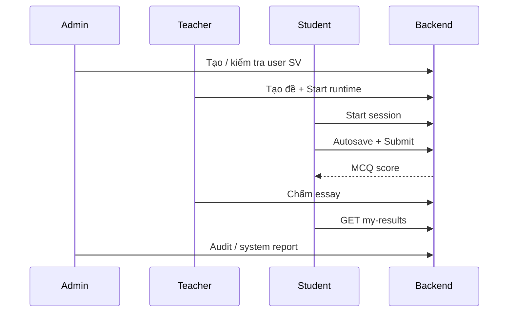

# Chiến lược kiểm thử — Role Admin & Student

Tài liệu này mô tả **phạm vi**, **thứ tự ưu tiên**, **kịch bản** và **tiêu chí pass/fail** khi test hai vai trò **Admin** và **Sinh viên (Student)**. Bổ sung cho [TEST_GUIDE_TEACHER_UI.md](./TEST_GUIDE_TEACHER_UI.md) (dành cho Giáo viên).

**Cập nhật:** 2026-05-19

---

## 1. Mục tiêu kiểm thử

| Mục tiêu | Mô tả |
|----------|--------|
| **Phân quyền** | Admin / Student chỉ truy cập đúng menu và API; từ chối trái vai trò (403 / redirect). |
| **Luồng nghiệp vụ cốt lõi** | Admin quản trị hệ thống; SV làm bài → nộp → xem kết quả. |
| **Tính toàn vẹn dữ liệu** | Điểm MCQ, autosave, session, audit log nhất quán sau thao tác. |
| **Sẵn sàng demo / bảo vệ** | Chạy được end-to-end trên local và production với dữ liệu seed CNTT 16-02. |

---

## 2. Môi trường & chuẩn bị

### 2.1 Chạy ứng dụng

```bash
# Terminal 1 — Backend
cd BackEnd/server
cp .env.example .env   # nếu chưa có
npm install
npm run migrate
npm run dev            # http://localhost:5000

# Terminal 2 — Frontend
cd FrontEnd/client
npm install
npm run dev            # http://localhost:5173
```

### 2.2 Dữ liệu demo (khuyến nghị)

```bash
cd BackEnd/server
npm run assign-teacher-class          # GV → CNTT 16-02
npx ts-node -r tsconfig-paths/register scripts/seed-students-cntt1602.ts
npx ts-node -r tsconfig-paths/register scripts/seed-demo-exams.ts
npm run fix-mcq-answers               # nếu MCQ lưu sai định dạng A–D
```

**Lưu ý migration:** `025_accounts_password_plain.sql` (cột mật khẩu hiển thị cho GV) — chạy `npm run migrate` trên mọi môi trường mới.

### 2.3 Tài khoản test

| Role | Email | Mật khẩu | Ghi chú |
|------|-------|----------|---------|
| **Admin** | `admin01@system.local` | `Test@123` | Toàn quyền quản trị |
| **Student (seed cũ)** | `sv01@system.local` | `Test@123` | Có thể chưa gán lớp CNTT 16-02 |
| **Student (lớp CNTT 16-02)** | `1671020190@student.dainam.edu.vn` | `Test@123` | Ví dụ: Nguyễn Ngọc Bảo Long |
| **Teacher** (phụ thuộc SV) | `gv01@system.local` | `Test@123` | Tạo/mở đề, chấm TL — xem guide GV |

Frontend map role: DB `student` → authority `user`; DB `admin` → `admin` + `user` (admin có thể vào cả route SV).

### 2.4 Kim tự tháp kiểm thử

```
        ┌─────────────┐
        │  E2E / UI   │  ← Checklist trong doc này (ưu tiên cao trước bảo vệ)
        ├─────────────┤
        │ API / Postman│  ← curl, OpenAPI (BackEnd/server/API.md)
        ├─────────────┤
        │ Unit (Vitest)│  ← npm test (auth, grading, exam…)
        └─────────────┘
```

```bash
cd BackEnd/server && npm test
cd FrontEnd/client && npm test
```

---

## 3. Ma trận phân quyền (smoke bắt buộc)

Chạy **trước** khi test chi tiết từng màn.

| Route / API | Admin | Student | Kỳ vọng SV |
|-------------|:-----:|:-------:|------------|
| `/admin/students` | ✅ | ❌ | 403 hoặc không thấy menu |
| `/admin/subjects` | ✅ | ❌ | |
| `/admin/password-resets` | ✅ | ❌ | |
| `/admin/audit-logs` | ✅ | ❌ | |
| `/admin/system-report` | ✅ | ❌ | |
| `/proctoring` (danh sách) | ✅ | ❌ | |
| `/teacher/students` | ❌ | ❌ | Chỉ teacher |
| `/exams`, `/exam/:id` | ✅* | ✅ | *Admin như GV trên UI |
| `/my-results`, `/prediction` | ✅ | ✅ | |
| `/grading`, `/question-bank` | ✅ | ❌ | |
| `POST .../sessions` (bắt đầu thi) | ❌** | ✅ | **Admin không start session SV |

**API mẫu (thay `TOKEN`):**

```bash
# Đăng nhập
curl -s -X POST "http://localhost:5000/v1/auth/login" \
  -H "Content-Type: application/json" \
  -d "{\"email\":\"admin01@system.local\",\"password\":\"Test@123\"}"

# SV gọi admin API → 403
curl -s "http://localhost:5000/v1/users" -H "Authorization: Bearer TOKEN_STUDENT"
```

---

## 4. Chiến lược test — Role ADMIN

### 4.1 Phạm vi chức năng

| # | Module | URL | Ưu tiên |
|---|--------|-----|---------|
| A1 | Dashboard | `/main` | P1 |
| A2 | Quản lý tài khoản (SV/GV/Admin) | `/admin/students` | P1 |
| A3 | Quản lý môn học | `/admin/subjects` | P2 |
| A4 | Nhật ký hệ thống | `/admin/audit-logs` | P2 |
| A5 | Báo cáo hệ thống | `/admin/system-report` | P2 |
| A6 | Duyệt reset mật khẩu | `/admin/password-resets` | P1 |
| A7 | Giám thị (danh sách ca thi) | `/proctoring` | P2 |
| A8 | Bài thi / Ngân hàng câu / Chấm điểm | `/exams`, `/question-bank`, `/grading` | P1 (dùng chung GV) |
| A9 | Phân tích điểm | `/score-analytics` | P3 |
| A10 | Đổi mật khẩu cá nhân | `/profile` | P2 |

### 4.2 Kịch bản P1 — Admin (bắt buộc pass)

#### A1 — Dashboard
- [ ] Đăng nhập `admin01@system.local` → vào `/main`
- [ ] Sidebar có nhóm **Quản lý sinh viên**, **Công cụ quản trị**
- [ ] Metric / hoạt động gần đây tải không lỗi (không crash khi DB trống)

#### A2 — Quản lý tài khoản (`/admin/students`)
- [ ] Danh sách user tải được (API `GET /v1/users`)
- [ ] **Thêm** tài khoản: họ tên, username, email, role, mật khẩu → xuất hiện trong bảng
- [ ] **Xóa** tài khoản test → biến mất khỏi danh sách
- [ ] Lọc/ hiển thị đúng role (student / teacher / admin)
- [ ] **Không** trùng email hoặc username khi thêm (409 + thông báo)

#### A6 — Reset mật khẩu (`/admin/password-resets`)
- [ ] Có danh sách yêu cầu (nếu SV đã gửi yêu cầu)
- [ ] **Duyệt** yêu cầu → SV đăng nhập được bằng mật khẩu mới
- [ ] **Từ chối** → trạng thái cập nhật, SV không đổi được mật khẩu qua link cũ

#### A8 — Vòng đời đề thi (phối hợp GV hoặc tự làm Admin)
- [ ] Tạo đề (`/exams/new`): lớp, môn, thời gian, số mã đề
- [ ] Gán câu hỏi (ngân hàng hoặc import)
- [ ] **Start runtime** → SV thấy đề ở trạng thái có thể vào thi
- [ ] Vào **Chấm điểm** → chấm câu tự luận (nếu có) → điểm cập nhật

### 4.3 Kịch bản P2 — Admin

#### A3 — Môn học
- [ ] Xem danh sách môn (52 môn CNTT hoặc subset seed)
- [ ] Thêm / sửa / xóa môn (nếu UI hỗ trợ)
- [ ] `credits`, `code`, `semester` lưu đúng

#### A4 — Audit logs
- [ ] Bảng log có: thời gian, actor, action, resource
- [ ] Phân trang / lọc theo thời gian (nếu có)
- [ ] Sau thao tác đăng nhập / tạo đề → có bản ghi mới (tùy cấu hình audit)

#### A5 — Báo cáo hệ thống
- [ ] Số SV, số đề, số phiên thi hiển thị hợp lý (≥ 0, khớp DB)
- [ ] Không lỗi khi DB lớn (timeout)

#### A7 — Giám thị
- [ ] Danh sách ca thi đang / đã mở
- [ ] Vào chi tiết `/proctoring/:examId` → thấy SV online / vi phạm (nếu có socket)

### 4.4 Kịch bản âm tính — Admin

- [ ] Đăng xuất → không truy cập `/admin/*` bằng URL trực tiếp (redirect login)
- [ ] Token hết hạn → API 401, UI đẩy về trang đăng nhập
- [ ] Không xóa chính tài khoản admin đang đăng nhập (nếu có guard)

---

## 5. Chiến lược test — Role STUDENT

### 5.1 Phạm vi chức năng

| # | Module | URL | Ưu tiên |
|---|--------|-----|---------|
| S1 | Dashboard | `/main` | P1 |
| S2 | Danh sách bài thi | `/exams` | P1 |
| S3 | Làm bài thi | `/exam/:examId` | P1 |
| S4 | Nộp bài & kết quả | submit → `/result/:examId` | P1 |
| S5 | Kết quả của tôi | `/my-results` | P1 |
| S6 | Dự đoán điểm (nếu bật) | `/prediction` | P3 |
| S7 | Đổi mật khẩu / Quên MK | `/profile`, `/reset-password` | P2 |
| S8 | Thông báo | Header bell | P3 |

**Không thuộc SV:** tạo đề, chấm bài, quản lý user, giám thị toàn hệ thống.

### 5.2 Điều kiện tiên quyết cho S3–S4

1. GV (hoặc Admin) đã **tạo đề** gán lớp **CNTT 16-02**
2. Đề đã **Start** (runtime active, trong khung giờ thi)
3. SV đăng nhập thuộc đúng `admin_class_id` của đề
4. MCQ đã fix định dạng đáp án `A`–`D` (`npm run fix-mcq-answers`)

### 5.3 Kịch bản P1 — Student (bắt buộc pass)

#### S1 — Đăng nhập & menu
- [ ] Đăng nhập `1671020190@student.dainam.edu.vn` / `Test@123`
- [ ] Sidebar **không** có: Quản lý user, Audit, System report, Chấm điểm, Tạo đề
- [ ] Có: Dashboard, Danh sách bài thi, Kết quả của tôi, Đổi mật khẩu

#### S2 — Danh sách bài thi
- [ ] Chỉ thấy đề thuộc lớp của SV (CNTT 16-02)
- [ ] Trạng thái: Chưa mở / Đang thi / Đã nộp / Hết hạn — hiển thị đúng
- [ ] Không thấy đề lớp khác (nếu có seed)

#### S3 — Làm bài (`/exam/:examId`)
- [ ] Bấm **Làm bài thi** từ `/exams` → trình duyệt **tự bật toàn màn hình** (bắt buộc), vào phòng thi
- [ ] Chỉ **một** khối UI fullscreen (không trùng 2 card); nếu từ chối fullscreen → một nút bật lại trong cùng màn chờ GV
- [ ] GV Start → đề mở khi đã fullscreen; nếu thoát fullscreen → một nút “Bật toàn màn hình và làm bài”
- [ ] Tạo session, hiển thị câu hỏi
- [ ] **MCQ:** chọn đáp án A–D, autosave (đợi vài giây, F5 vẫn giữ đáp án)
- [ ] **Tự luận:** nhập text, autosave
- [ ] **Đồng hồ** đếm ngược đúng `duration_min` / deadline
- [ ] **Cấm** copy/paste hoặc tab switch (nếu bật proctoring) → ghi nhận vi phạm
- [ ] Chuyển câu (panel số câu), đánh dấu “để sau”

#### S4 — Nộp bài
- [ ] **Nộp bài** → xác nhận → redirect `/result/:examId`
- [ ] Điểm MCQ hiển thị ngay (nếu đã chấm tự động)
- [ ] Câu TL: trạng thái “Chờ chấm” cho đến khi GV chấm
- [ ] **Nộp lần 2** cùng đề → bị chặn hoặc chỉ xem kết quả (theo rule hệ thống)

#### S5 — Kết quả của tôi
- [ ] `/my-results` liệt kê các phiên đã nộp
- [ ] Bấm xem chi tiết → điểm, %, ngày nộp khớp với lần thi vừa rồi
- [ ] Sau khi GV chấm TL → điểm tổng cập nhật

### 5.4 Kịch bản P2 — Student

#### S7 — Mật khẩu
- [ ] Đổi MK tại `/profile` → đăng xuất → đăng nhập MK mới
- [ ] Flow **quên mật khẩu** (email) → Admin duyệt → reset thành công

#### S8 — Edge cases thi
- [ ] Hết giờ → tự nộp hoặc khóa chỉnh sửa
- [ ] Mất mạng giữa chừng → reconnect, autosave khôi phục
- [ ] Đề chưa Start → không vào được phòng thi (thông báo rõ)

### 5.5 Kịch bản âm tính — Student

- [ ] URL `/admin/students` → từ chối
- [ ] API `POST /v1/users` → 403
- [ ] API `POST /v1/exams` (tạo đề) → 403
- [ ] Sửa đề người khác qua API → 403
- [ ] Tài khoản `is_active = false` → không đăng nhập được

---

## 6. Luồng tích hợp Admin ↔ Student (E2E đề xuất)

Chạy **một vòng** trước buổi demo bảo vệ (≈ 45–60 phút).



| Bước | Người thực hiện | Hành động | Pass criteria |
|------|------------------|-----------|---------------|
| 1 | Admin | Kiểm tra SV `1671020190@...` tồn tại, `is_active` | Login SV OK |
| 2 | GV | Mở đề demo (vd. NET301), Start | SV thấy “Đang thi” |
| 3 | SV | Làm 5 câu MCQ + 1 TL, nộp | Session `submitted` |
| 4 | SV | Mở `/my-results` | Có dòng điểm tạm |
| 5 | GV | Chấm TL | `grading_status = complete` |
| 6 | SV | Refresh kết quả | Điểm tổng tăng |
| 7 | Admin | Mở audit / system report | Số liệu ≥ 1 session |

---

## 7. Kiểm thử production

| Hạng mục | Local | Production |
|----------|-------|------------|
| URL FE | `http://localhost:5173` | Vercel preview / production |
| URL API | `http://localhost:5000/v1` | `https://api.nhongplus.id.vn/v1` |
| Migrate | `npm run migrate` | Chạy trên Render / Neon trước deploy |
| Seed | Script local | Chỉ khi DB staging trống |
| Socket giám thị | ws://localhost:5000 | wss + CORS đúng domain |

**Smoke production (15 phút):**
1. Login Admin + 1 SV CNTT 16-02  
2. SV vào 1 đề đang mở → nộp  
3. Admin mở system report (không 500)  

---

## 8. Báo cáo lỗi & tiêu chí hoàn thành

### 8.1 Mức độ ưu tiên bug

| Mức | Định nghĩa | Ví dụ |
|-----|------------|-------|
| **Blocker** | Không demo được | SV không nộp được; login fail hàng loạt |
| **Critical** | Sai nghiệp vụ chính | MCQ luôn 0 điểm; lộ đề lớp khác |
| **Major** | Workaround được | Phân trang lỗi; export CSV sai encoding |
| **Minor** | UI / copy | Nhãn tiếng Việt thiếu; căn lề |

### 8.2 Definition of Done (Admin + Student)

- [ ] 100% kịch bản **P1** (mục 4.2 + 5.3) pass trên local  
- [ ] Ma trận phân quyền (mục 3) pass  
- [ ] E2E một vòng (mục 6) pass  
- [ ] Smoke production pass  
- [ ] Không bug **Blocker** / **Critical** mở  

### 8.3 Template ghi nhận kết quả

```text
[ID] A2-01 — Thêm user trùng email
Steps: Admin → /admin/students → thêm email đã tồn tại
Expected: 409, thông báo tiếng Việt
Actual: ...
Status: Pass | Fail
Env: local | prod
```

---

## 9. Tài liệu liên quan

| File | Nội dung |
|------|----------|
| [TEST_GUIDE_TEACHER_UI.md](./TEST_GUIDE_TEACHER_UI.md) | Test chi tiết từng màn Giáo viên |
| [BackEnd/server/API.md](./BackEnd/server/API.md) | Contract REST |
| [DO_AN_MASTER.md](./DO_AN_MASTER.md) | Kiến trúc & tiến độ đồ án |
| [BackEnd/server/TEST_PLAN_TASKS_1_2_7.md](./BackEnd/server/TEST_PLAN_TASKS_1_2_7.md) | Timer & proctoring |

---

## 10. Phụ lục — Checklist nhanh in ra (1 trang)

### Admin — 10 phút
- [ ] Login admin01  
- [ ] /admin/students — list + thêm/xóa test user  
- [ ] /admin/password-resets — mở được  
- [ ] /admin/audit-logs — có dữ liệu hoặc empty OK  
- [ ] /admin/system-report — số liệu load  
- [ ] Không vào /teacher/students  

### Student — 15 phút
- [ ] Login SV CNTT 16-02  
- [ ] /exams — thấy đề đang mở  
- [ ] Làm + nộp 1 đề  
- [ ] /my-results — có bản ghi  
- [ ] Không vào /admin/*  
- [ ] Không thấy menu Tạo đề / Chấm bài  
