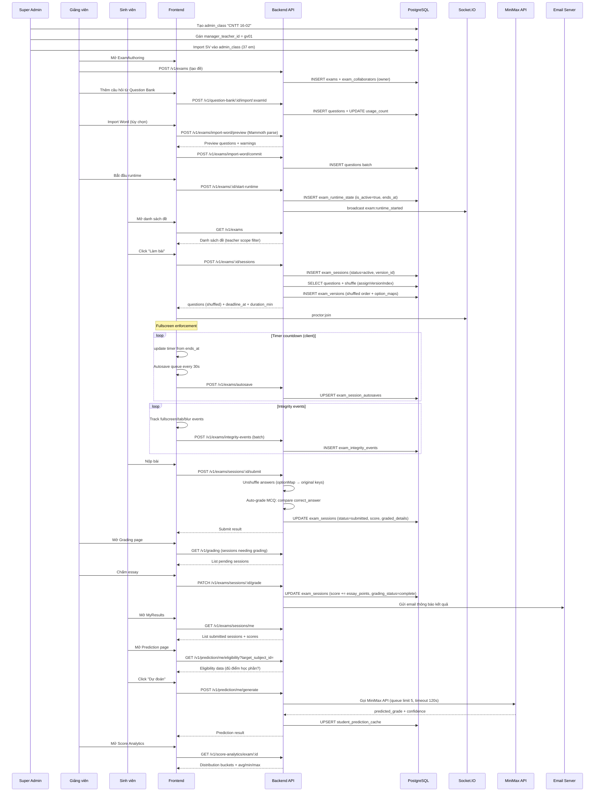
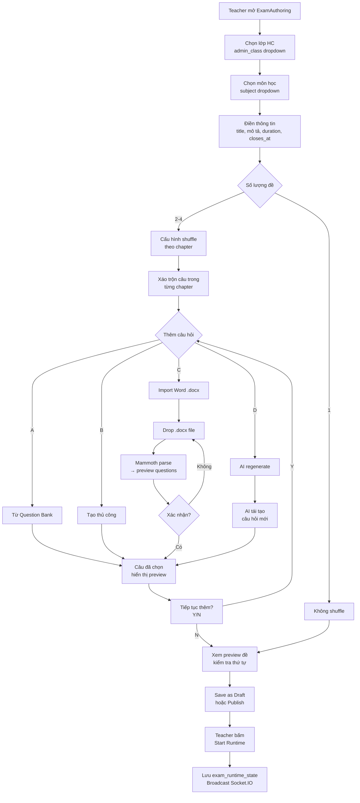
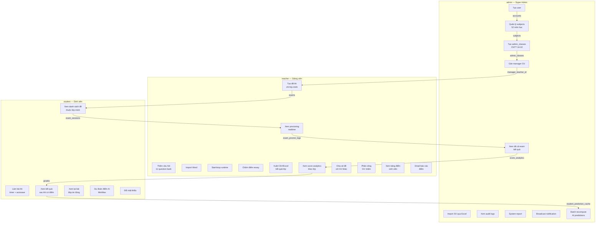

# TỔNG HỢP ĐỒ ÁN TỐT NGHIỆP

## Hệ thống thi trực tuyến (Online Examination System)

**Mã nguồn:** `C:\VS-Code\GraduationProject`  
**Ngày cập nhật:** 2026-05-21  
**Tổng số model (backend):** 31  
**Tổng số router (API):** 25  
**Tổng số trang (frontend):** 33+  
**Tổng số migration:** 37

---

## Mục lục

1. [Tổng quan hệ thống](#1-tổng-quan-hệ-thống)
2. [Kiến trúc tổng thể](#2-kiến-trúc-tổng-thể)
3. [Cấu trúc thư mục](#3-cấu-trúc-thư-mục)
4. [Tài khoản hệ thống](#4-tài-khoản-hệ-thống)
5. [Danh sách bảng Cơ sở Dữ liệu](#5-danh-sách-bảng-cơ-sở-dữ-liệu)
6. [Danh sách đầu API](#6-danh-sách-đầu-api)
7. [Frontend — Trang và chức năng](#7-frontend--trang-và-chức-năng)
8. [Các chức năng chính](#8-các-chức-năng-chính)
9. [Sơ đồ quan hệ thực thể (ER)](#9-sơ-đồ-quan-hệ-thực-thể-er)
10. [Sơ đồ luồng nghiệp vụ](#10-sơ-đồ-luồng-nghiệp-vụ)
11. [Socket.IO — Thời gian thực](#11-socketio--thời-gian-thực)
12. [Chi tiết Interface và Type Definitions](#12-chi-tiết-interface-và-type-definitions)
13. [Các file tài liệu](#13-các-file-tài-liệu)
14. [Database Migrations](#14-database-migrations)

---

## 1. Tổng quan hệ thống

### 1.1 Mô tả

Hệ thống thi trực tuyến (Online Examination System) là một ứng dụng web full-stack xây dựng bằng TypeScript, phục vụ quy trình thi trực tuyến trong môi trường đại học. Hệ thống hỗ trợ đầy đủ vòng đời thi: từ tạo đề thi, làm bài, giám sát (proctoring), chấm điểm tự động/thủ công, đến thống kê và dự đoán kết quả bằng AI.

### 1.2 Các vai trò

| Vai trò | Key trong code | Mô tả | Phạm vi |
|---------|---------------|--------|---------|
| **admin** | `"admin"` (enum `user_role`) | Quản trị viên (Super admin) | Toàn hệ thống: tài khoản, lớp hành chính, danh mục môn, xuất điểm mọi lớp |
| **teacher** | `"teacher"` | Giảng viên (Manager lớp) | Một `admin_class` duy nhất: quản lý SV, tạo đề thi, chấm điểm, xuất bảng điểm lớp mình |
| **student** | `"student"` | Sinh viên | Thuộc một `admin_class`; chỉ thấy đề và điểm trong phạm vi lớp mình |

### 1.3 Business Rules cốt lõi

1. **1 GV quản lý 1 lớp HC:** `admin_classes.manager_teacher_id` là UNIQUE (hoặc bảng gán 1–1)
2. **Không có đăng ký công khai:** sinh viên / giảng viên chỉ đăng nhập; tài khoản do admin tạo
3. **Xuất bảng điểm:** GV lọc theo `admin_class_id` được gán; super admin không giới hạn lớp
4. **Server-authoritative runtime:** Khi hết giờ realtime (`exam:force_submit`), server tự động force-submit toàn bộ phiên còn `active`, ưu tiên dùng autosave snapshot mới nhất nếu có

### 1.4 Tính năng nổi bật

- Đề thi hỗ trợ câu hỏi trắc nghiệm (MCQ) và tự luận (essay)
- Media upload (audio/video/image, max 25MB) qua Cloudinary
- Import đề thi từ file Word (.docx) kèm AI-assisted regeneration (Mammoth)
- Timer đồng bộ server (`exam_runtime_state`) — persist khi server restart
- Auto-save định kỳ (30s) trong quá trình làm bài, dùng cho force-submit recovery
- Giám sát toàn màn hình (fullscreen) và integrity events (tab switch, copy/paste, window blur)
- Proctoring thời gian thực qua Socket.IO với presence heartbeat 5s
- Ngân hàng câu hỏi (question bank) có thể tái sử dụng, có usage_count
- Xáo trộn câu hỏi theo chương (shuffle) với đáp án deterministic theo student_id hash (Fisher-Yates seeded)
- Chấm điểm tự động MCQ, chấm tay tự luận (grading assignments cho nhiều GV)
- Thống kê điểm theo 5 bucket ranges: 0-20%, 20-40%, 40-60%, 60-80%, 80-100%
- Dự đoán điểm bằng AI MiniMax với 3-tier architecture: predict (free) → evaluate (AI) → full-report
- Đa ngôn ngữ (Tiếng Việt / English / 日本語) qua i18next
- Email thông báo deadline (24h và 1h trước) qua Nodemailer (SMTP)
- Audit log toàn hệ thống (22 loại action: login, logout, create/delete exam, grading, password reset…)
- Chia sẻ đề thi giữa các lớp + phân công giảng viên cộng tác chấm điểm
- Excel/CSV export kết quả thi

---

## 2. Kiến trúc tổng thể

```
┌──────────────────────────────────────────────────────────┐
│                   Browser (Client)                        │
│          React 19 + TypeScript + Vite 7                  │
│          Mantine v8 (UI components)                      │
│          Redux Toolkit (state management)                 │
│          React Router v7 (routing)                        │
│          Socket.IO client + i18next + Axios              │
└──────────────────────────┬─────────────────────────────────┘
                           │ HTTPS / HTTP
                           │ REST API v1 + WebSocket
┌──────────────────────────▼─────────────────────────────────┐
│                Backend — Node.js / Express               │
│               TypeScript + Express 5                      │
│  ┌─────────────────┐ ┌──────────────────┐ ┌────────────┐   │
│  │  Controllers    │ │    Services      │ │   Jobs     │   │
│  │    (20+)       │ │     (30+)       │ │ (deadline) │   │
│  └─────────────────┘ └──────────────────┘ └────────────┘   │
│  ┌─────────────────┐ ┌──────────────────┐ ┌────────────┐   │
│  │    Models       │ │   Middlewares    │ │  Socket.IO │   │
│  │     (31)        │ │  (auth/RBAC)     │ │ (proctor)  │   │
│  └─────────────────┘ └──────────────────┘ └────────────┘   │
│                                                            │
│  PostgreSQL (Neon)  │  Cloudinary (media)  │  MiniMax AI     │
│  37 SQL migrations  │  SMTP (Nodemailer)   │                │
└────────────────────────────────────────────────────────────┘
```

### Stack công nghệ chi tiết

| Lớp | Công nghệ | Version |
|-----|-----------|---------|
| Frontend | React | 19 |
| Frontend | TypeScript | 5 |
| Frontend | Vite | 7 |
| Frontend | Mantine | v8 |
| Frontend | Redux Toolkit | latest |
| Frontend | React Router | v7 |
| Frontend | Socket.IO client | latest |
| Frontend | i18next | latest |
| Frontend | Axios | latest |
| Backend | Node.js | LTS |
| Backend | TypeScript | 5 |
| Backend | Express | 5 |
| Database | PostgreSQL | (Neon serverless) |
| Realtime | Socket.IO | server |
| Auth | JWT + bcrypt | cost 12 |
| Media | Cloudinary | - |
| Email | Nodemailer | SMTP |
| Word parsing | Mammoth | .docx import |
| AI | MiniMax API | grade prediction |
| Validation | Joi | request validation |

---

## 3. Cấu trúc thư mục

```
GraduationProject/
├── BackEnd/server/
│   ├── src/
│   │   ├── controllers/          # 20+ request handlers
│   │   │   ├── auth.controller.ts
│   │   │   ├── user.controller.ts
│   │   │   ├── adminClass.controller.ts
│   │   │   ├── adminSystemReport.controller.ts
│   │   │   ├── exam.controller.ts
│   │   │   ├── examSession.controller.ts
│   │   │   ├── examSharing.controller.ts
│   │   │   ├── export.controller.ts
│   │   │   ├── notification.controller.ts
│   │   │   ├── prediction.controller.ts
│   │   │   ├── program.controller.ts
│   │   │   ├── questionBank.controller.ts
│   │   │   ├── scoreAnalytics.controller.ts
│   │   │   ├── shuffle.controller.ts
│   │   │   ├── subject.controller.ts
│   │   │   ├── subjectCatalog.controller.ts
│   │   │   ├── subjectGroup.controller.ts
│   │   │   ├── teacherStudent.controller.ts
│   │   │   ├── gradePredictor.controller.ts
│   │   │   ├── passwordReset.controller.ts
│   │   │   └── class.controller.ts
│   │   ├── routes/v1/             # 25 routers (API route definitions)
│   │   │   ├── index.ts           # Mount tất cả routers vào /v1
│   │   │   ├── authRouter.ts
│   │   │   ├── userRouter.ts
│   │   │   ├── examRouter.ts       # Main exam router (phức tạp nhất)
│   │   │   ├── examSessionRouter.ts
│   │   │   ├── adminClassRouter.ts
│   │   │   ├── subjectRouter.ts
│   │   │   ├── programRouter.ts
│   │   │   ├── subjectGroupRouter.ts
│   │   │   ├── questionBankRouter.ts
│   │   │   ├── dashboardRouter.ts
│   │   │   ├── classRouter.ts
│   │   │   ├── scoreAnalyticsRouter.ts
│   │   │   ├── auditLogRouter.ts
│   │   │   ├── systemReportRouter.ts
│   │   │   ├── notificationRouter.ts
│   │   │   ├── predictionRouter.ts
│   │   │   ├── gradePredictorRouter.ts
│   │   │   ├── passwordResetRouter.ts
│   │   │   ├── examSharingRouter.ts
│   │   │   ├── examCollaboratorsRouter.ts
│   │   │   ├── exportRouter.ts
│   │   │   ├── shuffleRouter.ts
│   │   │   ├── teacherStudentsRouter.ts
│   │   │   └── boardRouter.ts      # (chưa mount trong index.ts)
│   │   ├── services/              # 30+ business logic services
│   │   │   ├── auth.service.ts
│   │   │   ├── exam.service.ts
│   │   │   ├── predictionBatch.service.ts
│   │   │   ├── predictionStudent.service.ts
│   │   │   ├── aiEvaluator.service.ts
│   │   │   ├── examImport.service.ts
│   │   │   ├── examAutosave.service.ts
│   │   │   ├── cloudinary.service.ts
│   │   │   ├── email.service.ts
│   │   │   ├── gradePredictor.service.ts
│   │   │   ├── scoreAnalytics.service.ts
│   │   │   ├── dashboard.service.ts
│   │   │   └── ... (nhiều service khác)
│   │   ├── models/                 # 31 database models (queries)
│   │   │   ├── user.model.ts       → bảng `accounts`
│   │   │   ├── exam.model.ts       → bảng `exams`
│   │   │   ├── examsession.model.ts → bảng `exam_sessions`
│   │   │   ├── question.model.ts   → bảng `questions`
│   │   │   ├── class.model.ts      → bảng `classes`
│   │   │   ├── enrollment.model.ts → bảng `enrollments`
│   │   │   ├── adminClass.model.ts → bảng `admin_classes`
│   │   │   ├── subject.model.ts    → bảng `subjects`
│   │   │   ├── grade.model.ts     → bảng `grades`
│   │   │   ├── assignment.model.ts  → bảng `assignments`
│   │   │   ├── program.model.ts    → bảng `programs`
│   │   │   ├── subjectGroup.model.ts → bảng `subject_groups`
│   │   │   ├── examIntegrity.model.ts → bảng `exam_integrity_events`
│   │   │   ├── examProctor.model.ts → bảng `exam_proctor_presence` + `exam_proctor_logs`
│   │   │   ├── examAutosave.model.ts → bảng `exam_session_autosaves`
│   │   │   ├── examVersion.model.ts → bảng `exam_versions`
│   │   │   ├── examShuffle.model.ts → bảng `exam_shuffle` (config)
│   │   │   ├── examRuntimeState.model.ts → bảng `exam_runtime_state`
│   │   │   ├── examSharing.model.ts → bảng `exam_shares` + `grading_assignments`
│   │   │   ├── examCollaborators.model.ts → bảng `exam_collaborators`
│   │   │   ├── questionBank.model.ts → bảng `question_bank`
│   │   │   ├── dashboard.model.ts   → view queries (student/teacher/admin overview)
│   │   │   ├── scoreAnalytics.model.ts → view queries (distribution)
│   │   │   ├── studentPredictionCache.model.ts → bảng `student_prediction_cache`
│   │   │   ├── userNotification.model.ts → bảng `user_notifications`
│   │   │   ├── auditLog.model.ts   → bảng `audit_logs`
│   │   │   ├── user_session.model.ts → bảng `user_sessions`
│   │   │   ├── passwordReset.model.ts → bảng `password_reset_requests`
│   │   │   ├── passwordResetToken.model.ts → bảng `password_reset_tokens`
│   │   │   ├── examDeadlineNotification.model.ts → bảng `exam_deadline_notifications`
│   │   │   ├── adminSystemReport.model.ts → tổng hợp system report
│   │   │   └── index.ts            # Export pool duy nhất
│   │   ├── middlewares/           # auth.middleware.ts, role.middleware.ts
│   │   ├── jobs/                  # Background jobs (deadline reminders)
│   │   ├── emails/                # Email templates
│   │   ├── utils/                 # Helpers: pagination, grade scale, predictionAiQueue
│   │   ├── validation/            # Joi validation schemas
│   │   ├── config/               # environment.ts, db.ts (pool)
│   │   └── db/migrations/         # 37 SQL files (001 → 033)
│   ├── docs/
│   │   ├── ROLES_AND_PERMISSIONS.md
│   │   └── EMAIL_SETUP.md
│   └── scripts/                   # Seed, demo generators
│
├── FrontEnd/client/
│   ├── src/
│   │   ├── pages/main/
│   │   │   ├── Dashboard/
│   │   │   │   ├── Dashboard.tsx
│   │   │   │   ├── StudentDashboard.tsx    # stats, upcoming, recent results, chart
│   │   │   │   └── AdminDashboard.tsx
│   │   │   ├── Exam/
│   │   │   │   ├── ExamList.tsx
│   │   │   │   ├── ExamAuthoring.tsx       # full exam creation UI (1086 lines)
│   │   │   │   ├── ExamTake.tsx            # exam taking interface (1313 lines)
│   │   │   │   ├── ExamSessions.tsx
│   │   │   │   ├── ExamResult.tsx
│   │   │   │   ├── MyResults.tsx
│   │   │   │   ├── QuestionBank.tsx
│   │   │   │   ├── ScoreAnalytics.tsx
│   │   │   │   ├── ExamQuestionBankPicker.tsx
│   │   │   │   ├── Prediction.tsx
│   │   │   │   └── examResultDisplay.tsx
│   │   │   ├── Admin/
│   │   │   │   ├── StudentManagement.tsx   # (676 lines)
│   │   │   │   ├── AdminClassManagement.tsx
│   │   │   │   ├── SubjectCatalogManagement.tsx
│   │   │   │   ├── SubjectManagement.tsx
│   │   │   │   ├── ProgramManagement.tsx
│   │   │   │   ├── PasswordResetManagement.tsx
│   │   │   │   ├── AuditLogPage.tsx
│   │   │   │   └── SystemReportPage.tsx
│   │   │   ├── Teacher/
│   │   │   │   ├── TeacherStudents.tsx
│   │   │   │   └── StudentTranscriptModal.tsx
│   │   │   ├── Grading/
│   │   │   │   ├── GradingIndex.tsx
│   │   │   │   ├── GradingList.tsx
│   │   │   │   └── Grading.tsx
│   │   │   ├── Proctoring/
│   │   │   │   ├── ProctoringDashboard.tsx
│   │   │   │   └── ProctoringList.tsx
│   │   │   └── Profile/
│   │   │       └── Profile.tsx
│   │   ├── components/
│   │   │   ├── Layout/
│   │   │   ├── NavBar/
│   │   │   ├── SideBar/
│   │   │   ├── Button/          # ButtonFilled, ButtonOutline, ButtonLight, ButtonTransparent
│   │   │   ├── Input/           # InputText, InputPassword, InputNumber, InputCheckbox, InputSelect, SubjectCategoryPicker, SearchableSelect, SchedulingPanel
│   │   │   ├── ExamTake/        # ExamTakeHeader, ExamQuestionPanel, McqOptionList, QuestionNavigator, ExamAudioPlayer, ExamVideoPlayer
│   │   │   ├── StatsSection/
│   │   │   ├── RecentResults/
│   │   │   ├── UpcomingExamsTable/
│   │   │   ├── PerformanceChart/
│   │   │   ├── EmptyState/
│   │   │   ├── PageHeader/
│   │   │   ├── ListPagination/
│   │   │   ├── LoadingScreen/
│   │   │   ├── NavigationPatterns/  # ContentTabs, SegmentedControls, OrderedList, StandardNumeric, HorizontalProgress, SectionProgressVertical
│   │   │   └── SwitchLanguage/
│   │   ├── services/           # Frontend API clients (examApi, adminClassApi, authApi, userApi, subjectApi, listApi, questionBankApi, teacherStudentsApi, programApi)
│   │   ├── hooks/              # Custom hooks (useAuth, useExamTakeState, useSubjectPickerCatalog)
│   │   ├── configs/routes.config/
│   │   │   ├── routes.config.ts
│   │   │   └── authRoute.tsx
│   │   └── pages/main/Exam/services/  # examAutosaveClient, examIntegrityClient, examRealtimeSocket, proctoringSocket
│   └── public/
│       ├── _redirects           # Netlify/Cloudflare Pages
│       ├── .htaccess            # Apache
│       └── vercel.json          # Vercel SPA fallback
│
├── docs/
│   ├── DOMAIN_MODEL.md           # Mermaid ER diagrams, 52 subjects, prerequisite chains
│   └── ...
├── scripts/
│   ├── seed-students-cntt1602.ts
│   ├── thesis_assets/diagrams.py
│   └── generate_bao_cao_do_an.py
├── DO_AN_MASTER.md
├── TEST_STRATEGY_ADMIN_STUDENT.md
└── README.md
```

---

## 4. Tài khoản hệ thống

Mật khẩu mặc định (test): **`Test@123`** (bcrypt cost 12, lưu trong `hashed_password` và `password_plain` cho test)

| Vai trò | Email |
|---------|-------|
| Admin | `admin01@system.local` |
| Giảng viên 1 | `gv01@system.local` |
| Giảng viên 2 | `gv02@system.local` |
| Giảng viên 3 | `gv03@system.local` |
| Sinh viên | `sv01@system.local` … `sv37@system.local` (37 em) |

---

## 5. Danh sách bảng Cơ sở Dữ liệu

### 5.1 Bảng người dùng & xác thực

| # | Tên bảng | File model | Columns chính |
|---|----------|-----------|---------------|
| 1 | `accounts` | `user.model.ts` | id, email, username, hashed_password, password_plain, role (admin/teacher/student), full_name, is_active, first_login, admin_class_id, created_at, updated_at |
| 2 | `user_sessions` | `user_session.model.ts` | id, user_id, device_id, device_info, token_hash, is_active, created_at, expires_at, last_active_at |
| 3 | `password_reset_requests` | `passwordReset.model.ts` | id, user_id, requested_by, status (pending/approved/rejected/expired), admin_note, new_password_plain, expires_at, created_at |
| 4 | `password_reset_tokens` | `passwordResetToken.model.ts` | id, user_id, token, expires_at, used, used_at, created_at |

### 5.2 Bảng lớp hành chính & môn học

| # | Tên bảng | File model | Columns chính |
|---|----------|-----------|---------------|
| 5 | `admin_classes` | `adminClass.model.ts` | id, program_id, program_code, intake_year, section, display_name, manager_teacher_id, expected_size, created_at |
| 6 | `admin_class_members` | (qua accounts.admin_class_id) | — |
| 7 | `classes` | `class.model.ts` | id, subject_id, teacher_id, semester, year, created_at |
| 8 | `enrollments` | `enrollment.model.ts` | id, class_id, student_id, enrolled_at |
| 9 | `subjects` | `subject.model.ts` | id, name, code, credits, semester, category (6 groups), sub_category, subject_group_id, program_id, prerequisites UUID[], is_active, created_at |
| 10 | `programs` | `program.model.ts` | id, code, name, description, is_active, created_at |
| 11 | `subject_groups` | `subjectGroup.model.ts` | id, program_id, code, name, description, sort_order, is_active, created_at |
| 12 | `program_teachers` | (qua program.model.ts) | program_id, teacher_id |

### 5.3 Bảng đề thi & phiên thi

| # | Tên bảng | File model | Columns chính |
|---|----------|-----------|---------------|
| 13 | `exams` | `exam.model.ts` | id, title, description, class_id, admin_class_id, subject_id, created_by, duration_min, num_versions, closes_at, created_at |
| 14 | `questions` | `question.model.ts` | id, exam_id, content, question_type (mcq/essay), options JSONB, correct_answer JSONB, media_url, points, display_order, version_index, question_bank_id, explanation, created_at |
| 15 | `exam_sessions` | `examsession.model.ts` | id, exam_id, student_id, started_at, submitted_at, status (active/submitted/expired), score, max_points, student_answers JSONB, graded_details JSONB, grading_status (pending_manual/complete), version_id, version_code |
| 16 | `exam_versions` | `examVersion.model.ts` | id, exam_id, version_code (D01), version_index, question_order JSONB, option_maps JSONB, created_at |
| 17 | `exam_runtime_state` | `examRuntimeState.model.ts` | exam_id, started_at, ends_at, duration_min, is_active |
| 18 | `exam_shuffle` | `examShuffle.model.ts` | exam_id, config (chapter-based shuffle) |

### 5.4 Bảng chống gian lận & giám sát

| # | Tên bảng | File model | Columns chính |
|---|----------|-----------|---------------|
| 19 | `exam_integrity_events` | `examIntegrity.model.ts` | id, exam_id, session_id, student_id, event_type (11 loại: exam_opened, fullscreen_enter/exit, visibility_hidden, window_blur/focus, copy_attempt, paste_attempt, context_menu, before_unload), client_at, details JSONB, created_at |
| 20 | `exam_proctor_presence` | `examProctor.model.ts` | id, exam_id, student_id, socket_id, ip_address, user_agent, joined_at, last_ping_at, disconnected_at |
| 21 | `exam_proctor_logs` | `examProctor.model.ts` | id, exam_id, session_id, student_id, event_type (12 loại: screenshot, webcam_capture, tab_switch, ip_address_change, browser_devtools_open, fullscreen_enter/exit, blur, visibility_hidden), screenshot_url, ip_address, user_agent, metadata JSONB, created_at |
| 22 | `exam_session_autosaves` | `examAutosave.model.ts` | id, exam_id, session_id, student_id, saved_at, answers JSONB, server_at, created_at, updated_at |

### 5.5 Bảng chấm điểm & thống kê

| # | Tên bảng | File model | Columns chính |
|---|----------|-----------|---------------|
| 23 | `grades` | `grade.model.ts` | id, assignment_id, student_id, score, feedback, graded_at |
| 24 | `assignments` | `assignment.model.ts` | id, class_id, title, description, due_date, created_at |
| 25 | `grading_assignments` | `examSharing.model.ts` | id, exam_session_id, exam_id, teacher_id, assigned_by, assigned_at, graded_at, status (pending/in_progress/completed), notes |

### 5.6 Bảng ngân hàng câu hỏi & chia sẻ

| # | Tên bảng | File model | Columns chính |
|---|----------|-----------|---------------|
| 26 | `question_bank` | `questionBank.model.ts` | id, created_by, subject_id, content, question_type, options JSONB, correct_answer JSONB, points, difficulty (DE/TRUNGBINH/KHO), chapter, answer_hint, explanation, tags string[], source_exam_id, usage_count, created_at, updated_at |
| 27 | `exam_shares` | `examSharing.model.ts` | id, exam_id, shared_with, role (viewer/grader/co-owner), assigned_by, assigned_at |
| 28 | `exam_collaborators` | `examCollaborators.model.ts` | id, exam_id, teacher_id, role (owner/grader), created_at |

### 5.7 Bảng AI & dự đoán

| # | Tên bảng | File model | Columns chính |
|---|----------|-----------|---------------|
| 29 | `student_prediction_cache` | `studentPredictionCache.model.ts` | user_id, payload JSONB (predicted_grade, confidence, generated_at) |

### 5.8 Bảng thông báo & audit

| # | Tên bảng | File model | Columns chính |
|---|----------|-----------|---------------|
| 30 | `user_notifications` | `userNotification.model.ts` | id, user_id, type (info/success/warning/error), title, message, is_read, link, created_at |
| 31 | `audit_logs` | `auditLog.model.ts` | id, actor_id, actor_role, action (22 loại: login, logout, create_account, delete_account, update_account, create_exam, delete_exam, update_exam, start_exam, submit_exam, force_submit_exam, grading, grade_session, create_question, delete_question, password_reset_request, password_reset_approve, password_reset_reject, system_event), resource_type, resource_id, details JSONB, ip_address, user_agent, created_at |
| 32 | `exam_deadline_notifications` | `examDeadlineNotification.model.ts` | exam_id, kind (24h/1h), đánh dấu đã gửi email |

---

## 6. Danh sách đầu API

Base URL: `/v1`

### 6.1 Auth — `/v1/auth`

| Method | Path | Auth | Purpose |
|--------|------|------|---------|
| `POST` | `/v1/auth/login` | None | Đăng nhập → JWT token + user object |
| `POST` | `/v1/auth/register` | JWT (admin) | Tạo tài khoản: email, username, password, role, full_name |
| `POST` | `/v1/auth/forgot-password` | None | Yêu cầu reset password |
| `POST` | `/v1/auth/reset-password` | None | Reset password với token |

### 6.2 Users — `/v1/users` (JWT + admin)

| Method | Path | Auth | Purpose |
|--------|------|------|---------|
| `GET` | `/v1/users` | admin | Danh sách user (paginated, filter theo role/search/admin_class_id) |
| `POST` | `/v1/users` | admin | Tạo user |
| `GET` | `/v1/users/:id` | admin | Chi tiết user (kèm homeroom_teacher_name, admin_class_name, managed_class_names) |
| `PATCH` | `/v1/users/:id` | admin | Cập nhật (full_name, is_active, role, username, email) |
| `DELETE` | `/v1/users/:id` | admin | Xóa user |
| `POST` | `/v1/users/:id/reset-password` | admin | Force reset password |
| `PATCH` | `/v1/users/:id/password` | JWT | Đổi mật khẩu của chính mình |

### 6.3 Dashboard — `/v1/dashboard`

| Method | Path | Auth | Purpose |
|--------|------|------|---------|
| `GET` | `/v1/dashboard/ping` | None | Health check: `{ success, message, path }` |
| `GET` | `/v1/dashboard` | admin/teacher/student | Role-specific dashboard data: student (stats, upcoming exams, recent results, chart), admin (system overview, recent students, activity), teacher (class stats, recent sessions) |
| `GET` | `/v1/dashboard/activity` | admin/teacher | Hoạt động phiên thi gần đây (filter: status, keyword, time) |

### 6.4 Exams — `/v1/exams` (JWT required)

| Method | Path | Auth | Purpose |
|--------|------|------|---------|
| `GET` | `/v1/exams` | admin/teacher/student | Danh sách đề (filter: admin_class_id, class_id, search) |
| `POST` | `/v1/exams` | admin/teacher | Tạo đề: title, class_id, admin_class_id, subject_id, duration_min, description, closes_at, num_versions |
| `GET` | `/v1/exams/:id` | admin/teacher/student | Chi tiết đề (kèm subject_name, admin_class_name, runtime_is_active) |
| `PATCH` | `/v1/exams/:id` | admin/teacher | Cập nhật đề |
| `DELETE` | `/v1/exams/:id` | admin/teacher | Xóa đề |
| `PATCH` | `/v1/exams/:id` | admin/teacher | Cập nhật đề thi |
| **Câu hỏi** ||||
| `GET` | `/v1/exams/:examId/questions` | admin/teacher/student | Danh sách câu hỏi (student ẩn correct_answer) |
| `POST` | `/v1/exams/:examId/questions` | admin/teacher | Thêm câu: content, points, question_type (mcq/essay), options, correct_answer, media_url, display_order |
| `PATCH` | `/v1/exams/:examId/questions/:questionId` | admin/teacher | Cập nhật câu hỏi |
| `DELETE` | `/v1/exams/:examId/questions/:questionId` | admin/teacher | Xóa câu hỏi |
| **Phiên thi** ||||
| `POST` | `/v1/exams/:examId/sessions` | student | Bắt đầu/lấy phiên active → trả `{ session, deadline_at, duration_min, questions[], version_code }` |
| `GET` | `/v1/exams/:examId/sessions` | admin/teacher | Danh sách phiên thi (paginated) |
| `POST` | `/v1/exams/:examId/force-submit` | admin/teacher | Force-submit toàn bộ phiên active (dùng autosave mới nhất) |
| `POST` | `/v1/exams/:examId/start-runtime` | admin/teacher | Bắt đầu runtime → lưu exam_runtime_state → broadcast Socket.IO |
| `GET` | `/v1/exams/:examId/my-submission` | student | Bài nộp submitted mới nhất (ẩn đáp án đúng) |
| `GET` | `/v1/exams/:examId/proctoring` | admin/teacher | Tổng quan proctoring (active sessions, violation count) |
| `GET` | `/v1/exams/:examId/integrity-events` | admin/teacher | Sự kiện integrity cho exam |
| `GET` | `/v1/exams/:examId/presence` | admin/teacher | Active student presence list |
| `GET` | `/v1/exams/:examId/proctor-logs` | admin/teacher | Proctor logs (paginated) |
| **Import Word** ||||
| `POST` | `/v1/exams/import-word/template` | admin/teacher | Download Word template |
| `POST` | `/v1/exams/import-word/preview` | admin/teacher | Preview Word import → trả `{ questions[], warnings[] }` |
| `POST` | `/v1/exams/import-word/commit` | admin/teacher | Commit Word import |
| `POST` | `/v1/exams/import-word/ai-recompose` | admin/teacher | AI-assisted exam regeneration |
| **Media** ||||
| `POST` | `/v1/exams/upload-media` | admin/teacher | Upload audio/video/image (max 25MB, Cloudinary) |
| **Integrity + Autosave** ||||
| `POST` | `/v1/exams/integrity-events` | student | Nhận batch integrity events |
| `POST` | `/v1/exams/autosave` | student | Nhận autosave snapshot (upsert on conflict session_id) |

### 6.5 Exam Sessions — `/v1/exam-sessions`

| Method | Path | Auth | Purpose |
|--------|------|------|---------|
| `POST` | `/v1/exam-sessions` | student | Tạo phiên thi mới |
| `POST` | `/v1/exam-sessions/:sessionId/submit` | student | Nộp bài: `{ answers }` → auto-grade MCQ → lưu score + graded_details |
| `GET` | `/v1/exams/sessions/me` | student | Lịch sử phiên thi của tôi |
| `GET` | `/v1/exams/sessions/:sessionId/grading` | admin/teacher | Dữ liệu chấm: bài làm + đề + graded_details đầy đủ |
| `PATCH` | `/v1/exams/sessions/:sessionId/grade` | admin/teacher | Chấm essay: `{ grades: { [questionId]: { points_awarded, comment } } }` |
| `GET` | `/v1/exams/sessions/:sessionId/review` | student | Xem lại bài (sau khi submitted/expired) |
| `POST` | `/v1/exams/sessions/:sessionId/report-violation` | student | Báo vi phạm |

### 6.6 Admin Classes — `/v1/admin-classes`

| Method | Path | Auth | Purpose |
|--------|------|------|---------|
| `GET` | `/v1/admin-classes` | admin/teacher | Danh sách lớp HC (kèm program_name, manager_name, student_count) |
| `POST` | `/v1/admin-classes` | admin | Tạo lớp HC: program_id, intake_year, section, display_name, manager_teacher_id |
| `GET` | `/v1/admin-classes/me` | JWT | Lớp HC của tôi (teacher → các lớp được gán; student → lớp của mình) |
| `GET` | `/v1/admin-classes/:id` | admin/teacher | Chi tiết lớp HC |
| `PATCH` | `/v1/admin-classes/:id` | admin | Cập nhật lớp HC |
| `DELETE` | `/v1/admin-classes/:id` | admin | Xóa lớp HC |
| `GET` | `/v1/admin-classes/:id/students` | admin/teacher | DS sinh viên (paginated, search) |
| `POST` | `/v1/admin-classes/:id/students/assign` | admin/teacher | Gán nhiều SV vào lớp (allowTransfer flag) |
| `POST` | `/v1/admin-classes/:id/students/manual` | admin/teacher | Thêm 1 SV thủ công |
| `DELETE` | `/v1/admin-classes/:id/students/:studentId` | admin/teacher | Xóa SV khỏi lớp |
| `POST` | `/v1/admin-classes/:id/students/import/preview` | admin/teacher | Preview Excel import (trả preview rows + errors) |
| `POST` | `/v1/admin-classes/:id/students/import/confirm` | admin/teacher | Confirm import |
| `GET` | `/v1/admin-classes/unassigned-students` | admin/teacher | SV chưa gán lớp nào |
| `GET` | `/v1/admin-classes/import-template` | admin/teacher | Download import template |

### 6.7 Subjects — `/v1/subjects`

| Method | Path | Auth | Purpose |
|--------|------|------|---------|
| `GET` | `/v1/subjects` | admin/teacher | Danh sách môn (paginated, filter: program_id, sub_category, search) |
| `POST` | `/v1/subjects` | admin | Tạo môn: name, code, credits, semester, category, sub_category, program_id, prerequisite_ids |
| `GET` | `/v1/subjects/catalog` | JWT | Catalog môn theo program (grouped by subject_groups) |
| `GET` | `/v1/subjects/picker-catalog` | JWT | Catalog cho subject picker |
| `GET` | `/v1/subjects/:id` | JWT | Chi tiết môn + prerequisites array |
| `PATCH` | `/v1/subjects/:id` | admin | Cập nhật môn |
| `PUT` | `/v1/subjects/:id/prerequisites` | admin | Đặt prerequisites: mảng UUID[] |
| `DELETE` | `/v1/subjects/:id` | admin | Xóa môn |
| `POST` | `/v1/subjects/bulk-delete` | admin | Xóa nhiều môn (batch, có kiểm tra FK) |
| `GET` | `/v1/subjects/import-template` | admin | Download Excel import template |
| `POST` | `/v1/subjects/import/preview` | admin | Preview Excel import |
| `POST` | `/v1/subjects/import/confirm` | admin | Confirm import (max 200/batch) |

### 6.8 Programs — `/v1/programs`

| Method | Path | Auth | Purpose |
|--------|------|------|---------|
| `GET` | `/v1/programs` | JWT | Danh sách chương trình (kèm subject_count, teacher_count) |
| `POST` | `/v1/programs` | admin | Tạo chương trình: code, name, description |
| `GET` | `/v1/programs/:id` | JWT | Chi tiết chương trình |
| `PATCH` | `/v1/programs/:id` | admin | Cập nhật chương trình |
| `DELETE` | `/v1/programs/:id` | admin | Xóa chương trình |
| `GET` | `/v1/programs/:id/teachers` | admin | DS giảng viên trong CT |
| `POST` | `/v1/programs/:id/teachers` | admin | Đặt giảng viên CT (upsert) |

### 6.9 Subject Groups — `/v1/subject-groups`

| Method | Path | Auth | Purpose |
|--------|------|------|---------|
| `GET` | `/v1/subject-groups` | JWT | Nhóm môn theo program (kèm subject_count) |
| `POST` | `/v1/subject-groups` | admin | Tạo nhóm môn: program_id, code, name, sort_order |
| `GET` | `/v1/subject-groups/:id` | JWT | Chi tiết nhóm môn |
| `PATCH` | `/v1/subject-groups/:id` | admin | Cập nhật nhóm môn |
| `DELETE` | `/v1/subject-groups/:id` | admin | Xóa nhóm môn (throws GROUP_HAS_SUBJECTS nếu có môn) |

### 6.10 Question Bank — `/v1/question-bank`

| Method | Path | Auth | Purpose |
|--------|------|------|---------|
| `GET` | `/v1/question-bank` | admin/teacher | Danh sách (paginated, filter: subject_id, difficulty, chapter, question_type, search, tags) |
| `POST` | `/v1/question-bank` | admin/teacher | Tạo câu hỏi bank |
| `GET` | `/v1/question-bank/:id` | admin/teacher | Chi tiết câu hỏi |
| `PATCH` | `/v1/question-bank/:id` | admin/teacher | Cập nhật câu hỏi |
| `DELETE` | `/v1/question-bank/:id` | admin/teacher | Xóa câu hỏi |
| `POST` | `/v1/question-bank/:id/import/:examId` | admin/teacher | Import câu hỏi vào đề thi (tự tăng usage_count) |

### 6.11 Teacher Students — `/v1/teacher-students`

| Method | Path | Auth | Purpose |
|--------|------|------|---------|
| `GET` | `/v1/teacher-students/` | teacher | DS sinh viên của giảng viên (theo admin_class) |
| `PATCH` | `/v1/teacher-students/:id` | teacher | Cập nhật thông tin SV |
| `DELETE` | `/v1/teacher-students/:id` | teacher | Xóa SV |
| `GET` | `/v1/teacher-students/:id/transcript` | admin/teacher | Bảng điểm SV (tất cả exam sessions) |
| `GET` | `/v1/teacher-students/:id/transcript/export` | admin/teacher | Export bảng điểm CSV |
| `GET` | `/v1/teacher-students/grade-report` | admin/teacher | Báo cáo điểm theo lớp |
| `GET` | `/v1/teacher-students/grade-report/exams` | admin/teacher | Danh sách đề cho báo cáo |
| `GET` | `/v1/teacher-students/grade-report/export` | admin/teacher | Export grade report CSV |
| `POST` | `/v1/teacher-students/grade-report/email` | teacher | Gửi email báo cáo điểm |

### 6.12 Score Analytics — `/v1/score-analytics`

| Method | Path | Auth | Purpose |
|--------|------|------|---------|
| `GET` | `/v1/score-analytics/exam/:examId` | admin/teacher | Phân bổ điểm theo 5 bucket ranges (0-20%, 20-40%, 40-60%, 60-80%, 80-100%) + avg/min/max |
| `GET` | `/v1/score-analytics/subjects` | admin/teacher | Phân bổ điểm theo môn học |
| `GET` | `/v1/score-analytics/admin-classes` | admin/teacher | Phân bổ điểm theo lớp HC |

### 6.13 Notifications — `/v1/notifications`

| Method | Path | Auth | Purpose |
|--------|------|------|---------|
| `GET` | `/v1/notifications` | JWT | DS thông báo (paginated) |
| `GET` | `/v1/notifications/unread-count` | JWT | Số thông báo chưa đọc |
| `PATCH` | `/v1/notifications/:id/read` | JWT | Đánh dấu đã đọc |
| `PATCH` | `/v1/notifications/read-all` | JWT | Đánh dấu đã đọc tất cả |
| `POST` | `/v1/notifications/broadcast` | admin | Gửi thông báo broadcast (to role, all users, hoặc exam participants) |

### 6.14 Audit Logs — `/v1/audit-logs`

| Method | Path | Auth | Purpose |
|--------|------|------|---------|
| `GET` | `/v1/audit-logs/` | admin | Query audit logs (filter: actor_id, action, resource_type, from_date, to_date; paginated) |

### 6.15 System Report — `/v1/system-report` (admin only)

| Method | Path | Auth | Purpose |
|--------|------|------|---------|
| `GET` | (router admin) | admin | Tổng hợp system report: overview, session_stats (completion_rate, pass_rate, avg_score), integrity_stats (violations_last_24h, top_violation_type), pending_grading, recent_exams |

### 6.16 Prediction (AI) — `/v1/prediction`

| Method | Path | Auth | Purpose |
|--------|------|------|---------|
| `GET` | `/v1/prediction/me` | student/admin | Lấy cached prediction |
| `GET` | `/v1/prediction/me/eligibility?target_subject_id=` | student | Kiểm tra eligibility dự đoán |
| `POST` | `/v1/prediction/me/generate` | student | Generate AI prediction (tối đa 5 request song song, timeout 120s → 408) |
| `POST` | `/v1/prediction/admin/recompute-all` | admin | Batch recompute tất cả SV |
| `GET` | `/v1/prediction/queue-stats` | admin | AI queue statistics |

### 6.17 Grade Predictor — `/v1/grade-predictor`

| Method | Path | Auth | Purpose |
|--------|------|------|---------|
| `POST` | `/v1/grade-predictor/predict` | JWT | Dự đoán điểm (free tier) |
| `POST` | `/v1/grade-predictor/evaluate` | JWT | Đánh giá bằng AI |
| `POST` | `/v1/grade-predictor/full-report` | JWT | Báo cáo đầy đủ |
| `GET` | `/v1/grade-predictor/model-info` | teacher/admin | Thông tin model |

### 6.18 Classes — `/v1/classes`

| Method | Path | Auth | Purpose |
|--------|------|------|---------|
| `GET` | `/v1/classes` | admin/teacher/student | Danh sách lớp học phần |
| `GET` | `/v1/classes/:id` | admin/teacher/student | Chi tiết lớp (kèm subject_name, teacher_name) |
| `POST` | `/v1/classes` | admin/teacher | Tạo lớp học phần |

### 6.19 Other Routers

| Router | Path | Auth | Purpose |
|--------|------|------|---------|
| `exportsRouter` | `/v1/exports/exam-results?examId=&format=csv|xlsx` | admin/teacher | Export kết quả thi (CSV hoặc HTML-based XLS) |
| `exportsRouter` | `/v1/exports/exam-results/:examId/summary` | admin/teacher | Summary statistics (total_submitted, avg_percentage, pass_rate, pending_grading) |
| `shuffleRouter` | `/v1/shuffle/:examId` | admin/teacher | Xáo trộn câu hỏi theo chương (Fisher-Yates within chapter groups) |
| `examSharingRouter` | `/v1/exam-sharing` | admin/teacher | Chia sẻ đề, list shares, remove share, check access |
| `examCollaboratorsRouter` | `/v1/exam-collaborators` | admin/teacher | Thêm/xóa cộng tác viên, check access |
| `passwordResetRouter` | `/v1/password-reset/request` | — | User request password reset → gửi email |
| `passwordResetRouter` | `/v1/password-reset/confirm` | — | Confirm token → update password |

---

## 7. Frontend — Trang và chức năng

### 7.1 Tổng quan

| Module | Số trang | Mô tả |
|--------|---------|-------|
| Dashboard | 3 | Student, Admin, Redirect |
| Exam | 11 | ExamList, ExamAuthoring, ExamTake, ExamSessions, ExamResult, MyResults, QuestionBank, ScoreAnalytics, ExamQuestionBankPicker, Prediction, examResultDisplay |
| Admin | 8 | StudentManagement, AdminClassManagement, SubjectCatalogManagement, SubjectManagement, ProgramManagement, PasswordResetManagement, AuditLogPage, SystemReportPage |
| Teacher | 2 | TeacherStudents, StudentTranscriptModal |
| Grading | 3 | GradingIndex, GradingList, Grading |
| Proctoring | 2 | ProctoringDashboard, ProctoringList |
| Profile | 1 | Profile |

### 7.2 Chi tiết từng trang

#### `ExamTake.tsx` (1313 lines) — Trang làm bài thi

Core features:
- **Timer countdown:** format `HH : MM : SS`, sync với `exam_runtime_state.ends_at` từ server
- **Question navigator sidebar:** hiển thị đã trả lời/chưa, click để nhảy
- **MCQ option rendering:** render options với shuffle keys (A/B/C/D display key)
- **Media support:** Audio player, Video player cho câu hỏi có media_url
- **Autosave:** `flushAutosaveQueue` mỗi 30s, queue pending saves
- **Integrity tracking:** `flushIntegrityQueue` gửi batch events lên server
- **Socket.IO integration:** `createExamRealtimeSocket` lắng nghe `exam:force_submit`, `exam:final_15m`, `exam:runtime_ended`
- **Fullscreen enforcement:** yêu cầu fullscreen khi bắt đầu, track `fullscreen_enter/exit` events
- **Question unshuffling:** dùng `optionMap` để reverse answer khi submit

#### `ExamAuthoring.tsx` (1086 lines) — Trang tạo đề thi

Core features:
- **Exam metadata form:** title, description, duration_min, closes_at, numVersions (1-4)
- **Admin class + subject picker:** cascading dropdown
- **Question bank picker:** modal chọn câu từ question bank
- **Manual question editor:** thêm từng câu với options (A/B/C/D) và correct answer
- **Word import:** Dropzone cho .docx file → preview → commit với AI-assisted regeneration
- **Media upload:** preview images/audio/video trong câu hỏi
- **Shuffle configuration:** chapter-based shuffle settings
- **Version management:** D01-D04, mỗi version có shuffled question order

#### `StudentManagement.tsx` (676 lines)

Core features:
- Paginated student list với search (email/username/full_name)
- Create student modal
- Edit student inline
- Force reset password
- Import students from Excel

---

## 8. Các chức năng chính

### 8.1 Xác thực & Phân quyền

**Auth Flow:**
1. `POST /v1/auth/login` với email + password
2. Backend: bcrypt compare → tạo JWT (expires 7d hoặc config) → lưu `user_sessions`
3. Frontend lưu JWT vào storage → gửi `Authorization: Bearer <token>` mọi request
4. Middleware `authMiddleware` giải mã JWT → đính `req.user`
5. Middleware `roleMiddleware` kiểm tra role

**Session tracking:**
- Mỗi user chỉ có 1 session active tại 1 thời điểm (single device login)
- Khi admin force-reset password → revoke all sessions của user đó
- `user_sessions` table: token_hash, device_id, expires_at, last_active_at

**First login flag:**
- `accounts.first_login = true` → user phải đổi password trước khi làm gì khác

### 8.2 Vòng đời đề thi (Exam Lifecycle)

```
1. Teacher tạo đề
   └─ Chọn admin_class + subject
   └─ Đặt title, duration, closes_at
   └─ Thêm câu hỏi (manual / question bank / Word import)
   └─ Cấu hình shuffle (theo chapter)
   └─ Save & Publish

2. Admin/Teacher bắt đầu runtime
   └─ POST /exams/:id/start-runtime
   └─ Lưu exam_runtime_state (started_at, ends_at, is_active=true)
   └─ Broadcast "exam:runtime_started" qua Socket.IO
   └─ Teacher vào proctoring dashboard

3. Student làm bài
   └─ POST /exams/:id/sessions → nhận questions (shuffled) + deadline_at
   └─ Join Socket.IO room "exam:{examId}"
   └─ Fullscreen required
   └─ Timer countdown (client sync với server)
   └─ Autosave mỗi 30s → backend upsert exam_session_autosaves
   └─ Integrity events (tab switch, copy, blur) → batch gửi lên server

4. Submit
   └─ Manual: student click "Nộp bài"
   └─ Auto: hết giờ → server broadcast "exam:force_submit"
   └─ Force submit: dùng autosave mới nhất
   └─ Auto-grade MCQ → score, graded_details
   └─ Essay: grading_status = 'pending_manual'

5. Grading (nếu có essay)
   └─ Teacher vào Grading page
   └─ Xem bài làm + đề + câu đã auto-grades
   └─ Nhập điểm essay từng câu
   └─ PATCH /exams/sessions/:id/grade → update score + grading_status='complete'

6. Xem kết quả
   └─ Student: GET /my-results hoặc /result/:examId
   └─ Hiển thị score, đúng/sai, đáp án đúng, giải thích (nếu có)
```

### 8.3 Ngăn chặn gian lận (Integrity Monitoring)

**11 loại integrity event** (examIntegrity.model.ts):
- `exam_opened` — student mở exam
- `fullscreen_enter` / `fullscreen_exit` / `fullscreen_error` — fullscreen state
- `visibility_hidden` / `window_blur` / `window_focus` — tab visibility
- `copy_attempt` / `paste_attempt` — clipboard
- `context_menu` — right-click
- `before_unload` — student cố tải lại trang

**Client-side queue:**
- Events được queue trong memory
- Batch gửi lên server mỗi 10-15s hoặc trước khi submit
- Retry logic với exponential backoff

**Proctoring logs (12 loại event):**
- `screenshot`, `webcam_capture`, `ip_address_change`
- `tab_switch`, `browser_devtools_open`, `console_open`
- `network_change`, `error`, `fullscreen_enter/exit`, `blur`, `visibility_hidden`

### 8.4 Auto-save

- Frontend gửi `POST /v1/exams/autosave` mỗi 30s khi có thay đổi
- Payload: `{ sessionId, savedAt, answers: Record<string, string> }`
- Backend: upsert vào `exam_session_autosaves` (ON CONFLICT session_id DO UPDATE)
- `server_at` timestamp ghi nhận lúc server nhận
- Khi force-submit: dùng autosave mới nhất thay vì payload rỗng

### 8.5 Xáo trộn câu hỏi (Shuffle)

**Deterministic shuffle:**
- `examVersion.model.ts`: `assignVersionIndex(studentId, totalVersions)` — dùng hash của student_id % totalVersions
- Cùng student + exam → cùng version_index → cùng shuffled order
- Fisher-Yates shuffle với seed = version_index + question.charCodeAt(0)

**Option shuffle:**
- `option_maps`: `{ question_id: { displayKey: originalKey } }`
- Display key (A/B/C/D) → original key (đáp án thật)
- Khi submit: `reverseAnswer(shuffledAnswer, optionMap)` → đáp án gốc để grade

**Question shuffle theo chương:**
- `examShuffle.model.ts`: xáo trộn câu trong cùng chapter, không xáo giữa các chapter
- Dùng cho "controlled shuffle" giữ nguyên thứ tự chapter

### 8.6 Real-time Proctoring (Socket.IO)

**Client → Server:**
- `proctor:join` — student vào exam room
- `proctor:leave` — student thoát
- `proctor:ping` — heartbeat mỗi 5s
- `proctor:violation` — client gửi violation event
- `proctor:screenshot` — base64 screenshot

**Server → Client:**
- `exam:force_submit` — server force submit (hết giờ / violation cao)
- `exam:runtime_ended` — runtime ended notification
- `exam:final_15m` — 15 phút còn lại warning
- `proctor:presence_update` — cập nhật danh sách presence

**Presence tracking:**
- `exam_proctor_presence` table: upsert on join, mark `disconnected_at` on leave
- `touchProctorPresence` mỗi ping để giữ alive
- Background job detect disconnected > 30s → mark disconnected

### 8.7 Ngân hàng câu hỏi (Question Bank)

- **CRUD** với filter: subject_id, difficulty, chapter, question_type, search, tags
- **Import to exam:** tự động tạo question trong exam và tăng `usage_count`
- **Difficulty levels:** `DE` (Dễ), `TRUNGBINH` (Trung bình), `KHO` (Khó)
- **Tags:** string[] để filter và phân loại
- **Source tracking:** `source_exam_id` để biết câu hỏi đến từ đâu

### 8.8 Subject Prerequisites

- 52 môn trong CNTT16-02 với prerequisites là mảng UUID[]
- 6 category: `foundation`, `ai_ml`, `software_eng`, `internship`, `general_ed`, `skills_support`
- Sub-category: math, programming, english, ai, ml, se, mobile, capstone, law, philosophy, politics, pe, soft_skills, etc.
- Prerequisite chains: P1 → P2 → P3 → P4 → P5 (tiếng Anh); AI → ML → Big Data

### 8.9 Lớp hành chính (Admin Class)

- `admin_classes` gắn với program (CNTT) và intake_year (16)
- `display_name`: "CNTT 16-02" format
- `manager_teacher_id` UNIQUE — 1 GV quản 1 lớp
- **Student assignment:** import Excel (preview + confirm) hoặc thủ công
- **Transfer:** khi gán SV đã có lớp → `allowTransfer` flag
- **Unassigned students:** query students với `admin_class_id IS NULL`

### 8.10 Score Analytics

- 5 bucket ranges: `0-20%`, `20-40%`, `40-60%`, `60-80%`, `80-100%`
- Tính `avg_percentage`, `min_percentage`, `max_percentage` từ submitted sessions
- Group by: exam, subject (qua class_id → subject), admin_class
- `pass_rate`: % sessions có score >= 60% trên submitted
- `completion_rate`: submitted / total sessions

### 8.11 AI Grade Prediction (MiniMax)

**3-tier architecture:**
1. **predict (free):** dựa trên historical grades + enrollment → rule-based
2. **evaluate (AI):** gọi MiniMax API → tốn token, có queue limit (5 concurrent)
3. **full-report:** detailed report từ AI

**Queue:**
- Max 5 MiniMax calls song song toàn server
- Timeout 120s → return 408 PredictionAiTimeoutError
- Batch recompute: admin trigger → tất cả students có đủ data

**Cache:**
- `student_prediction_cache` table lưu JSON payload
- Upsert on generate; admin recompute-all cập nhật tất cả

### 8.12 Email Notifications

- **Deadline reminders:** job chạy định kỳ check `exams.closes_at`, gửi 24h và 1h trước
- `exam_deadline_notifications` table đánh dấu đã gửi (tránh gửi trùng)
- Gửi qua Nodemailer với SMTP config trong `.env`
- **Types:** deadline reminder, grade result, password reset, broadcast notification

### 8.13 Audit Logging

**22 loại action:**
- Auth: `login`, `logout`
- Account: `create_account`, `delete_account`, `update_account`, `password_reset_request`, `password_reset_approve`, `password_reset_reject`
- Exam: `create_exam`, `delete_exam`, `update_exam`, `start_exam`, `submit_exam`, `force_submit_exam`
- Grading: `grading`, `grade_session`
- Question: `create_question`, `delete_question`
- System: `system_event`

**Filter được:** actor_id, action, resource_type, resource_id, from_date, to_date

### 8.14 Media Upload

- Cloudinary integration
- Max 25MB per file
- Supported: image (jpg/png/gif/webp), audio (mp3/wav/ogg/m4a/aac), video (mp4/webm/mov/m4v)
- URL stored in `questions.media_url` hoặc `question_bank.media_url`

### 8.15 Chia sẻ đề & Cộng tác

**exam_shares:** chia sẻ quyền xem đề với giảng viên khác
- `role`: `viewer` (chỉ xem), `grader` (xem + chấm), `co-owner` (toàn quyền)

**exam_collaborators:** cộng tác tạo đề
- `role`: `owner` (người tạo), `grader` (người được thêm)
- Tự động add owner vào exam_collaborators khi tạo exam

**grading_assignments:** phân công GV chấm phiên thi cụ thể
- `status`: `pending` → `in_progress` → `completed`

### 8.16 Đa ngôn ngữ

- i18next integration
- Language files: `vi`, `en`, `ja`
- `LanguageSwitcher` component trong SideBar
- Store language preference trong localStorage

---

## 9. Sơ đồ quan hệ thực thể (ER)

```mermaid
erDiagram
  accounts {
    uuid id PK
    string email UK
    string username UK
    string hashed_password
    string password_plain
    user_role role
    string full_name
    boolean is_active
    boolean first_login
    uuid admin_class_id FK
    timestamp created_at
    timestamp updated_at
  }
  user_sessions {
    uuid id PK
    uuid user_id FK
    string device_id
    string token_hash
    boolean is_active
    timestamp expires_at
    timestamp last_active_at
  }
  password_reset_requests {
    uuid id PK
    uuid user_id FK
    uuid requested_by FK
    reset_status status
    string admin_note
    uuid approved_by FK
    string new_password_plain
    timestamp expires_at
    timestamp created_at
  }
  password_reset_tokens {
    uuid id PK
    uuid user_id FK
    string token
    timestamp expires_at
    boolean used
    timestamp used_at
    timestamp created_at
  }
  admin_classes {
    uuid id PK
    uuid program_id FK
    string program_code
    int intake_year
    string section
    string display_name UK
    uuid manager_teacher_id FK UK
    int expected_size
    timestamp created_at
  }
  programs {
    uuid id PK
    string code UK
    string name
    string description
    boolean is_active
    timestamp created_at
  }
  subject_groups {
    uuid id PK
    uuid program_id FK
    string code
    string name
    string description
    int sort_order
    boolean is_active
    timestamp created_at
  }
  subjects {
    uuid id PK
    string name
    string code
    decimal credits
    int semester
    string category
    string sub_category
    uuid subject_group_id FK
    uuid program_id FK
    uuid[] prerequisites
    boolean is_active
    timestamp created_at
  }
  classes {
    uuid id PK
    uuid subject_id FK
    uuid teacher_id FK
    string semester
    int year
    timestamp created_at
  }
  enrollments {
    uuid id PK
    uuid class_id FK
    uuid student_id FK
    timestamp enrolled_at
  }
  exams {
    uuid id PK
    string title
    string description
    uuid class_id FK
    uuid admin_class_id FK
    uuid subject_id FK
    uuid created_by FK
    int duration_min
    int num_versions
    timestamp closes_at
    timestamp created_at
  }
  exam_runtime_state {
    uuid exam_id PK
    timestamp started_at
    timestamp ends_at
    int duration_min
    boolean is_active
  }
  exam_versions {
    uuid id PK
    uuid exam_id FK
    string version_code
    int version_index
    uuid[] question_order
    jsonb option_maps
    timestamp created_at
  }
  questions {
    uuid id PK
    uuid exam_id FK
    string content
    question_type question_type
    jsonb options
    jsonb correct_answer
    string media_url
    decimal points
    int display_order
    int version_index
    uuid question_bank_id FK
    string explanation
    timestamp created_at
  }
  exam_sessions {
    uuid id PK
    uuid exam_id FK
    uuid student_id FK
    timestamp started_at
    timestamp submitted_at
    session_status status
    decimal score
    decimal max_points
    jsonb student_answers
    jsonb graded_details
    grading_status grading_status
    uuid version_id FK
    string version_code
  }
  exam_session_autosaves {
    uuid id PK
    uuid exam_id FK
    uuid session_id FK UK
    uuid student_id FK
    timestamp saved_at
    jsonb answers
    timestamp server_at
    timestamp created_at
    timestamp updated_at
  }
  exam_integrity_events {
    uuid id PK
    uuid exam_id FK
    uuid session_id FK
    uuid student_id FK
    integrity_event_type event_type
    timestamp client_at
    jsonb details
    timestamp created_at
  }
  exam_proctor_presence {
    uuid id PK
    uuid exam_id FK
    uuid student_id FK
    string socket_id
    string ip_address
    string user_agent
    timestamp joined_at
    timestamp last_ping_at
    timestamp disconnected_at
  }
  exam_proctor_logs {
    uuid id PK
    uuid exam_id FK
    uuid session_id FK
    uuid student_id FK
    proctor_log_event_type event_type
    string screenshot_url
    string ip_address
    string user_agent
    jsonb metadata
    timestamp created_at
  }
  question_bank {
    uuid id PK
    uuid created_by FK
    uuid subject_id FK
    string content
    question_type question_type
    jsonb options
    jsonb correct_answer
    decimal points
    qb_difficulty difficulty
    int chapter
    string answer_hint
    string explanation
    string[] tags
    uuid source_exam_id FK
    int usage_count
    timestamp created_at
    timestamp updated_at
  }
  exam_shares {
    uuid id PK
    uuid exam_id FK
    uuid shared_with FK
    exam_share_role role
    uuid assigned_by FK
    timestamp assigned_at
  }
  exam_collaborators {
    uuid id PK
    uuid exam_id FK
    uuid teacher_id FK
    collaborator_role role
    timestamp created_at
  }
  grading_assignments {
    uuid id PK
    uuid exam_session_id FK
    uuid exam_id FK
    uuid teacher_id FK
    uuid assigned_by FK
    timestamp assigned_at
    timestamp graded_at
    grading_assignment_status status
    string notes
  }
  grades {
    uuid id PK
    uuid assignment_id FK
    uuid student_id FK
    decimal score
    string feedback
    timestamp graded_at
  }
  assignments {
    uuid id PK
    uuid class_id FK
    string title
    string description
    timestamp due_date
    timestamp created_at
  }
  student_prediction_cache {
    uuid user_id PK
    jsonb payload
    timestamp computed_at
  }
  user_notifications {
    uuid id PK
    uuid user_id FK
    notification_type type
    string title
    string message
    boolean is_read
    string link
    timestamp created_at
  }
  audit_logs {
    uuid id PK
    uuid actor_id FK
    string actor_role
    audit_action action
    string resource_type
    uuid resource_id
    jsonb details
    string ip_address
    string user_agent
    timestamp created_at
  }
  exam_deadline_notifications {
    uuid exam_id PK
    deadline_reminder_kind kind PK
  }

  accounts ||--o{ user_sessions : "has"
  accounts ||--o{ password_reset_requests : "requested"
  accounts ||--o{ password_reset_requests : "approved"
  accounts ||--o{ password_reset_tokens : "has"
  accounts ||--o{ admin_classes : "manages"
  accounts ||--o{ exam_sessions : "takes"
  accounts ||--o{ grades : "receives"
  accounts ||--o{ user_notifications : "receives"
  accounts ||--o{ audit_logs : "performs"
  accounts ||--o{ question_bank : "creates"
  accounts ||--o{ exam_collaborators : "collaborates"
  accounts ||--o{ exam_shares : "shared_with"
  accounts ||--o{ program_teachers : "teaches"
  accounts ||--o{ grading_assignments : "assigned_to_grade"

  admin_classes ||--o{ accounts : "students"
  admin_classes ||--o{ exams : "has"
  admin_classes }o--|| programs : "belongs_to"

  programs ||--o{ subject_groups : "has"
  programs ||--o{ program_teachers : "has"

  subjects ||--o{ classes : "taught_in"
  subjects ||--o{ exams : "exam_for"
  subjects ||--o{ question_bank : "banked_in"
  subjects }o--o| subjects : "prerequisites"
  subjects ||--o{ subject_groups : "grouped_in"

  classes ||--o{ enrollments : "enrolled_by"
  classes ||--o{ assignments : "has"
  classes ||--o{ grades : "graded_in"

  enrollments }o--|| accounts : "student"

  exams ||--o{ questions : "contains"
  exams ||--o{ exam_sessions : "taken_by"
  exams ||--o| exam_runtime_state : "runtime"
  exams ||--o| exam_versions : "versions"
  exams ||--o{ exam_integrity_events : "monitored"
  exams ||--o{ exam_session_autosaves : "autosaved"
  exams ||--o{ exam_shares : "shared"
  exams ||--o{ exam_collaborators : "collaborators"
  exams ||--o{ grading_assignments : "graded_in"
  exams ||--o{ exam_deadline_notifications : "reminders"
  exams }o--o| admin_classes : "scope"

  exam_sessions ||--o{ exam_integrity_events : "has"
  exam_sessions ||--o{ exam_session_autosaves : "has"
  exam_sessions ||--o{ grading_assignments : "assigned"

  exam_versions ||--o| exam_sessions : "assigned_to"

  questions ||--o| question_bank : "sourced_from"

  exam_proctor_presence ||--o{ exam_proctor_logs : "logs"

  student_prediction_cache ||--o| accounts : "student"
```

---

## 10. Sơ đồ luồng nghiệp vụ

### 10.1 Luồng thi trực tuyến toàn phần



### 10.2 Luồng tạo đề thi



### 10.3 Mô hình phân quyền chi tiết



---

## 11. Socket.IO — Thời gian thực

### 11.1 Events từ Client (FE) lên Server (BE)

| Event | Payload | Mô tả |
|-------|---------|-------|
| `proctor:join` | `{ examId, sessionId }` | Student join exam room |
| `proctor:leave` | `{ examId, sessionId }` | Student leave exam room |
| `proctor:ping` | `{ examId, sessionId }` | Presence heartbeat (5s interval) |
| `proctor:violation` | `{ examId, sessionId, eventType, severity, details? }` | Client-side violation event |
| `proctor:screenshot` | `{ examId, sessionId, imageData (base64) }` | Proctor screenshot capture |

### 11.2 Events từ Server (BE) xuống Client (FE)

| Event | Payload | Mô tả |
|-------|---------|-------|
| `exam:force_submit` | `{ examId, reason, at }` | Server-initiated forced submission (hết giờ / violation) |
| `exam:runtime_ended` | `{ examId, at }` | Runtime timer ended |
| `exam:final_15m` | `{ examId, message, at }` | 15 phút còn lại warning |
| `proctor:presence_update` | `{ examId, presences[] }` | Presence list update (khi có ai join/leave) |

### 11.3 Room Management

- Room name format: `exam:{examId}`
- Join: khi student bắt đầu session
- Leave: khi submit hoặc disconnect
- Presence: `exam_proctor_presence` table, touch on every ping, mark disconnected after 30s no ping

---

## 12. Chi tiết Interface và Type Definitions

### 12.1 User Role Enum

```typescript
// user.model.ts
export type UserRole = "admin" | "teacher" | "student";

// PublicUser (không có hashed_password)
export type PublicUser = Omit<User, "hashed_password"> & {
  password_plain?: string | null;
  homeroom_teacher_name?: string | null;
  homeroom_teacher_email?: string | null;
  admin_class_name?: string | null;
  managed_class_names?: string | null;
};
```

### 12.2 Exam Models

```typescript
// exam.model.ts
export interface Exam {
  id: string;
  title: string;
  description: string | null;
  class_id: string | null;
  admin_class_id: string | null;
  subject_id: string | null;
  created_by: string;
  duration_min: number;
  num_versions: number;
  closes_at: string | null;
  created_at: string;
}

export interface ExamDetail extends Exam {
  subject_name: string;
  subject_code: string | null;
  admin_class_name: string | null;
  class_semester: string | null;
  class_year: number | null;
  creator_name: string | null;
  runtime_is_active?: boolean; // rs.is_active = true AND rs.ends_at > NOW()
}
```

### 12.3 Exam Session

```typescript
// examsession.model.ts
export type SessionStatus = "active" | "submitted" | "expired";
export type GradingStatus = "pending_manual" | "complete";

export interface ExamSession {
  id: string;
  exam_id: string;
  student_id: string;
  started_at: string;
  submitted_at: string | null;
  status: SessionStatus;
  score: number | null;
  max_points: number | null;
  student_answers: Record<string, string | string[]> | null;
  graded_details: unknown | null;
  grading_status: GradingStatus | null;
  version_id: string | null;
  version_code: string | null;
}
```

### 12.4 Question

```typescript
// question.model.ts
export type QuestionType = "mcq" | "essay";

export interface Question {
  id: string;
  exam_id: string;
  content: string;
  question_type: QuestionType;
  options: Record<string, string> | null;    // { A: "text", B: "text", ... }
  correct_answer: string | string[] | null; // "A" hoặc ["A", "B"]
  media_url: string | null;
  points: number;
  display_order: number;
  version_index: number;
  question_bank_id?: string | null;
  explanation: string | null;
  created_at: string;
}

export type PublicQuestion = Omit<Question, "correct_answer">; // student view
```

### 12.5 Exam Version

```typescript
// examVersion.model.ts
export interface ExamVersion {
  id: string;
  exam_id: string;
  version_code: string;        // "D01"
  version_index: number;       // 0-based
  question_order: string[];   // shuffled question IDs
  option_maps: Record<string, Record<string, string>>; // { q_id: { displayKey: originalKey } }
  created_at: string;
}

// Deterministic version assignment
export function assignVersionIndex(studentId: string, totalVersions: number): number {
  let hash = 0;
  for (let i = 0; i < studentId.length; i++) {
    hash = ((hash << 5) - hash) + studentId.charCodeAt(i);
    hash = hash & hash;
  }
  return Math.abs(hash) % totalVersions;
}

// Reverse answer from shuffled display key to original key
export function reverseAnswer(
  shuffledAnswer: string,
  optionMap: Record<string, string>,
  originalOptions?: Record<string, string> | null
): string
```

### 12.6 Integrity Events

```typescript
// examIntegrity.model.ts
export type IntegrityEventType =
  | "exam_opened"
  | "fullscreen_enter"
  | "fullscreen_exit"
  | "fullscreen_error"
  | "visibility_hidden"
  | "window_blur"
  | "window_focus"
  | "copy_attempt"
  | "paste_attempt"
  | "context_menu"
  | "before_unload";

export interface IntegrityEventInput {
  type: IntegrityEventType;
  at: string; // ISO timestamp
  details?: Record<string, unknown>;
}
```

### 12.7 Proctor Models

```typescript
// examProctor.model.ts
export type ProctorLogEventType =
  | "screenshot"
  | "webcam_capture"
  | "ip_address_change"
  | "tab_switch"
  | "browser_devtools_open"
  | "console_open"
  | "network_change"
  | "error"
  | "fullscreen_enter"
  | "fullscreen_exit"
  | "blur"
  | "visibility_hidden";
```

### 12.8 Question Bank

```typescript
// questionBank.model.ts
export type QBDifficulty = "DE" | "TRUNGBINH" | "KHO";

export interface QuestionBankItem {
  id: string;
  created_by: string;
  subject_id: string | null;
  content: string;
  question_type: QuestionType;
  options: Record<string, string> | null;
  correct_answer: string | string[] | null;
  points: number;
  difficulty: QBDifficulty;
  chapter: number | null;
  answer_hint: string | null;
  explanation: string | null;
  tags: string[];
  source_exam_id: string | null;
  usage_count: number;
  created_at: string;
  updated_at: string;
}
```

### 12.9 Subject

```typescript
// subject.model.ts
export interface Subject {
  id: string;
  name: string;
  code: string;
  credits: number;
  semester: number;
  category: string; // foundation, ai_ml, software_eng, internship, general_ed, skills_support
  sub_category?: string | null;
  subject_group_id?: string | null;
  program_id?: string | null;
  prerequisites?: string[] | null; // UUID[]
  is_active: boolean;
  created_at: string;
}
```

### 12.10 Admin Class

```typescript
// adminClass.model.ts
export interface AdminClassDetail extends AdminClass {
  program_name?: string | null;
  manager_name: string | null;
  manager_email: string | null;
  student_count: number;
}

export type CreateAdminClassInput = {
  program_id: string;
  intake_year: number;
  section: string;
  display_name: string;
  manager_teacher_id?: string | null;
  expected_size?: number;
};
```

### 12.11 Program

```typescript
// program.model.ts
export interface Program {
  id: string;
  code: string;
  name: string;
  description: string | null;
  is_active: boolean;
  created_at: string;
  subject_count?: number;
  teacher_count?: number;
}
```

### 12.12 Audit Log

```typescript
// auditLog.model.ts
export type AuditAction =
  | "login" | "logout"
  | "create_account" | "delete_account" | "update_account"
  | "create_exam" | "delete_exam" | "update_exam"
  | "start_exam" | "submit_exam" | "force_submit_exam"
  | "grading" | "grade_session"
  | "create_question" | "delete_question"
  | "password_reset_request" | "password_reset_approve" | "password_reset_reject"
  | "system_event";
```

### 12.13 Notification

```typescript
// userNotification.model.ts
export type NotificationType = "info" | "success" | "warning" | "error";

export interface UserNotification {
  id: string;
  user_id: string;
  type: NotificationType;
  title: string;
  message: string;
  is_read: boolean;
  link: string | null;
  created_at: string;
}
```

### 12.14 Score Analytics

```typescript
// scoreAnalytics.model.ts
const DEFAULT_BUCKETS = [
  { range_label: "0-20%", min_pct: 0, max_pct: 20 },
  { range_label: "20-40%", min_pct: 20, max_pct: 40 },
  { range_label: "40-60%", min_pct: 40, max_pct: 60 },
  { range_label: "60-80%", min_pct: 60, max_pct: 80 },
  { range_label: "80-100%", min_pct: 80, max_pct: 100 },
];

export interface ScoreDistributionBucket {
  exam_id: string;
  exam_title: string;
  total_students: number;
  avg_score: number | null;
  max_score: number | null;
  min_score: number | null;
  buckets: Array<{ range_label: string; min_pct: number; max_pct: number; count: number }>;
}
```

### 12.15 Admin System Report

```typescript
// adminSystemReport.model.ts
export interface AdminSystemReport {
  overview: {
    total_accounts: number;
    total_students: number;
    total_teachers: number;
    total_exams: number;
    total_sessions: number;
    total_classes: number;
  };
  session_stats: {
    total_submitted: number;
    total_active: number;
    total_expired: number;
    completion_rate: number;
    pass_rate: number;
    avg_score: number | null;
  };
  integrity_stats: {
    violations_last_24h: number;
    top_violation_type: string | null;
    flagged_sessions: number;
  };
  pending_grading: number;
  recent_exams: Array<{
    exam_id: string;
    title: string;
    active_sessions: number;
    submitted_today: number;
  }>;
}
```

---

## 13. Các file tài liệu

| File | Mô tả |
|------|-------|
| `DO_AN_MASTER.md` | Tài liệu tổng hợp đồ án chính |
| `docs/DOMAIN_MODEL.md` | Mô hình nghiệp vụ + sơ đồ ER Mermaid + 52 môn học với categories + prerequisite chains |
| `BackEnd/server/API.md` | Danh sách REST API đầy đủ (tham khảo — có thể thiếu |
| `BackEnd/server/openapi.yaml` | OpenAPI specification (YAML) |
| `BackEnd/server/docs/ROLES_AND_PERMISSIONS.md` | Vai trò và quyền chi tiết |
| `BackEnd/server/docs/EMAIL_SETUP.md` | Hướng dẫn cấu hình SMTP |
| `BackEnd/server/EXAM_INTEGRITY_AUTOSAVE_CONTRACT.md` | Contract autosave + integrity FE↔BE (259 lines) |
| `BackEnd/server/SOCKET_IO_POC.md` | Socket.IO proof of concept |
| `BackEnd/server/MODULE_THI_SINH_VIEN.md` | Module thi sinh viên chi tiết |
| `BackEnd/server/README.md` | Hướng dẫn cài đặt backend |
| `FrontEnd/client/README.md` | Hướng dẫn cài đặt frontend |
| `FrontEnd/client/docs/screens-components.md` | Screens và components reference |
| `TEST_STRATEGY_ADMIN_STUDENT.md` | Chiến lược kiểm thử admin/student |
| `BackEnd/server/EXAM_INTEGRITY_AUTOSAVE_CONTRACT.md` | Chi tiết contract autosave và integrity |

---

## 14. Database Migrations

37 files SQL đánh số `001` → `033`:

| File | Mô tả |
|------|-------|
| `001_create_users.sql` | Bảng `accounts` với role enum |
| `002_exam_submission_grading.sql` | Bảng `exams`, `questions`, `exam_sessions` |
| `003_exam_integrity_autosave.sql` | `exam_integrity_events`, `exam_session_autosaves` |
| `004_exam_deadline_reminders.sql` | Thêm `closes_at` vào `exams` |
| `005_*.sql` | (sequence tiếp theo) |
| `006_question_display_order.sql` | Thêm `display_order` vào `questions` |
| `007_*.sql` | (continue) |
| `009_clean_schema_with_subjects.sql` | Bảng `subjects` |
| `010_*.sql` | (continue) |
| `011_audit_logs.sql` | Bảng `audit_logs` |
| `012_user_notifications.sql` | Bảng `user_notifications` |
| `013_exam_versions.sql` | Bảng `exam_versions` |
| `014_question_bank.sql` | Bảng `question_bank` |
| `015_*.sql` | (continue) |
| `016_exam_runtime_state.sql` | Bảng `exam_runtime_state` |
| `017_student_prediction_cache.sql` | Bảng `student_prediction_cache` |
| `018_proctoring_enhancements.sql` | `exam_proctor_presence`, `exam_proctor_logs` |
| `019_exam_collaborators.sql` | Bảng `exam_collaborators` |
| `020_admin_classes.sql` | Bảng `admin_classes` |
| `021_sync_subject_codes_from_cntt1602.sql` | Seed 52 subjects |
| `022_*.sql` | (continue) |
| `026_subject_prerequisites.sql` | Thêm `prerequisites` UUID[] vào `subjects` |
| `027_*.sql` | (continue) |
| `028_programs.sql` | Bảng `programs` |
| `029_subject_groups_program_teachers.sql` | `subject_groups`, `program_teachers` |
| `030_accounts_first_login.sql` | Thêm `first_login` vào `accounts` |
| `031_*.sql` | (continue) |
| `032_sync_catalog_subject_groups.sql` | Sync catalog với subject groups |
| `033_reseed_cntt_subject_catalog.sql` | Reseed subject data |

---

*Mọi thông tin trong file này được tổng hợp từ source code và tài liệu hiện có của dự án. Cập nhật ngày: 2026-05-21.*