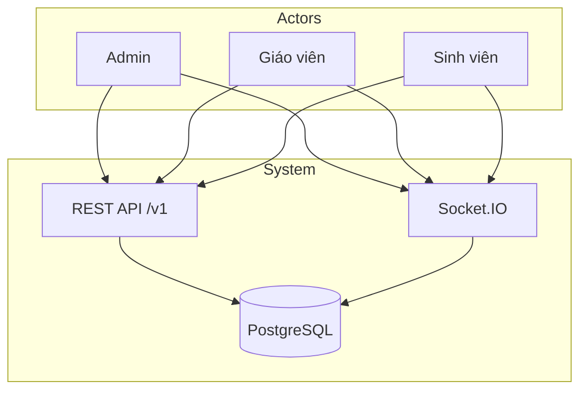
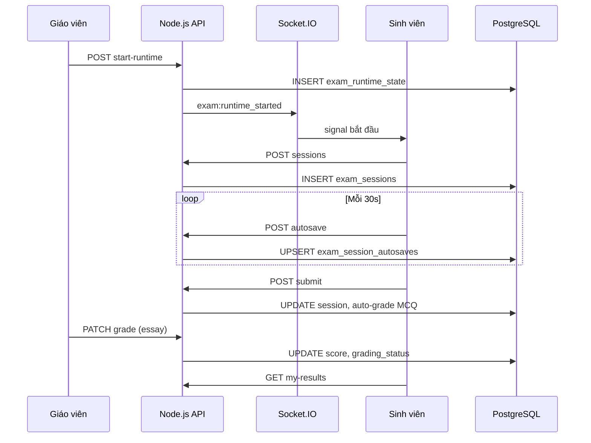

# ĐẶC TẢ HỆ THỐNG SIÊU CHI TIẾT

## Hệ thống thi trực tuyến (Online Examination System)

**Nguồn trích xuất:** `BaoCaoDoAn_OnlineExamination.docx`, `BaoCaoDoAn_OnlineExamination_DaiNam.docx`, `TONGB_HOP_DOAN_TOT_NGHIEP.md`, `DO_AN_MASTER.md`, `docs/DOMAIN_MODEL.md`, `BackEnd/server/docs/ROLES_AND_PERMISSIONS.md`, `BackEnd/server/EXAM_INTEGRITY_AUTOSAVE_CONTRACT.md`, `BackEnd/server/SOCKET_IO_POC.md`, `TEST_STRATEGY_ADMIN_STUDENT.md`, migrations PostgreSQL (`BackEnd/server/src/db/migrations/`), `package.json` (BE/FE).

**Mã nguồn:** `C:\VS-Code\GraduationProject`

**Ngày lập đặc tả:** 2026-05-24

> **Ghi chú:** Tài liệu đồ án được cung cấp mô tả **Hệ thống thi trực tuyến** (React + Node.js + PostgreSQL + Socket.IO), không phải hệ thống quản lý văn bản/OCR. Các actor thực tế là **Admin**, **Giáo viên (teacher)**, **Sinh viên (student)** — không có actor Giáo vụ / Lãnh đạo khoa / Khách như mẫu đề tài khác. CSDL là **PostgreSQL** (không MySQL/Sequelize); frontend là **React SPA** (không EJS/Bootstrap).

---

## Mục lục

1. [Thông tin chung](#1-thông-tin-chung)
2. [Tổng quan, tính cấp thiết và mục tiêu cụ thể](#2-tổng-quan-tính-cấp-thiết-và-mục-tiêu-cụ-thể)
3. [Kiến trúc hệ thống chi tiết](#3-kiến-trúc-hệ-thống-chi-tiết)
4. [Đặc tả chi tiết công nghệ](#4-đặc-tả-chi-tiết-công-nghệ)
5. [Phân tích chức năng chi tiết theo Actor](#5-phân-tích-chức-năng-chi-tiết-theo-actor)
6. [Thiết kế Cơ sở dữ liệu vật lý](#6-thiết-kế-cơ-sở-dữ-liệu-vật-lý)
7. [Quy trình và thuật toán](#7-quy-trình-và-thuật-toán)
8. [Kịch bản kiểm thử và đánh giá hiệu năng](#8-kịch-bản-kiểm-thử-và-đánh-giá-hiệu-năng)

---

## 1. Thông tin chung

| Hạng mục | Nội dung |
|----------|----------|
| **Tên đề tài** | XÂY DỰNG HỆ THỐNG THI TRỰC TUYẾN (ONLINE EXAMINATION SYSTEM) |
| **Sinh viên thực hiện** | ................................................ |
| **Mã sinh viên (MSV)** | ................................................ |
| **Người hướng dẫn** | Giảng viên hướng dẫn (theo bìa đồ án) |
| **Khoa** | CÔNG NGHỆ THÔNG TIN |
| **Trường** | TRƯỜNG ĐẠI HỌC ĐẠI NAM |
| **Bộ** | BỘ GIÁO DỤC VÀ ĐÀO TẠO |
| **Địa điểm, thời gian** | HÀ NỘI 2026 |
| **Kho mã nguồn** | `GraduationProject` — frontend `FrontEnd/client`, backend `BackEnd/server` |

### 1.1. Lời cam đoan (trích từ báo cáo)

Tôi xin cam đoan rằng đồ án tốt nghiệp với đề tài "Xây dựng hệ thống thi trực tuyến (Online Examination System)" là kết quả nghiên cứu và thực hiện của cá nhân tôi dưới sự hướng dẫn của giảng viên hướng dẫn. Các nội dung phân tích, thiết kế, triển khai và đánh giá được trình bày trong đồ án là trung thực; phần tham khảo từ tài liệu, mã nguồn mở và các công trình khác đã được trích dẫn trong phần tài liệu tham khảo. Tôi xin hoàn toàn chịu trách nhiệm trước nhà trường về tính trung thực của nội dung đồ án.

### 1.2. Thống kê hệ thống (theo `TONGB_HOP_DOAN_TOT_NGHIEP.md`)

| Chỉ số | Giá trị |
|--------|---------|
| Tổng số model (backend) | 31 |
| Tổng số router (API) | 25 |
| Tổng số trang (frontend) | 33+ |
| Tổng số migration SQL | 37–42 file |
| Tổng số bảng CSDL nghiệp vụ | 28 (+ `_migrations`) |
| Số môn học seed CNTT 16-02 | 52 |
| Số sinh viên seed demo | 37 (`sv01` … `sv37`) |

---

## 2. Tổng quan, tính cấp thiết và mục tiêu cụ thể

### 2.1. Giới thiệu chung và tính cấp thiết

Trong bối cảnh chuyển đổi số giáo dục, hình thức kiểm tra – đánh giá trực tuyến ngày càng phổ biến. Đại dịch COVID-19 đã thúc đẩy nhanh việc tổ chức thi trên môi trường mạng, đặt ra yêu cầu về tính ổn định, bảo mật, công bằng và khả năng giám sát hành vi thí sinh.

Kiểm tra và đánh giá kết quả học tập là khâu then chốt trong quản lý đào tạo. Khi quy mô lớp học tăng và học viên phân tán địa lý, tổ chức thi tập trung tại phòng máy gặp hạn chế về chi phí cơ sở vật chất, lịch thi và khả năng mở rộng. Thi trực tuyến cho phép linh hoạt thời gian, giảm chi phí in ấn đề giấy, tự động hóa một phần chấm trắc nghiệm và thống kê nhanh kết quả.

Tuy nhiên, thi trực tuyến đặt ra thách thức về toàn vẹn dữ liệu bài làm, đồng bộ thời gian làm bài, phát hiện hành vi bất thường, và phân quyền chặt chẽ để tránh lộ đề hoặc truy cập trái phép. Do đó, việc xây dựng một hệ thống có kiến trúc rõ ràng, có tài liệu API và quy ước autosave/integrity là cần thiết cho cả mục đích học tập và làm cơ sở mở rộng thương mại.

Một hệ thống thi trực tuyến hoàn chỉnh không chỉ là trang web hiển thị câu hỏi, mà cần chuỗi nghiệp vụ: quản trị người dùng và phân quyền, quản lý môn học và đề thi, tổ chức phiên thi, đồng bộ thời gian, tự động lưu bài, chống gian lận ở mức hợp lý, kênh thông báo thời gian thực cho giám thị, chấm điểm và thống kê kết quả.

### 2.2. Mục tiêu nghiên cứu

**Mục tiêu tổng quát:** Xây dựng phần mềm web hỗ trợ vòng đời tổ chức thi trực tuyến, có khả năng triển khai cục bộ phục vụ demo và có thể cấu hình triển khai môi trường thật.

**Mục tiêu cụ thể:**

1. Phân tích yêu cầu và thiết kế use case theo từng vai trò.
2. Triển khai backend REST `/v1` với PostgreSQL, migration schema, JWT và RBAC.
3. Triển khai frontend SPA với React, quản lý trạng thái, định tuyến và i18n.
4. Hiện thực làm bài thi: timer, autosave, integrity events, fullscreen theo cấu hình đề.
5. Hiện thực Socket.IO cho tín hiệu thi (bắt đầu, cảnh báo, force-submit) và màn hình giám thị.
6. Bổ sung tài liệu OpenAPI và hướng dẫn kiểm thử nhanh trong kho mã nguồn.

### 2.3. Phạm vi và đối tượng nghiên cứu

**Phạm vi:** Module người dùng, đề thi, phiên thi, làm bài, chấm điểm, giám sát, thống kê, import Word, ngân hàng câu hỏi, dự đoán điểm AI (MiniMax), đa ngôn ngữ (vi/en/ja), audit log, email thông báo.

**Không bao gồm:** Phần cứng phòng thi, sinh trắc học nâng cao, chứng thực pháp lý điện tử đầy đủ cấp quốc gia.

**Đối tượng nghiên cứu:** Kiến trúc ứng dụng web đa vai trò, mẫu thiết kế API, quản lý phiên làm bài an toàn, trải nghiệm người dùng khi làm bài dài với mạng không ổn định.

### 2.4. Phương pháp nghiên cứu

- Khảo sát tài liệu: đọc mã nguồn, `API.md`, `openapi.yaml`, contract autosave/integrity.
- Phân tích so sánh: đối chiếu với Moodle Quiz, Google Forms, hệ thống thương mại.
- Thực nghiệm: cài đặt cục bộ, chạy migration, kiểm thử end-to-end.
- Đánh giá: kiểm tra log, hành vi Socket, test tự động backend (Vitest).

### 2.5. Ý nghĩa thực tiễn và học thuật

**Thực tiễn:** Phục vụ khóa học ngắn hạn, kiểm tra giữa kỳ trực tuyến, thi thử trong trường đại học; giảm khối lượng vận hành giấy tờ; rút ngắn thời gian công bố điểm trắc nghiệm.

**Học thuật:** Case study thống nhất cho CSDL, Lập trình web, PM mã nguồn mở, An toàn thông tin; rèn kỹ năng viết tài liệu kỹ thuật (use case, ma trận quyền, phân tích rủi ro).

### 2.6. Business Rules cốt lõi

1. **1 GV quản lý 1 lớp HC:** `admin_classes.manager_teacher_id` là UNIQUE (hoặc bảng gán 1–1).
2. **Không có đăng ký công khai:** sinh viên / giảng viên chỉ đăng nhập; tài khoản do admin tạo.
3. **Xuất bảng điểm:** GV lọc theo `admin_class_id` được gán; super admin không giới hạn lớp.
4. **Server-authoritative runtime:** Khi hết giờ realtime (`exam:force_submit`), server tự động force-submit toàn bộ phiên còn `active`, ưu tiên dùng autosave snapshot mới nhất nếu có.

### 2.7. Tính năng nổi bật

- Đề thi hỗ trợ câu hỏi trắc nghiệm (MCQ) và tự luận (essay)
- Media upload (audio/video/image, max 25MB) qua Cloudinary
- Import đề thi từ file Word (.docx) kèm AI-assisted regeneration (Mammoth)
- Timer đồng bộ server (`exam_runtime_state`) — persist khi server restart
- Auto-save định kỳ (30s) trong quá trình làm bài
- Giám sát toàn màn hình (fullscreen) và integrity events (tab switch, copy/paste, window blur)
- Proctoring thời gian thực qua Socket.IO với presence heartbeat 5s
- Ngân hàng câu hỏi (question bank) có thể tái sử dụng, có `usage_count`
- Xáo trộn câu hỏi theo chương (shuffle) với đáp án deterministic theo `student_id` hash (Fisher-Yates seeded)
- Chấm điểm tự động MCQ, chấm tay tự luận (grading assignments cho nhiều GV)
- Thống kê điểm theo 5 bucket ranges: 0-20%, 20-40%, 40-60%, 60-80%, 80-100%
- Dự đoán điểm bằng AI MiniMax với 3-tier architecture: predict → evaluate → full-report
- Đa ngôn ngữ (Tiếng Việt / English / 日本語) qua i18next
- Email thông báo deadline (24h và 1h trước) qua Nodemailer (SMTP)
- Audit log toàn hệ thống (22 loại action)
- Chia sẻ đề thi giữa các lớp + phân công giảng viên cộng tác chấm điểm
- Excel/CSV export kết quả thi

---

## 3. Kiến trúc hệ thống chi tiết

### 3.1. Sơ đồ khối tổng thể (Hình 2.1 — báo cáo đồ án)

```
┌──────────────────────────────────────────────────────────┐
│                   Browser (Client)                        │
│          React 19 + TypeScript + Vite 7                  │
│          Mantine v8 (UI components)                      │
│          Redux Toolkit (state management)                 │
│          React Router v7 (routing)                        │
│          Socket.IO client + i18next + Axios              │
└──────────────────────────┬─────────────────────────────────┘
                           │ HTTPS / HTTP
                           │ REST API v1 + WebSocket
┌──────────────────────────▼─────────────────────────────────┐
│                Backend — Node.js / Express               │
│               TypeScript + Express 5                      │
│  ┌─────────────────┐ ┌──────────────────┐ ┌────────────┐   │
│  │  Controllers    │ │    Services      │ │   Jobs     │   │
│  │    (20+)       │ │     (30+)       │ │ (deadline) │   │
│  └─────────────────┘ └──────────────────┘ └────────────┘   │
│  ┌─────────────────┐ ┌──────────────────┐ ┌────────────┐   │
│  │    Models       │ │   Middlewares    │ │  Socket.IO │   │
│  │     (31)        │ │  (auth/RBAC)     │ │ (proctor)  │   │
│  └─────────────────┘ └──────────────────┘ └────────────┘   │
│                                                            │
│  PostgreSQL (Neon)  │  Cloudinary (media)  │  MiniMax AI     │
│  37+ SQL migrations │  SMTP (Nodemailer)   │                │
└────────────────────────────────────────────────────────────┘
```

### 3.2. Mô hình phân tầng e-assessment

Trong các hệ thống đào tạo hiện đại, đánh giá trực tuyến (e-assessment) tổ chức đề thi, giám sát phiên làm bài, thu thập bài làm, lưu trữ dữ liệu và chấm điểm thông qua các dịch vụ phần mềm. Mô hình phổ biến là ứng dụng web nhiều lớp: trình duyệt đóng vai trò client, máy chủ ứng dụng triển khai nghiệp vụ và API, cơ sở dữ liệu quan hệ đảm bảo tính bền vững của dữ liệu.

Đồ án đi theo mô hình: **React/TypeScript** (lớp giao diện), **Node.js/Express** (lớp dịch vụ REST), **PostgreSQL** (lớp lưu trữ). Bên cạnh kênh HTTP, hệ thống bổ sung **Socket.IO** để phục vụ giám sát thời gian thực và phát tín hiệu bắt đầu/kết thúc thi.

### 3.3. Mô hình REST — HTTP và JSON (Hình 2.2)

REST sử dụng các phương thức HTTP nhất quán:

| Phương thức | Mục đích |
|-------------|----------|
| GET | Đọc tài nguyên |
| POST | Tạo mới |
| PATCH/PUT | Cập nhật |
| DELETE | Xóa |

Tài nguyên đặt tên bằng danh từ (ví dụ `/v1/exams`), biểu diễn bằng JSON. Mã trạng thái: 200, 201, 400, 401, 403, 404, 409, 413, 429, 500.

Tiền tố phiên bản **`/v1`** giúp tách contract. File **`openapi.yaml`** và Swagger `/docs` duy trì schema request/response.

**Base URL production:** `https://api.nhongplus.id.vn/v1`  
**Base URL local:** `http://localhost:5000/v1`

### 3.4. Luồng JWT và RBAC (Hình 2.3)

```
Client                    Express API                 PostgreSQL
  │ POST /v1/auth/login        │                          │
  │ {email, password}          │                          │
  │ ─────────────────────────► │ bcrypt.compare           │
  │                            │ INSERT user_sessions     │
  │ ◄───────────────────────── │ JWT (HS256, exp 7d)      │
  │ { token, user }            │                          │
  │                            │                          │
  │ GET /v1/exams              │                          │
  │ Authorization: Bearer JWT  │                          │
  │ ─────────────────────────► │ authMiddleware           │
  │                            │ roleMiddleware           │
  │ ◄───────────────────────── │ query exams              │
```

**JWT claims tối thiểu:** định danh user, role (`admin`/`teacher`/`student`), `token_version`, thời hạn.

**RBAC:** Middleware `roleMiddleware` sau `authMiddleware`; từ chối 403 khi role không đủ quyền.

**Session tracking:** Một user chỉ có **1 session active** (`user_sessions` UNIQUE WHERE `is_active = true`). Revoke khi admin force-reset password.

### 3.5. Luồng truyền nhận API giữa Frontend (React) và Backend (Node.js)

| Bước | Thành phần | Hành động |
|------|------------|-----------|
| 1 | `FrontEnd/client/src/services/*.ts` | Axios gọi REST với `Authorization: Bearer` |
| 2 | `BackEnd/server/src/routes/v1/*.ts` | Router mount endpoint |
| 3 | `auth.middleware.ts` | Giải mã JWT, gắn `req.user` |
| 4 | `role.middleware.ts` | Kiểm tra role |
| 5 | `validation/*.ts` (Joi) | Validate body/query |
| 6 | `controllers/*.ts` | Xử lý request |
| 7 | `services/*.ts` | Business logic |
| 8 | `models/*.ts` | Truy vấn SQL tham số hóa (`pg` pool) |
| 9 | Response JSON | `{ success, data, message }` hoặc error envelope |

**Không có microservice Python/OCR** trong phạm vi đồ án. AI MiniMax được gọi trực tiếp từ backend Node.js qua HTTP API (dự đoán điểm).

### 3.6. Socket.IO — room và sự kiện (Hình 2.4)

```
                    ┌─────────────┐
                    │ Socket.IO   │
                    │ Server Hub  │
                    └──────┬──────┘
           ┌───────────────┼───────────────┐
           │               │               │
    room: exam:{examId}    │        room: exam:{examId}:proctors
           │               │               │
    ┌──────▼──────┐  ┌─────▼─────┐  ┌──────▼──────┐
    │  Sinh viên  │  │ Giáo viên │  │   Admin     │
    │  (student)  │  │ (teacher) │  │  (proctor)  │
    └─────────────┘  └───────────┘  └─────────────┘
```

**Client → Server:** `proctor:join`, `proctor:leave`, `proctor:ping` (heartbeat 5s), `proctor:violation`, `proctor:screenshot`, `exam:join`, `exam:ping`

**Server → Client:** `exam:force_submit`, `exam:runtime_ended`, `exam:final_15m`, `exam:runtime_started`, `proctor:presence_update`, `exam:alert`, `exam:proctor_alert`

**Auth Socket:** JWT tại handshake `io(url, { auth: { token } })`.

**Scale:** Multi-instance cần Redis adapter để đồng bộ room giữa các node.

### 3.7. Mô hình React — UI / state / side-effects (Hình 2.6)

- **Component UI:** Mantine v8, pages trong `FrontEnd/client/src/pages/main/`
- **State toàn cục:** Redux Toolkit (`authSlice`, exam state)
- **Side-effects:** Axios (REST), Socket.IO client, autosave queue 30s, integrity queue 10–15s
- **Routing:** React Router v7, authority guard trong `routes.config.ts`

### 3.8. Vòng đời phiên thi (Hình 2.7)

```
Tạo đề → Thêm câu hỏi → Start runtime → SV làm bài (autosave)
    → Nộp bài / Hết giờ / Force-submit → Auto-grade MCQ
    → Chấm tự luận (nếu có) → Xem kết quả → Thống kê / Export
```

### 3.9. Sơ đồ use case tổng thể theo tác nhân (Hình 3.1)



### 3.10. Cấu trúc thư mục dự án

```
GraduationProject/
├── BackEnd/server/          # API, migrations, socket, services
│   ├── src/controllers/     # 20+ handlers
│   ├── src/routes/v1/       # 25 routers
│   ├── src/services/        # 30+ business logic
│   ├── src/models/          # 31 models
│   ├── src/db/migrations/   # SQL migrations
│   ├── API.md, openapi.yaml
│   └── docs/
├── FrontEnd/client/         # SPA React
│   └── src/pages/main/      # Dashboard, Exam, Admin, Grading, Proctoring
├── docs/                    # DOMAIN_MODEL.md, sơ đồ ER
├── TONGB_HOP_DOAN_TOT_NGHIEP.md
├── DO_AN_MASTER.md
└── BaoCaoDoAn_OnlineExamination.docx
```

---

## 4. Đặc tả chi tiết công nghệ

### 4.1. Bảng công nghệ theo tầng (Bảng 2.2 — báo cáo)

| Tầng | Công nghệ | Phiên bản (package.json) |
|------|-----------|--------------------------|
| **Frontend — Framework** | React | ^19.2.0 |
| **Frontend — Ngôn ngữ** | TypeScript | ~5.9.3 |
| **Frontend — Build** | Vite | ^7.2.4 |
| **Frontend — UI** | Mantine (@mantine/core, hooks, form, dates, charts, dropzone) | ^8.3.10 / ^9.1.1 (dropzone) |
| **Frontend — State** | Redux Toolkit, redux-persist | ^2.7.0 |
| **Frontend — Routing** | React Router DOM | ^7.11.0 |
| **Frontend — HTTP** | Axios | ^1.13.6 |
| **Frontend — Realtime** | socket.io-client | 4.8.3 |
| **Frontend — i18n** | i18next, react-i18next | ^25.7.3 |
| **Frontend — Charts** | recharts, @mantine/charts | ^3.6.0 |
| **Frontend — Icons** | @tabler/icons-react, lucide-react | ^3.36.1 |
| **Frontend — Test** | Vitest, Playwright, Storybook | ^4.0.18 |
| **Backend — Runtime** | Node.js | LTS (khuyến nghị) |
| **Backend — Ngôn ngữ** | TypeScript | ^5.9.3 |
| **Backend — Web framework** | Express | ^5.2.1 |
| **Backend — CSDL driver** | pg (node-postgres) | ^8.18.0 |
| **Backend — Auth** | jsonwebtoken, bcrypt | ^9.0.3, ^6.0.0 (cost 12) |
| **Backend — Validation** | Joi | ^18.0.2 |
| **Backend — Realtime** | socket.io | ^4.8.3 |
| **Backend — Email** | nodemailer | ^6.9.16 |
| **Backend — Word import** | mammoth | ^1.12.0 |
| **Backend — Media** | cloudinary, multer | ^1.41.3, ^2.1.1 |
| **Backend — Export** | xlsx | ^0.18.5 |
| **Backend — API docs** | swagger-ui-express | ^5.0.1 |
| **Backend — Test** | Vitest | ^4.1.4 |
| **CSDL** | PostgreSQL (Neon serverless) | — |
| **AI** | MiniMax API | Tùy env `MINIMAX_*` |
| **Deploy FE** | Vercel / Netlify / Apache `.htaccess` | — |
| **Deploy BE** | Render / VPS + Nginx reverse proxy | — |

### 4.2. Công nghệ KHÔNG sử dụng (so với mẫu đề tài khác)

| Công nghệ | Trạng thái trong đồ án |
|-----------|------------------------|
| MySQL | Không — dùng PostgreSQL |
| Sequelize ORM | Không — truy vấn SQL trực tiếp qua `pg` pool |
| EJS template engine | Không — SPA React |
| Bootstrap | Không — Mantine UI |
| Tesseract / PaddleOCR | Không — không có module OCR |
| Python microservice | Không — monolith Node.js TypeScript |

### 4.3. Môi trường phát triển (Bảng 4.1)

| Thành phần | Phiên bản / ghi chú |
|------------|---------------------|
| Node.js | LTS phù hợp package.json |
| npm | Quản lý dependency |
| PostgreSQL | Local hoặc Neon cloud |
| Git | Quản lý phiên bản |
| Trình duyệt | Chrome/Edge — kiểm thử fullscreen, DevTools |
| IDE | VS Code / Cursor |

### 4.4. Biến môi trường chính

| Biến | Mục đích |
|------|----------|
| `DATABASE_URL` | Kết nối PostgreSQL |
| `JWT_SECRET` | Ký JWT |
| `CORS_ORIGINS` | Origin FE được phép |
| `SMTP_*` | Gửi email reset password / deadline |
| `CLOUDINARY_*` | Upload media câu hỏi |
| `MINIMAX_*` | Dự đoán điểm AI |
| `VITE_API_URL` | URL API cho frontend (dev/prod) |

### 4.5. Danh mục viết tắt (Bảng — báo cáo)

| Viết tắt | Ý nghĩa |
|----------|---------|
| API | Application Programming Interface |
| BE | Backend |
| CRUD | Create, Read, Update, Delete |
| FE | Frontend |
| HTTP/HTTPS | Giao thức truyền tải siêu văn bản |
| JWT | JSON Web Token |
| MCQ | Multiple Choice Question |
| RBAC | Role-Based Access Control |
| REST | Representational State Transfer |
| SMTP | Simple Mail Transfer Protocol |
| SPA | Single Page Application |
| SQL | Structured Query Language |
| UI/UX | Giao diện / trải nghiệm người dùng |
| UUID | Định danh duy nhất toàn cục |

### 4.6. So sánh nền tảng thi trực tuyến (Bảng 2.1)

| Nền tảng | Ưu điểm | Nhược điểm / ghi chú |
|----------|---------|---------------------|
| Moodle Quiz | Phổ biến trong giáo dục, plugin phong phú | Cài đặt nặng, tùy biến UI phức tạp |
| Google Forms | Nhanh, dễ dùng | Hạn chế proctoring, ít kiểm soát server-side timer |
| Hệ thống thương mại | Proctoring mạnh, SLA | Chi phí, khó tùy chỉnh mã nguồn |
| **Đồ án (GraduationProject)** | Mã nguồn mở, stack hiện đại, OpenAPI | Cần hardening production, CI đầy đủ |

---

## 5. Phân tích chức năng chi tiết theo Actor

### 5.1. Danh sách tác nhân (Bảng 3.1)

| Tác nhân | Key trong code | Mô tả | Phạm vi |
|----------|---------------|--------|---------|
| **Quản trị viên (admin)** | `"admin"` | Super admin | Toàn hệ thống: tài khoản, lớp HC, danh mục môn, audit, báo cáo, giám sát proctoring |
| **Giáo viên (teacher)** | `"teacher"` | Manager lớp / GV soạn đề | Một `admin_class`: quản lý SV, tạo đề, chấm, xuất bảng điểm lớp mình |
| **Sinh viên (student)** | `"student"` | Thí sinh | Thuộc một `admin_class`; làm bài, xem kết quả trong phạm vi lớp |

**Frontend mapping:** DB `student` và `teacher` → FE authority `user`; DB `admin` → `admin` + `user`.

### 5.2. Ma trận yêu cầu chức năng theo vai trò (Bảng 3.2)

| Chức năng | Admin | Teacher | Student |
|-----------|:-----:|:-------:|:-------:|
| Tạo/sửa đề (một số route FE) | Có (theo FE route) | Theo API | Không |
| Làm bài / autosave | Theo cấu hình demo | Theo cấu hình | Có |
| Giám sát proctoring | Có | Theo API | Không |
| Chấm điểm tự luận | Theo API | Có | Không |
| CRUD user | Có | Không | Không |
| Audit log / System report | Có | Không | Không |
| Reset password (duyệt) | Có | Không | Không (chỉ yêu cầu) |
| Import Word / Question bank | Có | Có | Không |
| Export kết quả | Có | Có | Không |
| Dự đoán điểm AI | Có | Có | Có |

### 5.3. Quản trị viên (Admin) — Đặc tả use case chi tiết

#### AD-01: CRUD người dùng

| Hạng mục | Nội dung |
|----------|----------|
| **Mã UC** | AD-01 |
| **Tên** | Quản lý tài khoản người dùng |
| **Mô tả** | Admin tạo, xem, sửa, xóa tài khoản admin/teacher/student |
| **Điều kiện tiên quyết** | Đăng nhập với role `admin`, JWT hợp lệ |
| **Luồng chính** | 1. Vào `/admin/students` → 2. `GET /v1/users` → 3. Thêm/Sửa/Xóa qua UI → 4. `POST/PATCH/DELETE /v1/users` |
| **Kết quả đầu ra** | Bản ghi `accounts` cập nhật; audit log ghi `create_account`/`update_account`/`delete_account` |
| **API** | `GET/POST/PATCH/DELETE /v1/users`, `POST /v1/users/:id/reset-password` |
| **Route FE** | `/admin/students` — authority `['admin']` |

#### AD-02: Nhật ký audit

| Hạng mục | Nội dung |
|----------|----------|
| **Mã UC** | AD-02 |
| **Điều kiện tiên quyết** | Role admin |
| **Luồng chính** | `GET /v1/audit-logs` với filter actor_id, action, resource_type, from_date, to_date |
| **Kết quả đầu ra** | Danh sách phân trang từ bảng `audit_logs` (22 loại action) |
| **Route FE** | `/admin/audit-logs` |

#### AD-03: Duyệt reset mật khẩu

| Hạng mục | Nội dung |
|----------|----------|
| **Mã UC** | AD-03 |
| **Điều kiện tiên quyết** | Có yêu cầu `password_reset_requests.status = pending` |
| **Luồng chính** | Admin duyệt/từ chối → `POST /v1/password-reset/approve` hoặc `/reject` |
| **Kết quả đầu ra** | SV đăng nhập bằng mật khẩu mới; `token_version` tăng, revoke sessions |

#### AD-04: Báo cáo hệ thống

| Hạng mục | Nội dung |
|----------|----------|
| **Mã UC** | AD-04 |
| **Luồng chính** | `GET /v1/system-report` |
| **Kết quả đầu ra** | overview, session_stats, integrity_stats, pending_grading, recent_exams |
| **Route FE** | `/admin/system-report` |

#### AD-05: Quản lý môn học / chương trình / lớp HC

| Hạng mục | Nội dung |
|----------|----------|
| **Modules** | `/admin/subjects`, `/admin/programs`, `/admin/classes` |
| **API** | `/v1/subjects`, `/v1/programs`, `/v1/admin-classes`, `/v1/subject-groups` |
| **Kết quả** | CRUD `subjects`, `programs`, `admin_classes`, import Excel môn/SV |

#### AD-06: Giám sát thi (Proctoring)

| Hạng mục | Nội dung |
|----------|----------|
| **Route FE** | `/proctoring`, `/proctoring/:examId` — chỉ admin trên FE |
| **API** | `GET /v1/exams/:examId/proctoring`, `/presence`, `/integrity-events`, `/proctor-logs` |
| **Kết quả** | Danh sách SV online, timeline vi phạm, force-submit |

### 5.4. Giáo viên (Teacher) — Đặc tả use case chi tiết

#### GV-01: Tạo và soạn đề thi

| Hạng mục | Nội dung |
|----------|----------|
| **Mã UC** | GV-01 |
| **Điều kiện tiên quyết** | Role teacher/admin; được gán `admin_class` |
| **Luồng chính** | Chọn lớp HC + môn → nhập title, `duration_min`, `closes_at`, `num_versions` (1–4) → thêm câu hỏi |
| **API** | `POST /v1/exams`, `POST /v1/exams/:examId/questions` |
| **Kết quả** | Bản ghi `exams` + `questions`; audit `create_exam` |

#### GV-02: Import đề Word

| Hạng mục | Nội dung |
|----------|----------|
| **Mã UC** | GV-05 |
| **Luồng** | Upload .docx → `POST import-word/preview` (Mammoth) → duyệt → `POST import-word/commit` |
| **Kết quả** | Câu hỏi map vào schema nội bộ; warnings nếu định dạng lỗi |

#### GV-03: Khởi động runtime thi

| Hạng mục | Nội dung |
|----------|----------|
| **Mã UC** | GV-01 (runtime) |
| **Luồng** | `POST /v1/exams/:examId/start-runtime` → ghi `exam_runtime_state` → broadcast Socket `exam:runtime_started` |
| **Kết quả** | Timer server-side; SV có thể bắt đầu session |

#### GV-04: Giám sát Socket

| Hạng mục | Nội dung |
|----------|----------|
| **Mã UC** | GV-02 |
| **Luồng** | Mở proctoring → lắng nghe presence, integrity → gửi cảnh báo / force-submit |
| **Kết quả** | SV nhận `exam:alert` hoặc bị `exam:force_submit` |

#### GV-05: Chấm điểm tự luận

| Hạng mục | Nội dung |
|----------|----------|
| **Mã UC** | GV-04 |
| **Luồng** | `GET /v1/exams/sessions/:sessionId/grading` → `PATCH .../grade` với `{ grades: { questionId: { points_awarded, comment } } }` |
| **Kết quả** | `exam_sessions.score` cập nhật; `grading_status = complete` |

#### GV-06: Quản lý sinh viên lớp

| Hạng mục | Nội dung |
|----------|----------|
| **Route** | `/teacher/students` |
| **API** | `/v1/teacher-students`, `/v1/admin-classes/:id/students` |
| **Kết quả** | Transcript, export CSV bảng điểm lớp |

### 5.5. Sinh viên (Student) — Đặc tả use case chi tiết

#### SV-01: Đăng nhập

| Hạng mục | Nội dung |
|----------|----------|
| **Mã UC** | SV-01 |
| **Luồng** | `POST /v1/auth/login` { email, password } → bcrypt → JWT + `user_sessions` |
| **Kết quả** | Token lưu client; redirect dashboard |
| **Lỗi** | 401 sai mật khẩu; không lộ stack trace production |

#### SV-02: Xem danh sách đề

| Hạng mục | Nội dung |
|----------|----------|
| **Mã UC** | SV-02 |
| **Điều kiện** | Thuộc `admin_class_id` của đề |
| **API** | `GET /v1/exams` |
| **Kết quả** | Chỉ đề trong phạm vi lớp; trạng thái Chưa mở/Đang thi/Đã nộp |

#### SV-03: Vào làm bài

| Hạng mục | Nội dung |
|----------|----------|
| **Mã UC** | SV-03 |
| **Điều kiện** | Runtime active; fullscreen (nếu bật); đề chưa hết hạn |
| **Luồng** | `POST /v1/exams/:examId/sessions` → nhận questions (shuffled), `deadline_at`, `version_code` |
| **Kết quả** | Session `active`; join Socket room `exam:{examId}` |

#### SV-04: Autosave

| Hạng mục | Nội dung |
|----------|----------|
| **Mã UC** | SV-04 |
| **Tần suất** | 30 giây (khuyến nghị contract) |
| **API** | `POST /v1/exams/autosave` — `{ exam_id, saved_at, answers }` max 2MB |
| **Kết quả** | Upsert `exam_session_autosaves`; 409 nếu session đã submitted |

#### SV-05: Gửi integrity events

| Hạng mục | Nội dung |
|----------|----------|
| **Mã UC** | SV-05 |
| **API** | `POST /v1/exams/integrity-events` — batch 1..200 events |
| **Loại sự kiện** | `exam_opened`, `fullscreen_enter/exit/error`, `visibility_hidden`, `window_blur/focus`, `copy_attempt`, `paste_attempt`, `context_menu`, `before_unload` |
| **Kết quả** | Ghi `exam_integrity_events` |

#### SV-06: Nộp bài

| Hạng mục | Nội dung |
|----------|----------|
| **Mã UC** | SV-06 |
| **Luồng** | `POST /v1/exam-sessions/:sessionId/submit` hoặc `/v1/exams/sessions/:sessionId/submit` |
| **Kết quả** | Auto-grade MCQ; `status = submitted`; `grading_status = pending_manual` nếu có essay |

#### SV-07: Xem kết quả

| Hạng mục | Nội dung |
|----------|----------|
| **Mã UC** | SV-07 |
| **API** | `GET /v1/exams/:examId/my-submission`, `/my-results`, review endpoint |
| **Kết quả** | Điểm, đúng/sai, giải thích (theo policy đề) |

### 5.6. Yêu cầu phi chức năng

| Loại | Yêu cầu |
|------|---------|
| **Bảo mật** | HTTPS production, JWT_SECRET mạnh, không commit secret, parameterized SQL, React escape XSS |
| **Hiệu năng** | Pool DB, tránh N+1, autosave không block UI, debounce input |
| **Khả dụng** | UI rõ ràng, i18n vi/en/ja, aria-live cho timer |
| **Tin cậy** | Migration đồng bộ; `exam_runtime_state` restore timer sau restart |
| **Mở rộng** | Router module hóa, OpenAPI, Redis adapter Socket (hướng phát triển) |

---

## 6. Thiết kế Cơ sở dữ liệu vật lý

**Hệ quản trị:** PostgreSQL (Neon serverless trên cloud; local cho dev).

**Migration:** `BackEnd/server/src/db/migrations/` — 42 file SQL; bảng theo dõi `_migrations`.

**Ghi chú:** Không dùng MySQL/Sequelize. Bảng `grades` và `assignments` **không tồn tại** trong migration — điểm nằm trên `exam_sessions`. Bảng `users` (migration `001`) có thể còn legacy; hệ thống hiện tại dùng `accounts`.

### 6.1. Ma trận khóa ngoại (Bảng 3.6 — báo cáo, đối chiếu thực tế)

| Bảng con | Cột FK | Bảng cha | Cardinality |
|----------|--------|----------|-------------|
| `accounts` | `admin_class_id` | `admin_classes` | N : 1 |
| `admin_classes` | `manager_teacher_id` | `accounts` | N : 1 |
| `admin_classes` | `program_id` | `programs` | N : 1 |
| `classes` | `subject_id` | `subjects` | N : 1 |
| `classes` | `teacher_id` | `accounts` | N : 1 |
| `enrollments` | `class_id` | `classes` | N : 1 |
| `enrollments` | `student_id` | `accounts` | N : 1 |
| `exams` | `class_id` | `classes` | N : 1 |
| `exams` | `admin_class_id` | `admin_classes` | N : 1 |
| `exams` | `subject_id` | `subjects` | N : 1 |
| `exams` | `created_by` | `accounts` | N : 1 |
| `questions` | `exam_id` | `exams` | N : 1 |
| `questions` | `question_bank_id` | `question_bank` | N : 1 |
| `exam_sessions` | `exam_id` | `exams` | N : 1 |
| `exam_sessions` | `student_id` | `accounts` | N : 1 |
| `exam_sessions` | `version_id` | `exam_versions` | N : 1 |
| `exam_session_autosaves` | `session_id` | `exam_sessions` | 1 : 1 (UNIQUE) |
| `exam_integrity_events` | `session_id` | `exam_sessions` | N : 1 |
| `exam_versions` | `exam_id` | `exams` | N : 1 |
| `exam_runtime_state` | `exam_id` | `exams` | 1 : 1 |
| `grading_assignments` | `exam_session_id` | `exam_sessions` | N : 1 |
| `user_sessions` | `user_id` | `accounts` | N : 1 |
| `user_notifications` | `user_id` | `accounts` | N : 1 |

### 6.2. Đặc tả từng bảng

#### Bảng `accounts`

| Tên trường | Kiểu dữ liệu | Ràng buộc | Khóa | Giải thích |
|------------|--------------|-----------|------|------------|
| `id` | UUID | NOT NULL, DEFAULT gen_random_uuid() | PK | Định danh tài khoản |
| `email` | TEXT | NOT NULL, UNIQUE |  | Email đăng nhập |
| `username` | TEXT | NOT NULL, UNIQUE |  | Tên đăng nhập |
| `hashed_password` | TEXT | NOT NULL |  | Mật khẩu bcrypt (cost 12) |
| `password_plain` | TEXT | nullable |  | MK hiển thị cho GV quản lý (không dùng auth) |
| `role` | TEXT | NOT NULL, CHECK admin/teacher/student |  | Vai trò RBAC |
| `full_name` | TEXT | nullable |  | Họ tên |
| `is_active` | BOOLEAN | NOT NULL, DEFAULT true |  | Tài khoản hoạt động |
| `admin_class_id` | UUID | FK → admin_classes(id) ON DELETE SET NULL | FK | Lớp HC (sinh viên) |
| `first_login` | BOOLEAN | NOT NULL, DEFAULT false |  | Bắt buộc đổi MK lần đầu |
| `token_version` | INTEGER | NOT NULL, DEFAULT 0 |  | Vô hiệu hóa JWT cũ khi đổi MK |
| `created_at` | TIMESTAMPTZ | NOT NULL, DEFAULT NOW() |  | Thời điểm tạo |
| `updated_at` | TIMESTAMPTZ | NOT NULL, DEFAULT NOW() |  | Thời điểm cập nhật |

#### Bảng `user_sessions`

| Tên trường | Kiểu dữ liệu | Ràng buộc | Khóa | Giải thích |
|------------|--------------|-----------|------|------------|
| `id` | UUID | PK | PK | ID phiên đăng nhập |
| `user_id` | UUID | NOT NULL, FK accounts CASCADE | FK | Người dùng |
| `device_id` | VARCHAR(255) | NOT NULL |  | ID thiết bị |
| `device_info` | TEXT | nullable |  | UA / thiết bị |
| `token_hash` | VARCHAR(64) | NOT NULL |  | Hash JWT |
| `is_active` | BOOLEAN | NOT NULL, DEFAULT true |  | Phiên còn hiệu lực |
| `created_at` | TIMESTAMPTZ | NOT NULL |  | Tạo phiên |
| `expires_at` | TIMESTAMPTZ | NOT NULL |  | Hết hạn |
| `last_active_at` | TIMESTAMPTZ | NOT NULL |  | Hoạt động gần nhất |

**UNIQUE:** `(user_id)` WHERE `is_active = true` — một thiết bị một session.

#### Bảng `programs`

| Tên trường | Kiểu dữ liệu | Ràng buộc | Khóa | Giải thích |
|------------|--------------|-----------|------|------------|
| `id` | UUID | PK | PK | ID chuyên ngành |
| `code` | TEXT | NOT NULL, UNIQUE |  | Mã ngành (CNTT) |
| `name` | TEXT | NOT NULL |  | Tên ngành |
| `description` | TEXT | nullable |  | Mô tả |
| `is_active` | BOOLEAN | NOT NULL, DEFAULT true |  | Còn dùng |
| `created_at` | TIMESTAMPTZ | NOT NULL |  | Ngày tạo |

#### Bảng `subject_groups`

| Tên trường | Kiểu dữ liệu | Ràng buộc | Khóa | Giải thích |
|------------|--------------|-----------|------|------------|
| `id` | UUID | PK | PK | ID nhóm môn |
| `program_id` | UUID | FK programs CASCADE, nullable | FK | Ngành (nullable sau kho môn) |
| `code` | TEXT | NOT NULL |  | Mã nhóm (math, english…) |
| `name` | TEXT | NOT NULL |  | Tên nhóm |
| `description` | TEXT | nullable |  | Mô tả |
| `sort_order` | INT | NOT NULL, DEFAULT 0 |  | Thứ tự hiển thị |
| `is_active` | BOOLEAN | NOT NULL, DEFAULT true |  | Còn dùng |
| `group_scope` | TEXT | CHECK base/shared/catalog |  | Phạm vi nhóm |
| `created_at` | TIMESTAMPTZ | NOT NULL |  | Ngày tạo |

#### Bảng `program_teachers`

| Tên trường | Kiểu dữ liệu | Ràng buộc | Khóa | Giải thích |
|------------|--------------|-----------|------|------------|
| `program_id` | UUID | PK composite, FK programs | PK, FK | Chuyên ngành |
| `teacher_id` | UUID | PK composite, FK accounts | PK, FK | GV được phân quyền |
| `created_at` | TIMESTAMPTZ | NOT NULL |  | Ngày gán |

#### Bảng `program_subject_groups`

| Tên trường | Kiểu dữ liệu | Ràng buộc | Khóa | Giải thích |
|------------|--------------|-----------|------|------------|
| `program_id` | UUID | PK composite | PK, FK | Chuyên ngành |
| `subject_group_id` | UUID | PK composite | PK, FK | Nhóm môn |
| `sort_order` | INT | NOT NULL, DEFAULT 0 |  | Thứ tự |
| `created_at` | TIMESTAMPTZ | NOT NULL |  | Ngày liên kết |

#### Bảng `program_subjects`

| Tên trường | Kiểu dữ liệu | Ràng buộc | Khóa | Giải thích |
|------------|--------------|-----------|------|------------|
| `program_id` | UUID | PK composite | PK, FK | Chuyên ngành |
| `subject_id` | UUID | PK composite | PK, FK | Môn học |
| `created_at` | TIMESTAMPTZ | NOT NULL |  | Ngày gán |

#### Bảng `subjects`

| Tên trường | Kiểu dữ liệu | Ràng buộc | Khóa | Giải thích |
|------------|--------------|-----------|------|------------|
| `id` | UUID | PK | PK | ID môn |
| `name` | TEXT | NOT NULL |  | Tên môn |
| `code` | TEXT | nullable |  | Mã môn |
| `credits` | DECIMAL(4,1) | NOT NULL, DEFAULT 0 |  | Tín chỉ |
| `semester` | INTEGER | NOT NULL, DEFAULT 0 |  | Học kỳ CTĐT |
| `category` | TEXT | DEFAULT general |  | Khối lớn (6 nhóm CNTT) |
| `sub_category` | TEXT | nullable |  | Khối nhỏ |
| `prerequisites` | UUID[] | nullable |  | Môn tiên quyết |
| `program_id` | UUID | FK programs, nullable | FK | Ngành (legacy; dùng program_subjects) |
| `subject_group_id` | UUID | FK subject_groups SET NULL | FK | Nhóm môn |
| `is_active` | BOOLEAN | NOT NULL, DEFAULT true |  | Còn dùng |
| `created_at` | TIMESTAMPTZ | NOT NULL |  | Ngày tạo |

#### Bảng `admin_classes`

| Tên trường | Kiểu dữ liệu | Ràng buộc | Khóa | Giải thích |
|------------|--------------|-----------|------|------------|
| `id` | UUID | PK | PK | ID lớp hành chính |
| `program_code` | TEXT | NOT NULL, DEFAULT CNTT |  | Mã CT (text) |
| `intake_year` | INTEGER | NOT NULL |  | Khóa (16) |
| `section` | TEXT | NOT NULL |  | Tổ (02) |
| `display_name` | TEXT | NOT NULL |  | CNTT 16-02 |
| `manager_teacher_id` | UUID | FK accounts SET NULL | FK | GV chủ nhiệm (UNIQUE nghiệp vụ) |
| `program_id` | UUID | FK programs RESTRICT | FK | Liên kết programs |
| `expected_size` | INTEGER | NOT NULL, DEFAULT 0, CHECK >= 0 |  | Sĩ số dự kiến |
| `created_at` | TIMESTAMPTZ | NOT NULL |  | Ngày tạo |

**UNIQUE:** `(program_code, intake_year, section)`.

#### Bảng `classes`

| Tên trường | Kiểu dữ liệu | Ràng buộc | Khóa | Giải thích |
|------------|--------------|-----------|------|------------|
| `id` | UUID | PK | PK | Lớp học phần |
| `subject_id` | UUID | FK subjects RESTRICT | FK | Môn |
| `teacher_id` | UUID | FK accounts RESTRICT | FK | GV phụ trách |
| `semester` | TEXT | NOT NULL |  | Học kỳ |
| `year` | INTEGER | NOT NULL |  | Năm học |
| `created_at` | TIMESTAMPTZ | NOT NULL |  | Ngày tạo |

#### Bảng `enrollments`

| Tên trường | Kiểu dữ liệu | Ràng buộc | Khóa | Giải thích |
|------------|--------------|-----------|------|------------|
| `id` | UUID | PK | PK | ID ghi danh |
| `class_id` | UUID | FK classes CASCADE | FK | Lớp HP |
| `student_id` | UUID | FK accounts CASCADE | FK | Sinh viên |
| `enrolled_at` | TIMESTAMPTZ | NOT NULL |  | Ngày ghi danh |

**UNIQUE:** `(class_id, student_id)`.

#### Bảng `exams`

| Tên trường | Kiểu dữ liệu | Ràng buộc | Khóa | Giải thích |
|------------|--------------|-----------|------|------------|
| `id` | UUID | PK | PK | ID đề thi |
| `title` | TEXT | NOT NULL |  | Tiêu đề |
| `description` | TEXT | nullable |  | Mô tả |
| `class_id` | UUID | FK classes CASCADE, nullable | FK | Lớp HP (legacy) |
| `admin_class_id` | UUID | FK admin_classes RESTRICT | FK | Lớp HC |
| `subject_id` | UUID | FK subjects RESTRICT | FK | Môn học |
| `created_by` | UUID | FK accounts RESTRICT | FK | Người tạo |
| `duration_min` | INTEGER | NOT NULL |  | Thời lượng phút |
| `num_versions` | INTEGER | NOT NULL, DEFAULT 2, CHECK 1..4 |  | Số mã đề D01–D04 |
| `closes_at` | TIMESTAMPTZ | nullable |  | Hạn chót |
| `created_at` | TIMESTAMPTZ | NOT NULL |  | Ngày tạo |

#### Bảng `questions`

| Tên trường | Kiểu dữ liệu | Ràng buộc | Khóa | Giải thích |
|------------|--------------|-----------|------|------------|
| `id` | UUID | PK | PK | ID câu |
| `exam_id` | UUID | FK exams CASCADE | FK | Đề thi |
| `content` | TEXT | NOT NULL |  | Nội dung |
| `question_type` | TEXT | CHECK mcq/essay |  | Loại câu |
| `options` | JSONB | nullable |  | Lựa chọn MCQ |
| `correct_answer` | JSONB | nullable |  | Đáp án đúng |
| `points` | DECIMAL(4,1) | NOT NULL, DEFAULT 1 |  | Điểm |
| `display_order` | INTEGER | DEFAULT 0 |  | Thứ tự |
| `version_index` | INTEGER | NOT NULL, DEFAULT 0, CHECK 0..3 |  | Mã đề 0=D01 |
| `media_url` | TEXT | nullable |  | URL Cloudinary |
| `question_bank_id` | UUID | FK question_bank SET NULL | FK | Nguồn bank |
| `explanation` | TEXT | nullable |  | Giải thích |
| `created_at` | TIMESTAMPTZ | NOT NULL |  | Ngày tạo |

#### Bảng `question_bank`

| Tên trường | Kiểu dữ liệu | Ràng buộc | Khóa | Giải thích |
|------------|--------------|-----------|------|------------|
| `id` | UUID | PK | PK | ID câu kho |
| `created_by` | UUID | FK accounts | FK | GV tạo |
| `subject_id` | UUID | FK subjects | FK | Môn |
| `content` | TEXT | NOT NULL |  | Nội dung |
| `question_type` | TEXT | CHECK mcq/essay |  | Loại |
| `options` | JSONB | nullable |  | MCQ options |
| `correct_answer` | JSONB | nullable |  | Đáp án |
| `points` | DECIMAL(4,1) | DEFAULT 1 |  | Điểm |
| `difficulty` | TEXT | CHECK DE/TRUNGBINH/KHO |  | Độ khó |
| `chapter` | INTEGER | nullable |  | Chương shuffle |
| `answer_hint` | TEXT | nullable |  | Gợi ý |
| `explanation` | TEXT | nullable |  | Giải thích |
| `tags` | TEXT[] | nullable |  | Thẻ |
| `source_exam_id` | UUID | FK exams SET NULL | FK | Đề nguồn |
| `usage_count` | INTEGER | NOT NULL, DEFAULT 0 |  | Số lần dùng |
| `created_at` | TIMESTAMPTZ | NOT NULL |  | Tạo |
| `updated_at` | TIMESTAMPTZ | NOT NULL |  | Cập nhật |

#### Bảng `exam_versions`

| Tên trường | Kiểu dữ liệu | Ràng buộc | Khóa | Giải thích |
|------------|--------------|-----------|------|------------|
| `id` | UUID | PK | PK | ID phiên bản |
| `exam_id` | UUID | FK exams CASCADE | FK | Đề |
| `version_code` | VARCHAR(10) | NOT NULL |  | D01, D02… |
| `version_index` | INTEGER | NOT NULL |  | 0-based |
| `question_order` | JSONB | NOT NULL |  | Thứ tự câu xáo |
| `option_maps` | JSONB | NOT NULL |  | Map đáp án xáo |
| `created_at` | TIMESTAMPTZ | NOT NULL |  | Ngày tạo |

#### Bảng `exam_sessions`

| Tên trường | Kiểu dữ liệu | Ràng buộc | Khóa | Giải thích |
|------------|--------------|-----------|------|------------|
| `id` | UUID | PK | PK | ID phiên thi |
| `exam_id` | UUID | FK exams CASCADE | FK | Đề |
| `student_id` | UUID | FK accounts CASCADE | FK | SV |
| `status` | TEXT | CHECK active/submitted/expired |  | Trạng thái |
| `started_at` | TIMESTAMPTZ | NOT NULL |  | Bắt đầu |
| `submitted_at` | TIMESTAMPTZ | nullable |  | Nộp |
| `score` | DECIMAL(6,2) | nullable |  | Điểm |
| `max_points` | DECIMAL(6,2) | nullable |  | Điểm tối đa |
| `student_answers` | JSONB | nullable |  | Bài làm |
| `graded_details` | JSONB | nullable |  | Chi tiết chấm |
| `grading_status` | TEXT | CHECK pending_manual/complete |  | Trạng thái chấm |
| `version_id` | UUID | FK exam_versions | FK | Phiên bản đề |
| `version_code` | VARCHAR(10) | nullable |  | Mã đề |
| `question_order` | JSONB | nullable |  | Thứ tự câu SV |
| `created_at` | TIMESTAMPTZ | NOT NULL |  | Tạo phiên |

#### Bảng `exam_runtime_state`

| Tên trường | Kiểu dữ liệu | Ràng buộc | Khóa | Giải thích |
|------------|--------------|-----------|------|------------|
| `exam_id` | UUID | PK, FK exams CASCADE | PK, FK | Đề đang chạy |
| `started_at` | TIMESTAMPTZ | NOT NULL |  | Bắt đầu đồng hồ |
| `ends_at` | TIMESTAMPTZ | NOT NULL |  | Kết thúc |
| `duration_min` | INTEGER | NOT NULL |  | Thời lượng |
| `is_active` | BOOLEAN | NOT NULL, DEFAULT true |  | Đồng hồ chạy |

#### Bảng `exam_session_autosaves`

| Tên trường | Kiểu dữ liệu | Ràng buộc | Khóa | Giải thích |
|------------|--------------|-----------|------|------------|
| `id` | UUID | PK | PK | ID autosave |
| `session_id` | UUID | FK exam_sessions CASCADE, UNIQUE | FK | Phiên (1 bản/phiên) |
| `exam_id` | UUID | FK exams CASCADE | FK | Đề |
| `student_id` | UUID | FK accounts CASCADE | FK | SV |
| `answers` | JSONB | NOT NULL |  | Câu trả lời tạm |
| `saved_at` | TIMESTAMPTZ | NOT NULL |  | Thời điểm client |
| `server_at` | TIMESTAMPTZ | NOT NULL |  | Thời điểm server |
| `created_at` | TIMESTAMPTZ | NOT NULL |  | Tạo |
| `updated_at` | TIMESTAMPTZ | NOT NULL |  | Cập nhật |

#### Bảng `exam_integrity_events`

| Tên trường | Kiểu dữ liệu | Ràng buộc | Khóa | Giải thích |
|------------|--------------|-----------|------|------------|
| `id` | UUID | PK | PK | ID sự kiện |
| `exam_id` | UUID | FK exams CASCADE | FK | Đề |
| `session_id` | UUID | FK exam_sessions CASCADE | FK | Phiên |
| `student_id` | UUID | FK accounts CASCADE | FK | SV |
| `event_type` | TEXT | NOT NULL, CHECK 11 loại |  | Loại vi phạm |
| `event_at` | TIMESTAMPTZ | NOT NULL |  | Thời điểm client |
| `details` | JSONB | nullable |  | Metadata |
| `created_at` | TIMESTAMPTZ | NOT NULL |  | Ghi DB |

#### Bảng `exam_proctor_presence`

| Tên trường | Kiểu dữ liệu | Ràng buộc | Khóa | Giải thích |
|------------|--------------|-----------|------|------------|
| `id` | UUID | PK | PK | ID presence |
| `exam_id` | UUID | FK exams CASCADE | FK | Đề |
| `student_id` | UUID | FK accounts CASCADE | FK | SV |
| `socket_id` | TEXT | NOT NULL |  | Socket connection id |
| `ip_address` | TEXT | nullable |  | IP |
| `user_agent` | TEXT | nullable |  | UA |
| `joined_at` | TIMESTAMPTZ | NOT NULL |  | Vào phòng |
| `last_ping_at` | TIMESTAMPTZ | NOT NULL |  | Ping 5s |
| `disconnected_at` | TIMESTAMPTZ | nullable |  | Ngắt kết nối |

**UNIQUE:** `(exam_id, student_id)`.

#### Bảng `exam_proctor_logs`

| Tên trường | Kiểu dữ liệu | Ràng buộc | Khóa | Giải thích |
|------------|--------------|-----------|------|------------|
| `id` | UUID | PK | PK | ID log |
| `exam_id` | UUID | FK exams | FK | Đề |
| `session_id` | UUID | FK exam_sessions SET NULL | FK | Phiên |
| `student_id` | UUID | FK accounts | FK | SV |
| `event_type` | TEXT | NOT NULL |  | screenshot, tab_switch, devtools… |
| `screenshot_url` | TEXT | nullable |  | URL ảnh |
| `ip_address` | TEXT | nullable |  | IP |
| `user_agent` | TEXT | nullable |  | UA |
| `metadata` | JSONB | nullable |  | Mở rộng |
| `created_at` | TIMESTAMPTZ | NOT NULL |  | Ghi log |

#### Bảng `exam_deadline_notifications`

| Tên trường | Kiểu dữ liệu | Ràng buộc | Khóa | Giải thích |
|------------|--------------|-----------|------|------------|
| `id` | UUID | PK | PK | ID |
| `exam_id` | UUID | FK exams CASCADE | FK | Đề |
| `student_id` | UUID | FK accounts CASCADE | FK | SV |
| `sent_at` | TIMESTAMPTZ | NOT NULL |  | Đã gửi |
| `notification_type` | TEXT | DEFAULT reminder |  | Loại nhắc |
| `created_at` | TIMESTAMPTZ | NOT NULL |  | Tạo |

#### Bảng `exam_shares`

| Tên trường | Kiểu dữ liệu | Ràng buộc | Khóa | Giải thích |
|------------|--------------|-----------|------|------------|
| `id` | UUID | PK | PK | Chia sẻ đề |
| `exam_id` | UUID | FK exams | FK | Đề |
| `shared_with` | UUID | FK accounts | FK | GV nhận |
| `role` | TEXT | CHECK viewer/grader/co-owner |  | Quyền |
| `assigned_by` | UUID | FK accounts | FK | Người gán |
| `assigned_at` | TIMESTAMPTZ | NOT NULL |  | Thời gian |

#### Bảng `exam_collaborators`

| Tên trường | Kiểu dữ liệu | Ràng buộc | Khóa | Giải thích |
|------------|--------------|-----------|------|------------|
| `id` | UUID | PK | PK | Cộng tác viên |
| `exam_id` | UUID | FK exams | FK | Đề |
| `teacher_id` | UUID | FK accounts | FK | GV |
| `role` | TEXT | CHECK owner/grader |  | owner/grader |
| `created_at` | TIMESTAMPTZ | NOT NULL |  | Ngày thêm |

#### Bảng `grading_assignments`

| Tên trường | Kiểu dữ liệu | Ràng buộc | Khóa | Giải thích |
|------------|--------------|-----------|------|------------|
| `id` | UUID | PK | PK | Phân công chấm |
| `exam_session_id` | UUID | FK exam_sessions | FK | Phiên |
| `exam_id` | UUID | FK exams | FK | Đề |
| `teacher_id` | UUID | FK accounts | FK | GV chấm |
| `assigned_by` | UUID | FK accounts | FK | Người giao |
| `assigned_at` | TIMESTAMPTZ | NOT NULL |  | Giao |
| `graded_at` | TIMESTAMPTZ | nullable |  | Hoàn thành |
| `status` | TEXT | CHECK pending/in_progress/completed |  | Trạng thái |
| `notes` | TEXT | nullable |  | Ghi chú |

#### Bảng `student_prediction_cache`

| Tên trường | Kiểu dữ liệu | Ràng buộc | Khóa | Giải thích |
|------------|--------------|-----------|------|------------|
| `user_id` | UUID | PK, FK accounts CASCADE | PK, FK | Sinh viên |
| `payload` | JSONB | NOT NULL |  | Kết quả MiniMax AI |
| `computed_at` | TIMESTAMPTZ | NOT NULL |  | Lúc tính |

#### Bảng `password_reset_requests`

| Tên trường | Kiểu dữ liệu | Ràng buộc | Khóa | Giải thích |
|------------|--------------|-----------|------|------------|
| `id` | UUID | PK | PK | Yêu cầu reset |
| `user_id` | UUID | FK accounts | FK | Tài khoản |
| `requested_by` | UUID | FK accounts | FK | Người yêu cầu |
| `status` | TEXT | CHECK pending/approved/rejected/expired |  | Trạng thái |
| `admin_note` | TEXT | nullable |  | Ghi chú admin |
| `approved_by` | UUID | nullable | FK | Admin duyệt |
| `new_password_plain` | TEXT | nullable |  | MK tạm |
| `expires_at` | TIMESTAMPTZ | NOT NULL |  | Hết hạn |
| `created_at` | TIMESTAMPTZ | NOT NULL |  | Tạo |
| `updated_at` | TIMESTAMPTZ | NOT NULL |  | Cập nhật |

#### Bảng `password_reset_tokens`

| Tên trường | Kiểu dữ liệu | Ràng buộc | Khóa | Giải thích |
|------------|--------------|-----------|------|------------|
| `id` | UUID | PK | PK | Token email |
| `user_id` | UUID | FK accounts | FK | Tài khoản |
| `token` | VARCHAR(64) | UNIQUE |  | Token |
| `expires_at` | TIMESTAMPTZ | NOT NULL |  | Hết hạn 1h |
| `used` | BOOLEAN | DEFAULT false |  | Đã dùng |
| `used_at` | TIMESTAMPTZ | nullable |  | Lúc dùng |
| `created_at` | TIMESTAMPTZ | NOT NULL |  | Tạo |

#### Bảng `audit_logs`

| Tên trường | Kiểu dữ liệu | Ràng buộc | Khóa | Giải thích |
|------------|--------------|-----------|------|------------|
| `id` | UUID | PK | PK | ID log |
| `actor_id` | UUID | nullable |  | Người thực hiện |
| `actor_role` | TEXT | nullable |  | admin/teacher/student/system |
| `action` | TEXT | NOT NULL |  | 22 loại: login, create_exam, submit_exam… |
| `resource_type` | TEXT | nullable |  | Loại tài nguyên |
| `resource_id` | UUID | nullable |  | ID tài nguyên |
| `details` | JSONB | DEFAULT {} |  | Ngữ cảnh |
| `ip_address` | TEXT | nullable |  | IP |
| `user_agent` | TEXT | nullable |  | UA |
| `created_at` | TIMESTAMPTZ | NOT NULL |  | Thời điểm |

#### Bảng `user_notifications`

| Tên trường | Kiểu dữ liệu | Ràng buộc | Khóa | Giải thích |
|------------|--------------|-----------|------|------------|
| `id` | UUID | PK | PK | Thông báo |
| `user_id` | UUID | FK accounts CASCADE | FK | Người nhận |
| `type` | TEXT | CHECK info/success/warning/error |  | Loại UI |
| `title` | TEXT | NOT NULL |  | Tiêu đề |
| `message` | TEXT | NOT NULL |  | Nội dung |
| `is_read` | BOOLEAN | DEFAULT FALSE |  | Đã đọc |
| `link` | TEXT | nullable |  | Điều hướng |
| `created_at` | TIMESTAMPTZ | NOT NULL |  | Tạo |

#### Bảng `_migrations`

| Tên trường | Kiểu dữ liệu | Ràng buộc | Khóa | Giải thích |
|------------|--------------|-----------|------|------------|
| `name` | TEXT | PK | PK | Tên file migration |
| `applied_at` | TIMESTAMPTZ | NOT NULL |  | Thời điểm chạy |

---

## 7. Quy trình và thuật toán

> **Lưu ý:** Đồ án không có luồng "Văn bản đến/đi" hay OCR. Các luồng nghiệp vụ thực tế là vòng đời thi trực tuyến, import Word, autosave, integrity, Socket.IO, chấm điểm và thống kê.

### 7.1. Luồng đăng nhập và xác thực

1. Client gửi `{ email, password }` qua HTTPS tới `POST /v1/auth/login`.
2. Server: `bcrypt.compare` với `accounts.hashed_password` (cost 12).
3. Tạo JWT (HS256, `JWT_SECRET`, exp ~7 ngày) chứa `userId`, `role`, `token_version`.
4. Ghi `user_sessions`: `token_hash`, `device_id`, `expires_at`; vô hiệu hóa session active cũ (single device).
5. Client lưu token; mọi request REST gửi `Authorization: Bearer <token>`.
6. Nếu `first_login = true` → bắt buộc đổi mật khẩu trước khi tiếp tục.

### 7.2. Luồng tạo đề thi và import Word

```
GV/Admin → Nhập metadata (title, duration_min, admin_class_id, subject_id, num_versions)
    → POST /v1/exams
    → Thêm câu: manual | question_bank | import Word
    → [Import Word] upload .docx (multipart, giới hạn kích thước)
    → Mammoth parse → preview JSON/HTML
    → GV duyệt → commit → INSERT questions
    → [Optional] POST /v1/shuffle/:examId — xáo theo chapter
    → Tạo exam_versions (D01–D04) với question_order + option_maps
```

**Thuật toán import Mammoth:** Chuyển `.docx` → HTML/JSON cấu trúc câu hỏi; map sang schema `questions` (mcq/essay, options JSONB, correct_answer JSONB); log warnings định dạng; trả 400 nếu parse lỗi.

### 7.3. Luồng tổ chức phiên thi (runtime)

1. GV `POST /v1/exams/:examId/start-runtime`.
2. Server ghi `exam_runtime_state`: `started_at`, `ends_at = started_at + duration_min`, `is_active = true`.
3. Broadcast Socket.IO `exam:runtime_started` tới room `exam:{examId}`.
4. SV mở đề → kiểm tra runtime active + `closes_at` + quyền lớp.
5. `POST /v1/exams/:examId/sessions`:
   - Gán `version_index = hash(student_id) % num_versions` (deterministic).
   - Load `exam_versions` → trả `questions[]` đã xáo, `option_maps`, `deadline_at`.
6. SV join Socket room; bắt đầu timer UI sync với `ends_at` server (server là nguồn sự thật).

### 7.4. Luồng làm bài, autosave và integrity

**Autosave (contract `EXAM_INTEGRITY_AUTOSAVE_CONTRACT.md`):**

- Client queue answers trong state React.
- Mỗi **30 giây** (hoặc khi có thay đổi): `POST /v1/exams/autosave`.
- Payload: `{ exam_id, saved_at ISO-8601, answers: Record<questionId, value> }`, max **2MB**.
- Server: map `exam_id + user_id` → session `active`; UPSERT `exam_session_autosaves` ON CONFLICT `session_id`.
- Trả `409` nếu session `submitted`/`expired` → client hiển thị "phiên đã kết thúc".
- Client backoff khi 429/503 (exponential backoff).

**Integrity events:**

- Hook: `fullscreen`, `visibilitychange`, `blur`/`focus`, `copy`/`paste`, `contextmenu`, `beforeunload`.
- Batch gửi `POST /v1/exams/integrity-events` (1–200 events/request).
- Dedupe mềm: `(session_id, event_type, event_at, payload_hash)`.
- Lưu `exam_integrity_events` → giám thị lọc timeline.

### 7.5. Luồng nộp bài và chấm điểm

**Nộp thủ công:**
1. SV xác nhận dialog → `POST .../submit` với `{ answers }`.
2. Server transaction: khóa session → reverse option shuffle → auto-grade MCQ → ghi `score`, `graded_details`.
3. Essay: `grading_status = pending_manual`.

**Nộp tự động / Force-submit:**
1. Hết giờ: server interval/job phát `exam:force_submit`.
2. GV force: `POST /v1/exams/:examId/force-submit`.
3. Với mỗi session `active`: lấy autosave mới nhất → merge answers → submit → auto-grade MCQ.
4. Idempotent: session đã `submitted` bỏ qua.

**Thuật toán chấm MCQ tự động:**
```
for each question in exam:
  if question_type == 'mcq':
    student_answer = reverse_shuffle(session.answers[qid], option_map[qid])
    if normalize(student_answer) == normalize(correct_answer):
      points_awarded = question.points
    else:
      points_awarded = 0
    graded_details[qid] = { points_awarded, correct: bool }
total_score = sum(points_awarded)
```

**Chấm tự luận:** GV `PATCH /grade` → cập nhật `graded_details` từng câu → recalculate `score` → `grading_status = complete`.

### 7.6. Luồng giám sát Socket.IO (Proctoring)

```
SV connect Socket (JWT handshake)
  → proctor:join { examId }
  → UPSERT exam_proctor_presence
  → proctor:ping mỗi 5s → touch last_ping_at

GV/Admin join proctor room
  → GET /proctoring, /presence, /integrity-events
  → emit exam:proctor_alert → SV nhận exam:alert

Disconnect > 30s → mark disconnected_at
Force-submit → exam:force_submit → SV auto submit UI
```

### 7.7. Thuật toán xáo trộn câu hỏi và đáp án (Shuffle)

**Gán mã đề (deterministic):**
```typescript
version_index = stableHash(student_id) % num_versions  // 0..3 → D01..D04
```

**Fisher-Yates seeded (trong chapter):**
- Nhóm câu theo `chapter`.
- Shuffle trong từng nhóm với seed = `version_index + hash(chapter)`.
- Không xáo câu giữa các chapter (controlled shuffle).

**Option shuffle:**
- `option_maps[question_id]`: map display key (A/B/C/D) → original key.
- Khi submit: `reverseAnswer(displayKey, optionMap)` trước khi so sánh `correct_answer`.

### 7.8. Thuật toán thống kê điểm (Score Analytics)

- Input: `exam_sessions` WHERE `status IN (submitted, expired)` AND `score IS NOT NULL`.
- `percentage = (score / max_points) * 100`.
- Bucket 5 khoảng: `[0,20)`, `[20,40)`, `[40,60)`, `[60,80)`, `[80,100]`.
- Aggregate: `avg`, `min`, `max`, `pass_rate` (>= 60%), `completion_rate`.
- Group by: `exam_id`, `subject_id`, `admin_class_id`.

### 7.9. Thuật toán dự đoán điểm AI (MiniMax)

**3-tier:**
1. **predict (free):** rule-based từ lịch sử `exam_sessions` + enrollment.
2. **evaluate (AI):** HTTP MiniMax API, queue max **5 concurrent**, timeout **120s** → 408.
3. **full-report:** báo cáo chi tiết AI.

Cache: `student_prediction_cache.payload` JSONB; upsert on generate.

### 7.10. Thuật toán tìm kiếm / lọc (thay cho Full-text search OCR)

Hệ thống **không có** OCR hay full-text search trên scan PDF. Các tìm kiếm thực tế:

| Module | Cơ chế |
|--------|--------|
| Danh sách user | `ILIKE` trên email, username, full_name + filter role |
| Danh sách đề | filter `admin_class_id`, `search` title |
| Question bank | filter subject, difficulty, chapter, tags, `search` content |
| Audit log | filter action, actor, date range |

**Highlight từ khóa:** Không có engine full-text highlight; UI Mantine hiển thị kết quả lọc trực tiếp.

### 7.11. Luồng phục hồi runtime sau server restart

1. Đọc `exam_runtime_state` WHERE `is_active = true`.
2. So sánh `NOW()` với `ends_at`:
   - Nếu chưa hết giờ: client tính remaining = `ends_at - server_time`.
   - Nếu đã hết: trigger force-submit cho sessions còn `active`.
3. Không cộng thêm thời gian cho SV khi refresh trang.

### 7.12. Sequence diagram — Luồng thi end-to-end



---

## 8. Kịch bản kiểm thử và đánh giá hiệu năng

### 8.1. Kiểm thử thủ công gợi ý (Bảng 4.2)

| Kịch bản | Bước kiểm tra | Kết quả mong đợi |
|----------|---------------|------------------|
| Health API | GET `/` | 200, thông tin service |
| Đăng nhập SV | POST `/v1/auth/login` | JWT hợp lệ |
| Làm bài + autosave | Quan sát network | 200, không mất tiến độ |
| Hết giờ | Chờ timer = 0 | Khóa nộp, trạng thái đúng |
| Socket runtime | Hai trình duyệt | SV nhận tín hiệu |

### 8.2. Danh mục kiểm thử chi tiết TC-01 → TC-76 (Phụ lục báo cáo)

| ID | Mô tả | Kết quả mong đợi |
|----|-------|------------------|
| TC-01 | Cài dependency backend | Thành công, không lỗi peer nghiêm trọng |
| TC-02 | Cài dependency frontend, dev server | Chạy cổng mặc định 5173 |
| TC-03 | Sao chép `.env.example` → `.env`, điền DATABASE_URL | Hợp lệ |
| TC-04 | Migration DB trống | Không lỗi SQL |
| TC-05 | GET `/` health | 200 |
| TC-06 | GET `/docs` Swagger | Hiển thị endpoint |
| TC-07 | Tạo user qua admin/seed | User tồn tại |
| TC-08 | Đăng nhập admin | Token lưu đúng |
| TC-09 | Đăng nhập giáo viên | Phân quyền route hợp lệ |
| TC-10 | Đăng nhập sinh viên | Thành công |
| TC-11 | Sai mật khẩu | Thông báo lỗi, không lộ stack production |
| TC-12 | Token hết hạn | 401 |
| TC-13 | Admin GET `/v1/users` | Danh sách user |
| TC-14 | Admin cập nhật user | Không vi phạm FK |
| TC-15 | Admin audit log | Có bản ghi sự kiện |
| TC-16 | GV tạo đề hợp lệ | examId trả về |
| TC-17 | Thêm MCQ 4 phương án | Lưu DB |
| TC-18 | Thêm câu tự luận | Lưu DB |
| TC-19 | Import Word preview | Cấu trúc không vỡ |
| TC-20 | Import Word commit | Số câu khớp preview |
| TC-21 | Question bank tạo câu | Gắn môn |
| TC-22 | SV xem danh sách đề | Đề được phép |
| TC-23 | SV không thấy đề lớp khác | 403/ẩn |
| TC-24 | Bắt đầu làm bài | Timer đúng duration_min |
| TC-25 | Refresh trang | Khôi phục runtime, không cộng thời gian |
| TC-26 | Autosave định kỳ | 200, reload giữ đáp án |
| TC-27 | Mất mạng ngắn | Backoff, không spam |
| TC-28 | Integrity thoát fullscreen | Ghi sự kiện |
| TC-29 | Integrity chuyển tab | Ghi sự kiện |
| TC-30 | Giám thị proctoring | Thấy SV online |
| TC-31 | Socket start-runtime | SV nhận tín hiệu |
| TC-32 | Broadcast cảnh báo | Hiển thị trên máy SV |
| TC-33 | Force-submit | SV không chỉnh sửa thêm |
| TC-34 | Nộp bài thủ công | status submitted |
| TC-35 | Hết giờ auto nộp | MCQ được tính điểm |
| TC-36 | Xem kết quả | Điểm + chi tiết đúng/sai |
| TC-37 | Chấm tự luận | Tổng điểm cập nhật |
| TC-38 | Export CSV/Excel | Mở được Excel |
| TC-39 | Shuffle theo chương | Thứ tự khác giữa SV |
| TC-40 | i18n vi/en/ja | Nhãn không vỡ layout |
| TC-41 | Đổi mật khẩu | Login lại OK |
| TC-42 | Reset password email | Mail hợp lệ (SMTP) |
| TC-43 | AI không có API key | Degrade êm, không crash |
| TC-44 | AI có key | Kết quả trong thời gian chấp nhận |
| TC-45 | Score analytics admin | Thống kê không lỗi |
| TC-46 | System report | Không lộ secret |
| TC-47 | npm test backend | Pass |
| TC-48 | npm test frontend | Không fail blocking |
| TC-49 | Build production FE | Không lỗi TS |
| TC-50 | CORS production | Chỉ origin cho phép |
| TC-51 | .env không commit | .gitignore OK |
| TC-52 | Log 500 dev vs prod | Stack ẩn prod |
| TC-53 | Media câu hỏi | MIME đúng |
| TC-54 | Đăng xuất | Token không dùng được |
| TC-55 | 20 tab autosave giả lập | Server ổn định |
| TC-56 | SV không PATCH grade | 403 |
| TC-57 | Teacher không route admin FE | Redirect/403 |
| TC-58 | Backup/restore DB | Schema + data OK |
| TC-59 | Boundary đề 1 phút | Timer không âm |
| TC-60 | Boundary 200 câu | Scroll/autosave mượt |
| TC-61 | Unicode tiêu đề Tiếng Việt | UTF-8 end-to-end |
| TC-62 | Hai tab cùng user | Khóa/cảnh báo |
| TC-63 | Đổi ngôn ngữ khi làm bài | Không mất câu trả lời |
| TC-64 | Mất mạng 60s | Offline UI, retry |
| TC-65 | Chấm vượt điểm tối đa | Validation từ chối |
| TC-66 | Xóa cookie token | 401 redirect login |
| TC-67 | API curl không token | 401 |
| TC-68 | CORS preflight OPTIONS | Origin hợp lệ |
| TC-69 | Log không in password/token | An toàn |
| TC-70 | Rate limit login (nếu có) | Chặn sau N lần |
| TC-71 | Migration trên DB có data | Không mất bảng |
| TC-72 | Export BOM UTF-8 | Excel Windows OK |
| TC-73 | Teacher không xóa admin | 403 |
| TC-74 | Server restart giữa ca thi | Timer restore |
| TC-75 | File đính kèm quá lớn | 413/400 |
| TC-76 | 50 user đọc dashboard | Smoke ổn định |

### 8.3. Kiểm thử theo chiến lược Admin & Student (`TEST_STRATEGY_ADMIN_STUDENT.md`)

**Tài khoản test:**

| Role | Email | Mật khẩu |
|------|-------|----------|
| Admin | `admin01@system.local` | `Test@123` |
| Giáo viên | `gv01@system.local` … `gv03@system.local` | `Test@123` |
| Sinh viên | `sv01@system.local` … `sv37@system.local` | `Test@123` |
| SV CNTT 16-02 | `1671020190@student.dainam.edu.vn` | `Test@123` |

**Ma trận phân quyền smoke:**

| Route | Admin | Student |
|-------|:-----:|:-------:|
| `/admin/students` | ✅ | ❌ |
| `/admin/audit-logs` | ✅ | ❌ |
| `/exams`, `/exam/:id` | ✅ | ✅ |
| `/grading` | ✅ | ❌ |
| `POST .../sessions` | ❌ | ✅ |

**Definition of Done:** 100% P1 pass; ma trận phân quyền pass; E2E một vòng; smoke production; không bug Blocker/Critical.

### 8.4. Kiểm thử biên (boundary) — báo cáo bổ sung

- Thời gian đề: 1 phút, 5 phút, 180 phút.
- Số câu: 1, 50, 200.
- File Word rất nhỏ / rất lớn.
- JWT sắp hết hạn khi đang làm bài.
- Mạng offline 30s rồi online.
- Double submit / double click nộp bài.
- Đổi múi giờ client — server vẫn là nguồn sự thật timer.

### 8.5. Kiểm thử tự động

```bash
cd BackEnd/server && npm test    # Vitest
cd FrontEnd/client && npm test   # Vitest unit
```

Backend: auth, grading, exam services. Frontend: unit tests theo project Vitest.

### 8.6. Đánh giá hiệu năng hệ thống

**Mục tiêu và phương pháp (theo báo cáo Chương 4.6):**

| Hạng mục | Khuyến nghị | Ghi chú đồ án |
|----------|-------------|---------------|
| Autosave load test | k6 hoặc Apache Bench trên staging | Ghi p95 latency, throughput |
| Dashboard query | `EXPLAIN ANALYZE` | Thêm index nếu sequential scan cao |
| Concurrent users | TC-55 (20 tab), TC-76 (50 user dashboard) | Smoke nhẹ |
| Socket reconnect | Client library auto-reconnect | Kiểm tra mất tín hiệu |
| FE re-render | Debounce input; tránh re-render toàn màn khi autosave | ExamTake.tsx |
| AI queue | Max 5 concurrent MiniMax; timeout 120s | Tránh thundering herd |

**Kết quả đánh giá (trạng thái hiện tại — báo cáo Chương 5):**

| Tiêu chí | Đánh giá |
|----------|----------|
| MVP/demo end-to-end | **Ổn** — luồng thi cốt lõi hoàn chỉnh |
| Production readiness | Cần CI/test coverage, hardening secret, APM |
| Proctoring | Mức "mềm", phụ thuộc trình duyệt |
| Socket scale | Single-node OK; multi-instance cần Redis adapter |
| Test coverage | BE Vitest có; FE một phần; mở rộng trước production |

**Hạn chế đã ghi nhận:**
- Proctoring không thay thế giám sát con người / webcam chuyên dụng.
- CI và độ bao phủ test cần tăng.
- OpenAPI có thể drift so với code — cần test contract.

**Hướng phát triển hiệu năng:**
- Redis adapter Socket.IO.
- APM / OpenTelemetry, log JSON tập trung.
- Rate limit đăng nhập, WAF.
- Partial scoring MCQ, IRT (học thuật).

---

## Kết luận

Đồ án đã phân tích, thiết kế và triển khai hệ thống thi trực tuyến với các module chính phù hợp thực tiễn giáo dục số. Hệ thống thể hiện vai trò của kiến trúc REST, cơ sở dữ liệu quan hệ PostgreSQL, và kênh thời gian thực Socket.IO trong tổ chức thi. Hướng tiếp theo: củng cố bảo mật vận hành, mở rộng kiểm thử tự động, hoàn thiện triển khai production.

---

## Tài liệu tham khảo

1. Tài liệu nội bộ: `DO_AN_MASTER.md`, `README.md`, `BackEnd/server/API.md`, `openapi.yaml`
2. `BackEnd/server/docs/ROLES_AND_PERMISSIONS.md`
3. `BackEnd/server/EXAM_INTEGRITY_AUTOSAVE_CONTRACT.md`, `SOCKET_IO_POC.md`
4. Express.js — https://expressjs.com/
5. React — https://react.dev/
6. PostgreSQL — https://www.postgresql.org/docs/
7. Socket.IO — https://socket.io/docs/
8. JWT RFC 7519 — https://www.rfc-editor.org/rfc/rfc7519

---

*File sinh tự động bởi `scripts/generate_dac_ta_he_thong.py`. Chỉnh sửa bìa (họ tên, MSV, GVHD) trước khi nộp.*
