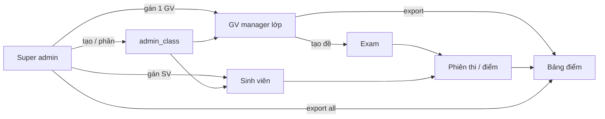
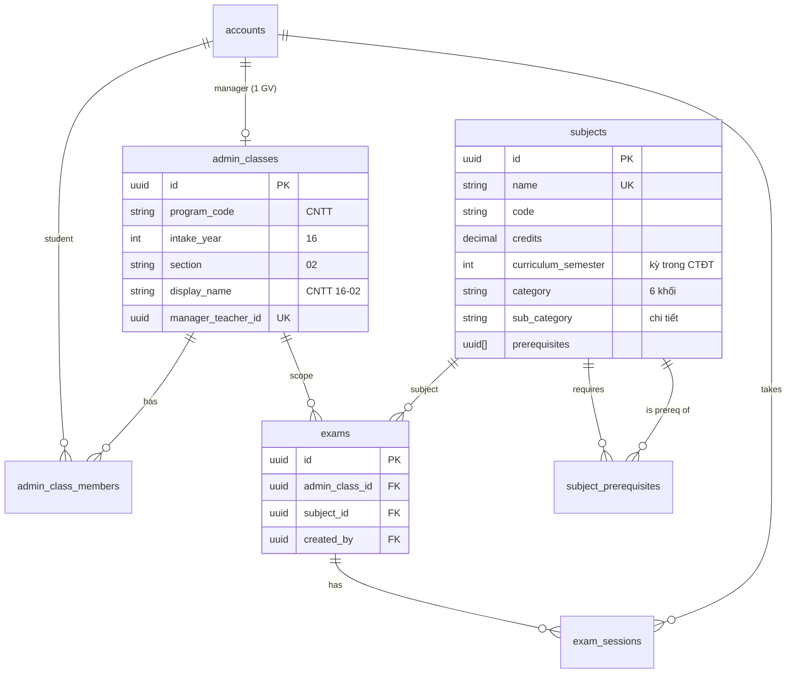
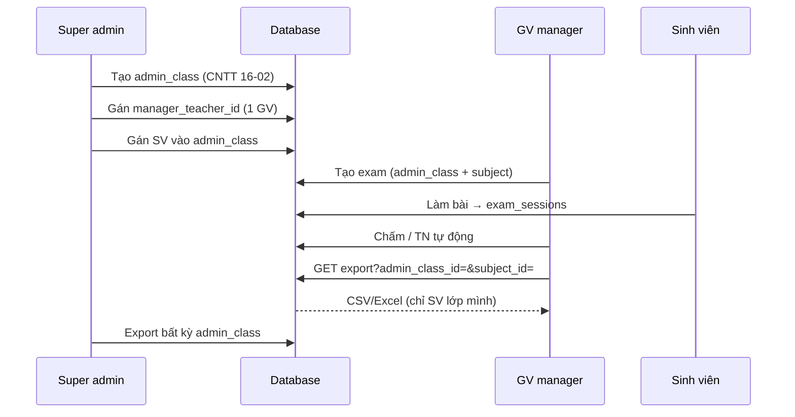
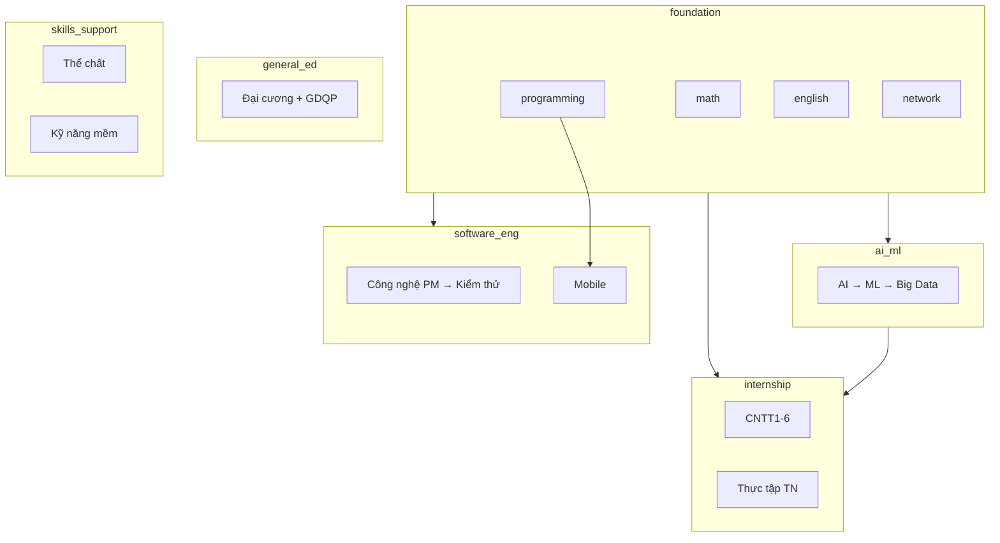

# Mô hình nghiệp vụ — Hệ thống thi trực tuyến (CNTT)

> **Ghi chú cho báo cáo:** File này tập trung sơ đồ quan hệ dạng Mermaid và luồng nghiệp vụ. Khi thiết kế thay đổi, cập nhật file này trước khi implement.

**Nguồn dữ liệu môn / điểm mẫu:** `cntt1602_grades.json` (lớp CNTT16-02, 52 học phần, 37 sinh viên).

---

## 1. Vai trò và phân quyền

| Vai trò (đề xuất) | Mô tả | Phạm vi |
|-------------------|--------|---------|
| **Super admin** | Quản trị toàn hệ thống | Tài khoản, tạo `admin_class`, gán GV chủ nhiệm, danh mục môn, xuất điểm **mọi lớp** |
| **Giáo viên (manager lớp)** | “Admin” theo lớp hành chính | **Một** `admin_class` (vd. CNTT 16-02): SV, đề thi, chấm, xuất bảng điểm **chỉ lớp mình** |
| **Sinh viên** | Làm bài, xem kết quả | Thuộc một `admin_class`; chỉ thấy đề/điểm trong phạm vi lớp |

**Ràng buộc nghiệp vụ (đã thống nhất):**

- **1 GV quản lý 1 lớp:** `admin_classes.manager_teacher_id` UNIQUE (hoặc bảng gán 1–1).
- **Xuất bảng điểm:** GV lọc theo `admin_class_id` được gán; super admin không giới hạn lớp.
- **Tương lai:** GV bộ môn (dạy môn, không chủ nhiệm) → bảng phân quyền riêng, chưa cần trong phase hiện tại.

---

## 2. Phân cấp dữ liệu: Lớp hành chính vs Môn học

**Giải thích ngắn:**

- **`admin_class`** = lớp hành chính cao nhất (CNTT 16-02) — trục quản lý của GV và export điểm.
- **`subjects`** = học phần trong chương trình (52 môn), có **khối** + **sub_category** + prerequisite.
- **`exams`** = đề thi online gắn **lớp HC + môn** (không thay thế bảng điểm tích lũy trong JSON, nhưng cùng phạm vi SV).

---

## 3. Luồng phân lớp → Xuất bảng điểm

**Nguồn điểm tích lũy (hiện tại / tương lai):**

| Nguồn | Mục đích |
|--------|----------|
| `cntt1602_grades.json` | Huấn luyện / demo bảng điểm 37 SV × 52 môn |
| `exam_sessions` | Điểm thi online trên hệ thống |
| Hợp nhất (sau) | Dashboard GV: điểm thi + điểm học phần đã import |

---

## 4. Phân loại môn học — 6 khối (CNTT 16-02)

Tham chiếu chi tiết từng môn: bảng trong `cntt1602_grades.json` (`category`, `sub_category`).

| `category` | Tên hiển thị | `sub_category` gợi ý |
|------------|--------------|----------------------|
| `foundation` | Khối nền tảng | `math`, `programming`, `english`, `network`, `database`, `systems`, `intro` |
| `ai_ml` | AI / ML / Dữ liệu | `ai`, `ml`, `data_eng`, `big_data` |
| `software_eng` | Software Engineering | `se`, `mobile`, `testing` |
| `internship` | Thực tập / đồ án | `cntt1`…`cntt6`, `capstone` |
| `general_ed` | Đại cương bắt buộc | `law`, `philosophy`, `politics`, `history`, `national_defense` |
| `skills_support` | Kỹ năng / TC / hỗ trợ | `pe`, `soft_skills`, `security`, `digital`, `it_business`, `geo` |

**Chuỗi prerequisite (ví dụ, từ JSON):**

- Tiếng Anh: P1 → P2 → P3 → P4 → P5  
- AI/ML: Xác suất + Lập trình HĐT → Trí tuệ nhân tạo → Học máy; Công nghệ dữ liệu + Học máy → Dữ liệu lớn  
- SE: Lập trình HĐT + PTTK HTTT → Công nghệ phần mềm → Kiểm thử phần mềm; Lập trình HĐT + TT CNTT3 → Lập trình mobile  

---

## 5. Ánh xạ nhanh: Khối → Mã môn (S01–S52)

| ID | Môn | category | sub_category |
|----|-----|----------|--------------|
| S01–S05 | GDTC / Võ / Yoga / Zumba | skills_support | pe |
| S06 | Thực tập tốt nghiệp | internship | capstone |
| S07 | Pháp luật đại cương | general_ed | law |
| S08, S30 | Kỹ năng mềm cơ bản / nâng cao | skills_support | soft_skills |
| S09, S16, S17, S21 | Toán (ĐSTT, Giải tích, Xác suất, Rời rạc) | foundation | math |
| S10 | Nhập môn CNTT | foundation | intro |
| S11, S22, S24 | Lập trình cơ bản, CTDL, OOP | foundation | programming |
| S15, S20, S31, S36, S46 | Tiếng Anh P1–P5 | foundation | english |
| S23, S50 | Mạng máy tính, Lập trình mạng | foundation | network |
| S32 | Lý thuyết CSDL | foundation | database |
| S33 | Lập trình IoT | foundation | iot |
| S34, S38, S39, S43 | AI, Học máy, Công nghệ DL, Dữ liệu lớn | ai_ml | ai / ml / data_eng / big_data |
| S41, S42, S52 | CNPM, Mobile, Kiểm thử PM | software_eng | se / mobile / testing |
| S12, S19, S25, S44, S47 | Thực tập CNTT1–6 | internship | cntt1…cntt6 |
| S13–S14, S35, S40, S45 | Triết, KTCT, CNXH, HCM, Lịch sử Đảng | general_ed | philosophy / politics / history |
| S26–S29 | GDQP P1–P4 | general_ed | national_defense |
| S18 | Hệ thống thông tin địa lý | skills_support | geo |
| S37 | Phân tích thiết kế HTTT | foundation | systems |
| S48 | An toàn, bảo mật | skills_support | security |
| S49 | Chuyển đổi số | skills_support | digital |
| S51 | Ứng dụng CNTT trong DN | skills_support | it_business |

---

## 6. Việc cần làm khi implement (checklist)

- [x] Migration `020_admin_classes.sql`, `021_sync_subject_codes_from_cntt1602.sql`  
- [x] API `GET /v1/admin-classes`, `GET /v1/admin-classes/me`  
- [x] `exams.admin_class_id` + `exams.subject_id`; UI tạo đề: lớp HC + chọn môn  
- [ ] API export: `GET /v1/exports/grades?admin_class_id=&subject_id=` — GV chỉ lớp mình  
- [x] Chuẩn hóa `subjects.code` / `category` / `sub_category` (migration 021)  
- [x] UI ExamAuthoring: “Lớp hành chính” + “Môn học” (không còn dropdown `classes` trùng/null)  

**Chạy migration:** `cd BackEnd/server && npm run migrate`

---

## 7. Ghi chú triển khai role

Trong code hiện tại enum có thể vẫn là `admin` | `teacher` | `student`:

- **`admin`** trong DB = **super admin** (hiển thị UI: Quản trị hệ thống).  
- **`teacher`** + bản ghi gán `admin_class` = **GV manager lớp**.

Khi đổi tên role trong DB, cập nhật sơ đồ và `API.md`.
