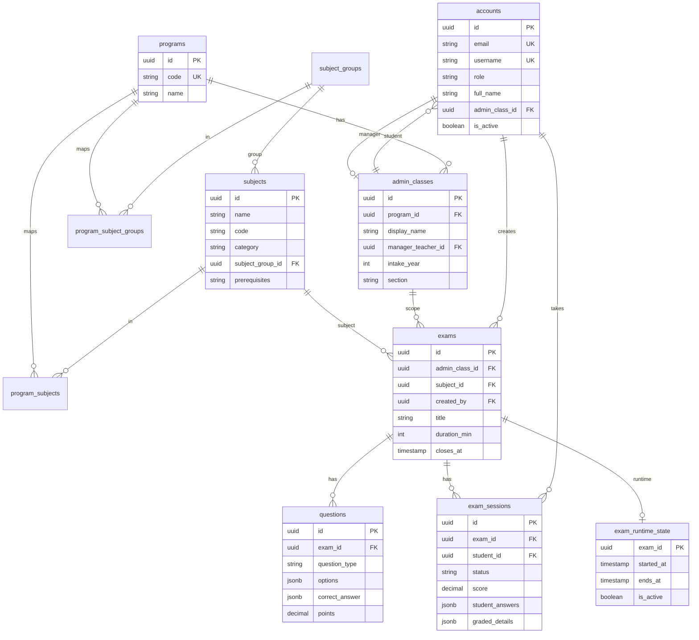
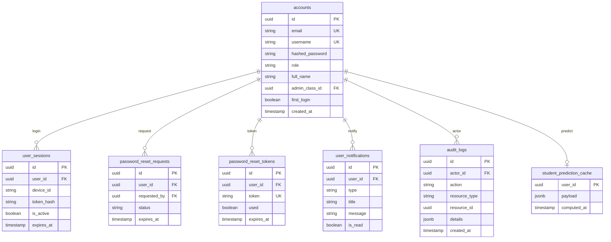
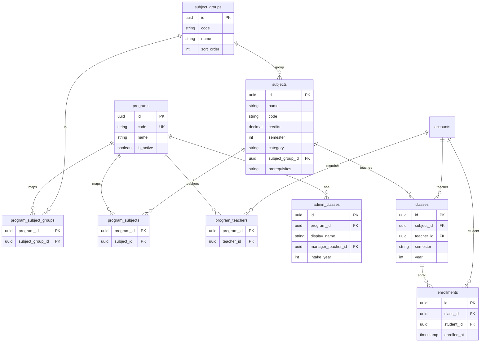
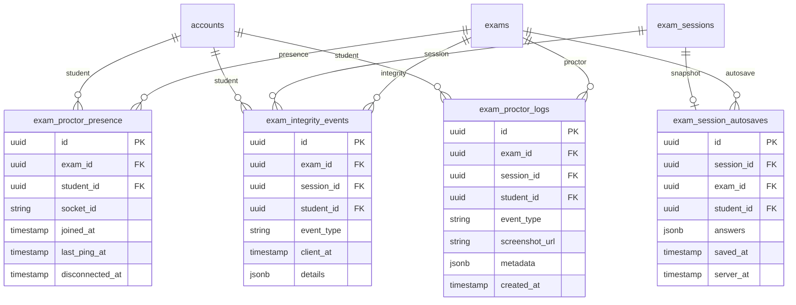
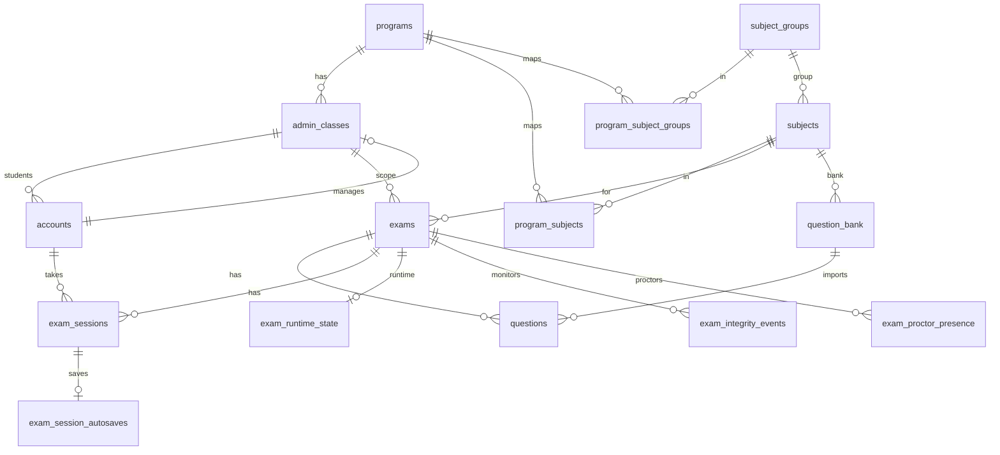
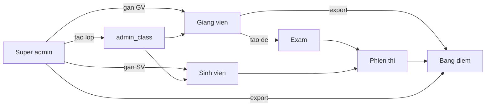
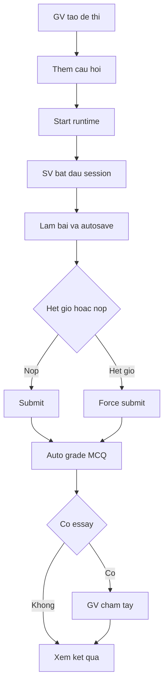
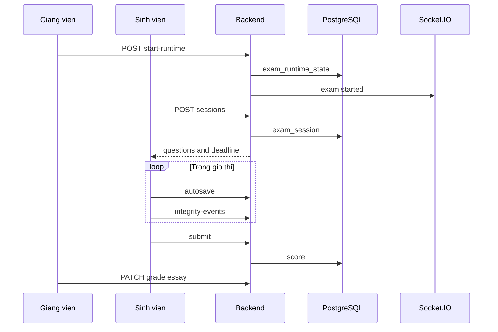

# Sơ đồ quan hệ thực thể (ER) — Mermaid

## Cách dùng đúng (tránh lỗi `UnknownDiagramError`)

Lỗi **`No diagram type detected`** xảy ra khi dán **sai nội dung** vào [Mermaid Live](https://mermaid.live):

| Sai | Đúng |
|-----|------|
| Dán cả file `.md` (tiêu đề `##`, bảng, `---`) | Chỉ **một** sơ đồ mỗi lần |
| Dán kèm ` ```mermaid ` và ` ``` ` | **Không** dán dấu fence — chỉ nội dung từ `erDiagram` / `flowchart` |
| Dán nhiều sơ đồ liên tiếp | Mỗi lần một sơ đồ (mục 2, 3, … hoặc file `.mmd`) |

**Cách nhanh nhất:** mở file trong thư mục [`docs/mermaid/`](mermaid/) → **Ctrl+A** → dán vào Mermaid Live → Export PNG.

| File `.mmd` | Nội dung |
|-------------|----------|
| `01-er-tong-quan.mmd` | ER tổng quan (mục 2) |
| `02-er-nguoi-dung.mmd` | ER người dùng (mục 3) |
| `03-er-mon-hoc.mmd` | ER môn học & lớp (mục 4) |
| `04-er-de-thi.mmd` | ER đề thi (mục 5) |
| `05-er-gian-lan.mmd` | ER chống gian lận (mục 6) |
| `06-flow-phan-quyen.mmd` | Flowchart phân quyền (mục 8.1) |
| `07-flow-lam-bai.mmd` | Flowchart làm bài (mục 8.2) |

Nếu copy từ khối code bên dưới: copy **từ dòng `erDiagram` (hoặc `flowchart`)** đến hết sơ đồ — **không** copy dòng ` ```mermaid `.

---

## 1. Nền tảng vẽ & chụp ảnh (khuyến nghị)

| Nền tảng | Link | Cách dùng |
|----------|------|-----------|
| **Mermaid Live Editor** (nên dùng) | https://mermaid.live | Dán code → xem preview → **Actions → Export PNG/SVG** |
| **VS Code / Cursor** | Extension: *Markdown Preview Mermaid Support* | Mở file `.md` này → Preview (Ctrl+Shift+V) → chụp màn hình |
| **GitHub** | Push file `.md` lên repo | README/docs tự render Mermaid |
| **draw.io** | https://app.diagrams.net | Arrange → Insert → Advanced → **Mermaid** |
| **Notion / Obsidian** | Block code `mermaid` | Dán trực tiếp trong note |

**Lưu ý:** Một sơ đồ quá nhiều bảng (30+) sẽ bị chật. File này **chia 5 sơ đồ** theo nhóm nghiệp vụ — phù hợp chương thiết kế CSDL trong báo cáo.

---

## 2. Sơ đồ tổng quan (giống ví dụ trong DOMAIN_MODEL.md)

*Dùng cho mục “Mô hình nghiệp vụ / ER khái niệm” — ít bảng, dễ đọc.*

*File sẵn: [`docs/mermaid/01-er-tong-quan.mmd`](mermaid/01-er-tong-quan.mmd)*



---

## 3. Nhóm Người dùng & Xác thực

*File sẵn: [`docs/mermaid/02-er-nguoi-dung.mmd`](mermaid/02-er-nguoi-dung.mmd)*



---

## 4. Nhóm Lớp học & Môn học

*File sẵn: [`docs/mermaid/03-er-mon-hoc.mmd`](mermaid/03-er-mon-hoc.mmd)*



---

## 5. Nhóm Đề thi & Phiên thi (chi tiết)

*File sẵn: [`docs/mermaid/04-er-de-thi.mmd`](mermaid/04-er-de-thi.mmd)*

```mermaid
erDiagram
  exams ||--o{ questions : has
  exams ||--o{ exam_sessions : has
  exams ||--o{ exam_versions : versions
  exams ||--o| exam_runtime_state : runtime
  exams ||--o{ exam_shares : shares
  exams ||--o{ exam_collaborators : collab
  exams }o--|| admin_classes : class
  exams }o--|| subjects : subject
  accounts ||--o{ exams : creates
  questions }o--o| question_bank : source
  exam_sessions }o--o| exam_versions : version
  accounts ||--o{ exam_sessions : takes
  exam_sessions ||--o{ grading_assignments : grade
  question_bank }o--|| subjects : subject

  exams {
    uuid id PK
    string title
    uuid admin_class_id FK
    uuid subject_id FK
    uuid created_by FK
    int duration_min
    int num_versions
    timestamp closes_at
  }

  questions {
    uuid id PK
    uuid exam_id FK
    string question_type
    string content
    jsonb options
    jsonb correct_answer
    string media_url
    decimal points
    uuid question_bank_id FK
  }

  exam_versions {
    uuid id PK
    uuid exam_id FK
    string version_code
    int version_index
    jsonb question_order
    jsonb option_maps
  }

  exam_sessions {
    uuid id PK
    uuid exam_id FK
    uuid student_id FK
    string status
    timestamp started_at
    timestamp submitted_at
    decimal score
    jsonb student_answers
    jsonb graded_details
    string grading_status
  }

  exam_runtime_state {
    uuid exam_id PK
    timestamp started_at
    timestamp ends_at
    boolean is_active
  }

  question_bank {
    uuid id PK
    uuid subject_id FK
    uuid created_by FK
    string difficulty
    int chapter
    int usage_count
  }

  exam_shares {
    uuid id PK
    uuid exam_id FK
    uuid shared_with FK
    string role
  }

  exam_collaborators {
    uuid id PK
    uuid exam_id FK
    uuid teacher_id FK
    string role
  }

  grading_assignments {
    uuid id PK
    uuid exam_session_id FK
    uuid teacher_id FK
    string status
  }
```

---

## 6. Nhóm Chống gian lận & Giám sát

*File sẵn: [`docs/mermaid/05-er-gian-lan.mmd`](mermaid/05-er-gian-lan.mmd)*



---

## 7. Sơ đồ ER đầy đủ (một trang — dùng khi cần “tổng thể”)

*File sẵn: [`docs/mermaid/08-er-tong-the.mmd`](mermaid/08-er-tong-the.mmd) — zoom 150–200% khi export PNG.*



---

## 8. Luồng nghiệp vụ (flowchart — bổ sung cho báo cáo)

### 8.1 Phân quyền 3 vai trò

*File sẵn: [`docs/mermaid/06-flow-phan-quyen.mmd`](mermaid/06-flow-phan-quyen.mmd)*



### 8.2 Vòng đời làm bài thi

*File sẵn: [`docs/mermaid/07-flow-lam-bai.mmd`](mermaid/07-flow-lam-bai.mmd)*



### 8.3 Luồng thi (sequence — chương thiết kế)

*File sẵn: [`docs/mermaid/09-sequence-thi.mmd`](mermaid/09-sequence-thi.mmd)*



---

## 9. Gợi ý chèn vào khóa luận

| Hình trong báo cáo | Dùng sơ đồ số |
|--------------------|---------------|
| Hình 3.x — Mô hình ER tổng quan | **Mục 2** |
| Hình 3.x — ER người dùng | **Mục 3** |
| Hình 3.x — ER môn học & lớp | **Mục 4** |
| Hình 3.x — ER đề thi & phiên thi | **Mục 5** |
| Hình 3.x — ER chống gian lận | **Mục 6** |
| Hình 3.x — Phân quyền | **Mục 8.1** |
| Hình 3.x — Luồng làm bài | **Mục 8.2** hoặc **8.3** |

**Export đẹp:** Trên https://mermaid.live → **Configuration** → bật theme `neutral` hoặc `forest` → Export **PNG** 2x scale.

---

*File: `docs/SO_DO_ER_MERMAID.md` — đồng bộ với schema thực tế trong `BackEnd/server/src/models/` và `TONGB_HOP_DOAN_TOT_NGHIEP.md`.*
